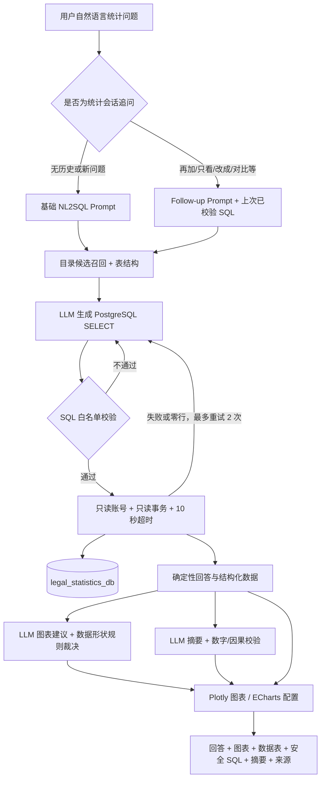

# 法律统计 NL2SQL 接入报告

> 接入日期：2026-07-27
>
> 数据范围：中国法律年鉴 2019、2020、2021 版离线统计数据
>
> 当前状态：独立数据库已导入，NL2SQL、ChatBI 多轮追问、自动图表和数据摘要已接入法律问答 Agent，真实模型与浏览器联调通过

## 1. 接入结论

本项目已新增 `search_legal_statistics` 工具和结构化 `LegalStatisticsChatBIResult`，用于回答案件数量、年度变化、指标对比和机构统计等法律统计问题，并返回可视化所需的数据。统计数据继续使用现有 PostgreSQL 容器 `legalflow-postgres`，但存放在独立数据库 `legal_statistics_db`，没有写入维权业务数据库 `legal_db`。

这项能力适合并入法律问答 Agent，但不能代替法条检索或类案检索：

| 用户问题 | 应调用能力 | 数据能否作为法律依据 |
|---|---|---|
| 2020 年劳动争议一审收案多少 | 法律统计 NL2SQL | 不能，仅为统计资料 |
| 劳动合同解除有哪些规定 | 法条 RAG | 可以引用有效法条 |
| 类似劳动争议法院如何处理 | 类案 RAG | 只能作为类案参考 |
| 案件趋势及适用法律 | 统计 NL2SQL + 法条 RAG | 统计和法律依据分开表述 |

## 2. 实际数据情况

离线包位于 `data/sources/legal_statistics/`，导入前后数量已经核对一致。

| 项目 | 实际数量或范围 |
|---|---:|
| 年鉴版本 | 2019、2020、2021 |
| 统计年份范围 | 2015—2020 |
| 主要连续统计年份 | 2018、2019、2020 |
| 数据集 | 193 |
| 行级记录 | 3,044 |
| 数值事实 | 11,612 |
| 原始单元格 | 23,573 |
| 已提取为 facts 的数据集 | 186 |
| 仅保留 records 的数据集 | 7 |

年份口径需要特别区分：`yearbook_year` 是年鉴版本年份，`statistical_year_end` 才是统计问题通常所说的年份。当前有 65 张表的年份根据“年鉴年份减一”推断，对应事实通过 `year_inferred` 质量标记保留，不会伪装成明确年份。

## 3. 总体架构



当前版本没有实现医生、患者等医疗角色权限。该能力在法律年鉴统计跑通阶段没有实际业务必要，暂不放进 SQL 生成链路。需要面向不同法律机构开放时，应另行设计数据域权限，而不是复用医疗角色模型。

数据库部署结构：

```text
legalflow-postgres（同一 PostgreSQL 容器）
├── legal_db
│   └── 法条、案例、渠道、会话业务数据
└── legal_statistics_db
    └── legal_statistics
        ├── datasets
        ├── records
        ├── facts
        ├── cells
        └── category_mappings
```

采用“同容器、独立数据库”是当前数据量下较合理的方案：运维成本低于新增 PostgreSQL 容器，同时连接池、账号、权限和数据库命名空间都与业务库分开。若将来统计库达到千万级事实、需要高并发分析或独立备份周期，再迁移到单独 PostgreSQL 实例更合适。

## 4. 数据表职责

| 表 | 用途 | 是否开放给 NL2SQL |
|---|---|---|
| `datasets` | 表级目录、年份、机构、主题、单位和来源追溯 | 是 |
| `records` | 原表每一行的 JSON 表达，兼容异构表 | 是 |
| `facts` | 每个数值单元格形成的长表，是数值问答主表 | 是 |
| `cells` | 原始单元格审计和解析复核 | 否 |
| `category_mappings` | 跨年名称标准化映射 | 是 |

`cells` 没有开放给模型生成 SQL，因为用户统计问答不需要读取原始单元格，减少可查询面也有利于安全和稳定性。

## 5. NL2SQL 与 ChatBI 工作流

### 5.1 目录候选召回

系统先从问题中确定性提取年份、案件类别和指标词，并处理“受理→收案”“审结→结案”等同义词。明确的年份区间会展开，例如“2018 到 2020”会得到 2018、2019、2020，而不是只取两个端点。

随后从 `facts + datasets` 查询真实存在的 `dataset_id`、表标题、维度和指标，按关键词及年份打分后，将前 30 个候选交给模型。这一步用于减少模型凭空编造列名、指标名和数据集 ID。

### 5.2 SQL 生成与校验

模型只能生成一条 PostgreSQL `SELECT`，并必须使用 `legal_statistics` 全限定表名。校验器会拒绝：

- INSERT、UPDATE、DELETE、CREATE、DROP 等写操作；
- 多语句、SQL 注释、CTE、UNION、子查询和行锁；
- `public`、`pg_catalog`、`information_schema` 及危险函数；
- 未限定表名、许可表之外的 JOIN；
- SUM、AVG、COUNT 等聚合函数，防止把“合计”行和分类明细重复相加；
- 超过 100 行的结果，自动将 LIMIT 压到 100。

当 SQL 合法但返回 0 行时，系统最多重试两次，并提示模型删除不存在的枚举过滤条件、使用空格标准化后的中文标签。

### 5.3 只读执行

统计查询使用独立连接池和数据库账号 `legal_statistics_reader`。实测权限如下：

| 权限检查 | 结果 |
|---|---|
| 连接 `legal_statistics_db` | 允许 |
| 查询统计表 | 允许 |
| INSERT 统计表 | 拒绝 |
| 在统计 schema 建表 | 拒绝 |
| 连接业务数据库 `legal_db` | 拒绝 |

每次执行还会设置只读事务与 10 秒超时：

```sql
SET TRANSACTION READ ONLY;
SET LOCAL statement_timeout = '10s';
```

因此安全边界不是只依赖 Prompt，而是“SQL 校验 + 只读账号 + 只读事务 + 超时”四层控制。

### 5.4 确定性回答生成

最终用户回答由程序按查询结果确定性格式化，不再让模型自由改写数字。回答只能引用 SQL 返回的数字，并必须说明单位、统计年份、表标题或统计机构。收案、结案、判决、调解等口径不会混加；只有用户明确询问趋势、增减或比例时才计算衍生数字。

所有统计回答强制附加：

> 以上为《中国法律年鉴》统计资料，仅供数据分析，不构成法律依据或个案结论。

普通聊天回答不会暴露内部文件路径或商业数据网站名称。ChatBI 调试面板会展示已经通过白名单校验的 SQL，便于项目演示和审计；展示的是已校验 SQL，不是模型原始输出。

### 5.5 多轮上下文

每个 `user_id + session_id` 保存上一次成功查询的已校验 SQL。后续问题出现“再加、只看、改成、排除、下钻、对比”等追问特征时，API 直接进入统计追问流程：

1. 把上一次已校验 SQL 作为上下文提供给 `STATISTICS_FOLLOWUP_PROMPT`；
2. 要求保留用户本轮没有修改的年份、案件类型、机构和指标；
3. 由模型重新生成完整 SQL，而不是对字符串进行机械拼接；
4. 新 SQL 必须再次经过同样的白名单、只读事务、超时和重试流程；
5. 成功后才替换会话中的统计上下文。

因此“再加上结案数”会保留原收案指标和年份，“只看 2020 年”会保留收案、结案和案件类别，仅修改年份。若本轮明显是全新问题，系统允许放弃上一条 SQL。

### 5.6 图表推荐与摘要防幻觉

ChatBI 支持 `line`、`bar`、`pie`、`scatter`、`heatmap` 和 `table`。模型只能提出图表类型和理由，程序规则根据年份数量、指标数量、单位是否一致和数据形状作最终裁决：时间序列优先折线图，单年同单位指标对比优先柱状图，混合单位或形状不适合时降级为表格。

摘要允许模型写 2—3 句，但会检查其中的全部数字是否来自查询结果，并拒绝“因为、导致、疫情、成效、影响”等无证据因果词。校验不通过时使用程序生成的保守摘要。图表的数据点、数据表和最终回答中的数字均直接来自 SQL 结果，不由模型重新生成。

## 6. Agent 路由

法律问答 Agent 已注册统计工具，并加入以下确定性语义约定：

- 统计数字、年度趋势、比例：`search_legal_statistics`；
- 法律规定：`search_statute`；
- 同类裁判结果：`search_similar_cases`；
- 统计资料加法律规定：组合调用统计工具和法条工具。

首次统计问题由法律问答 Agent 选择 `search_legal_statistics`。统计会话建立后，API 会优先识别统计追问，避免 Supervisor 把“再加上结案数”“只看 2020 年”误判为普通聊天并依据历史直接作答。

## 7. 真实联调结果

| 问题 | 返回结果 | 校验结论 |
|---|---|---|
| 2020 年全国法院劳动争议一审收案多少 | 439,678 件 | 正确 |
| 2018 到 2020 年劳动争议一审收案趋势 | 452,289 → 483,767 → 439,678 件 | 正确，先升后降 |
| 2020 年全国法院民事一审案件有多少 | 收案 13,136,436；结案 13,305,873；未结 1,108,317 件 | 正确区分口径，未重复求和 |

浏览器同会话三轮联调结果：

| 轮次 | 用户输入 | SQL/数据继承 | 图表结果 |
|---|---|---|---|
| 1 | 2018 到 2020 年劳动争议一审收案变化趋势？ | 返回 3 个年度的收案数据 | 单序列折线图 |
| 2 | 再加上结案数，用同一张图对比 | 保留年份与收案，追加结案，共 6 行 | 双序列折线图 |
| 3 | 只看 2020 年 | 保留收案与结案，只把年份改为 2020，共 2 行 | 双指标柱状图 |

三轮均返回数据表、摘要、年鉴来源和已校验 SQL。浏览器页面的 Plotly 图形实际渲染正常，控制台无前端错误；摘要未出现“疫情导致下降”“清理积案”等无数据支撑的解释。

劳动争议数据来自各年度“全国法院审理/受理民事一审案件情况统计表”，维度为“劳动争议、人事争议”。因此回答应明确该年鉴分类包含人事争议，不能将其解释为只统计狭义劳动争议。

## 8. 配置与代码位置

主要实现文件：

| 文件 | 职责 |
|---|---|
| `src/core/config.py` | 统计库独立连接配置 |
| `src/infra/legal_statistics_database.py` | 独立异步引擎和会话工厂 |
| `src/agents/legal_knowledge/legal_statistics_nl2sql.py` | 候选召回、SQL 生成、校验、执行和回答 |
| `src/agents/legal_knowledge/legal_statistics_chatbi.py` | 多轮识别、图表结构、摘要校验、来源和结构化返回 |
| `src/agents/legal_knowledge/tools.py` | 注册 `search_legal_statistics` |
| `src/agents/workers/legal_qa_agent.py` | Agent 工具说明与路由规则 |
| `src/api/routers/chat.py` | 统计会话上下文、同步与流式 API 返回 |
| `scripts/gradio_chat_demo.py` | Plotly、数据表、摘要、来源和 SQL 展示 |
| `test/test_legal_statistics_nl2sql.py` | SQL 安全、真实查询和工具注册测试 |
| `test/test_legal_statistics_chatbi.py` | 多轮、图表、摘要和回退规则测试 |

环境变量：

```dotenv
LEGAL_STATISTICS_DB_NAME=legal_statistics_db
LEGAL_STATISTICS_DB_USER=legal_statistics_reader
LEGAL_STATISTICS_DB_PASSWORD=
```

密码留空时复用 `DB_PASSWORD`，便于当前本地容器运行；生产环境应为统计只读账号设置独立随机密码。

## 9. 测试结果

统计模块专项测试：`18 passed`，覆盖合法查询、LIMIT 限制、写操作/多语句/注释/系统表/危险函数/子查询/聚合/越权表拒绝、年份范围解析、真实数据库结果、Follow-up Prompt、追问识别、图表推荐、合计行排除、单位混合降级、错误图表回退和因果摘要回退。

项目其余测试（排除旧的 `test/test_supervisor_agent.py`）：`62 passed, 5 subtests passed`。

全量 `pytest` 当前仍会在收集旧测试时中断。原因是 `test/test_supervisor_agent.py` 使用已经不存在的 `agents.supervisor_agent` 导入路径，并保留“新冠病史、糖尿病、过敏史”等医疗项目测试内容。该问题属于医疗遗留清理范围，不是本次 NL2SQL 回归失败；删除或法律化重写该测试应单独确认。

## 10. 当前限制与后续建议

1. 当前只有 2019—2021 版年鉴，主要能稳定比较 2018—2020；不能回答尚未导入的 2021 年以后趋势。
2. 自动抽取事实中存在 `year_inferred`，回答必须保留质量提示；关键展示场景应抽查原始单元格。
3. 7 个数据集目前只有行级 records，没有可直接计算的 facts，相关问题可能需要后续定制解析。
4. 跨年类别名称可能变化，`category_mappings` 仍需要按高频问题逐步人工维护。
5. 当前保守禁止 SQL 聚合，优先保证数字不重复计算；将来若支持复杂 ChatBI，应建立人工审核的语义层或指标视图，而不是放开模型自由 SUM。
6. 建议保存一组 20—30 条固定统计问答金标，覆盖年份、机构、口径、趋势、占比、无结果和歧义问题，作为每次 Prompt 或模型升级后的回归集。
7. 当前统计会话上下文以最后一次成功 SQL 为核心，适合“增删过滤条件、增加指标、限定年份”；复杂的跨主题回退、多个并行分析分支和长期分析会话仍需要结构化查询状态，而不能无限依赖 SQL 文本。

## 11. 总体评价

当前架构和工作流是合理的：关系型年鉴统计数据使用 PostgreSQL + NL2SQL，比向量库更适合精确数值、筛选和跨年比较；同时通过独立数据库避免污染维权业务表。目录候选召回降低了模型猜字段的概率，数据库权限和 SQL 校验提供了实际安全边界。多轮追问没有绕过安全校验，图表和摘要也采用“模型建议、程序裁决”的方式，符合数值产品对可追溯性和确定性的要求。

现阶段这套能力已经达到“可在项目中完整演示和继续迭代”的水平，尤其适合作为实习面试项目中法律问答 Agent 的统计分支：它同时体现了数据建模、NL2SQL 安全、Agent 路由、多轮状态、可视化和防幻觉设计。尚未达到开放式生产 ChatBI 的程度，主要差距不在数据库或 Agent 接入，而在统计口径映射、更多年份数据、金标评测集、自动抽取质量复核以及复杂分析会话状态。
