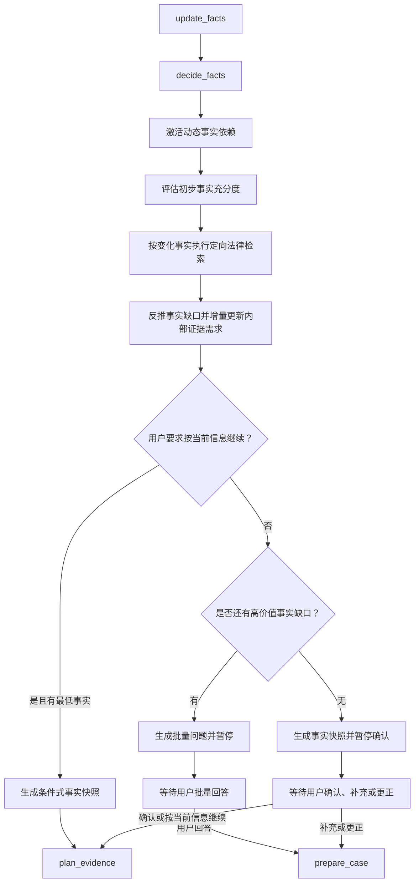

# `decide_facts` 事实决策与动态追问节点说明书

> 文档状态：目标节点设计，可作为后端重构和前后端联调依据  
> 编写日期：2026-08-01  
> 所属工作流：维权助手 GuideGraph  
> 节点序号：节点四  
> 关联文档：`维权工作流优化说明书.md`、`update_facts节点说明书.md`、`证据评估节点说明书.md`

## 1. 节点定位

`decide_facts` 是维权助手工作流的第四个核心节点，也是事实阶段的决策和收敛节点。

```text
update_facts
      |
      v
decide_facts
      |
      +-- 事实不充分 --> 生成批量动态追问并暂停
      |
      +-- 事实充分 --> 生成事实快照并暂停确认
      |
      +-- 用户要求按当前信息继续 --> 生成条件式快照并进入 plan_evidence
```

它不再从用户原文中提取事实，而是读取节点三更新后的事实黑板，必要时按事实变化执行定向法律检索，判断哪些事实还会影响责任、诉求、期限、管辖、程序、损失、证据需求或行动方案，并决定是否继续追问。

一句话定义：

> `decide_facts` 负责确认“当前事实够不够、法律条件还要求确认什么、应当批量问什么、什么时候停止追问，以及当前事实产生了哪些内部证据需求”。

## 2. 节点职责

### 2.1 应当负责

- 读取最新事实黑板和本轮事实变化集；
- 激活与当前案件有关的动态事实依赖；
- 按责任、诉求、期限、管辖、程序、损失和安全维度评估事实充分度；
- 识别阻断性事实缺口和非阻断性信息缺口；
- 根据事实状态排除已经明确、否认或明确不知道的事项；
- 计算每个事实缺口的信息增益和用户回答成本；
- 选择本轮已经暴露的全部高价值事实缺口；
- 将问题按主题组织成可阅读的 Markdown 批次；
- 使用稳定问题 ID 和决策键防止重复追问；
- 根据事实变化增量更新内部证据需求；
- 在法律条件、期限、管辖、程序或特殊证据规则可能改变追问方向时，执行定向法律检索；
- 根据检索到的法律条件反推尚未确认的事实槽位和证明目标；
- 复用未受影响的检索依据，仅对新增或变化事实进行增量检索；
- 保存检索来源、版本、定位、适用条件和检索降级状态；
- 判断继续追问是否还会改变法律分析、证据清单或行动方案；
- 事实充分时生成可编辑的事实快照；
- 用户要求“现在生成方案”时停止普通追问并生成条件式快照；
- 用户后续补充事实时判断变化是实质变化还是非实质变化；
- 在等待批量回答或事实快照确认前持久化决策状态；
- 将确认后的事实基线交给 `plan_evidence`。

### 2.2 不应负责

- 不从用户原文提取或写入事实；
- 不静默修改事实状态；
- 不判断用户陈述已经被证据证明；
- 不确定最终责任、违法、违约、侵权或犯罪结论；
- 不直接计算精确诉讼时效或仲裁期限；
- 不完成最终法律关系和请求权分析；
- 不建立完整的最终法律模型；
- 不把定向检索结果直接写成用户可见的确定性法律结论；
- 不把未经版本、效力和精确定位校验的检索结果作为正式引用；
- 不固化正式证据清单；
- 不创建证据上传入口；
- 不要求用户在事实追问阶段逐项上传证据；
- 不评估材料真实性、合法性、可采性或证明力；
- 不生成最终行动方案或维权可能性；
- 不用固定轮次代替事实充分度判断。

### 2.3 与节点三的边界

```text
update_facts
→ 提取、更新、去重、更正和保存事实

decide_facts
→ 读取事实，判断缺口、追问和停止条件
```

节点四发现事实冲突时只能生成冲突核对问题，不能自行选择其中一个版本。

### 2.4 与节点五的边界

```text
decide_facts
→ 内部、候选、可变的证据需求

decide_facts 的定向检索
→ 只用于识别会改变追问方向的法律条件、程序条件和证明目标

plan_evidence
→ 结合法律关系、请求权、法律检索和举证责任
→ 固化正式证据清单和交付入口
```

节点四的内部证据需求用于避免每轮从零生成，但不代表已经完成法律上的举证责任判断。节点四可以保存定向检索依据和候选证明目标，节点五仍需重新进行完整法律检索、来源校验和正式化。

## 3. 核心设计原则

### 3.1 追问目标是决策充分，不是字段填满

系统不需要知道案件所有细节，只需要掌握足以支持下一阶段法律分析、证据规划和行动建议的事实。

以下问题不应追问：

- 不会改变责任、诉求、期限、管辖、程序或损失判断；
- 不会改变待证事实或证据需求；
- 只是出于好奇；
- 已经能够从现有事实可靠确定；
- 用户已经明确表示不知道；
- 只会增加用户负担而没有明显信息增益。

### 3.2 每轮批量询问当前高价值缺口

不能采用“一轮只问一个事实”的旧模式。

每轮应当：

1. 找出当前已经暴露的全部高价值事实缺口；
2. 按责任、诉求、时间、金额、程序等主题分组；
3. 在可阅读范围内一次展示；
4. 缺口过多时按主题和优先级拆成多个批次；
5. 用户回答后重新计算，不预先发送固定问卷。

### 3.3 事实依赖动态展开

事实列表不是固定表单。

例如：

```text
确认属于闲鱼交易
→ 激活卖家身份、商品、付款、履行、退款和平台处理事实

确认对方是个人卖家
→ 激活是否偶发交易、平台主体信息和实际收款对象

确认平台已经拒绝退款
→ 激活拒绝时间、平台理由和当前订单状态
```

尚未满足前置条件的事实槽位不应提前询问。

### 3.4 事实状态严格控制可问范围

```text
confirmed  → 不问
denied     → 不问
unknown    → 不重复问
superseded → 不使用、不问
unclear    → 只问针对性澄清
conflicted → 只问冲突核对
not_provided → 可以进入候选
```

用户说“不知道”是有效回答，不是低质量回答。

### 3.5 程序选问题，模型写问题

程序负责：

- 激活事实槽位；
- 判断状态；
- 过滤重复；
- 计算信息增益；
- 选择问题批次；
- 验证问题 ID 和影响维度；
- 决定停止或暂停。

大模型负责：

- 将选中的问题写得自然；
- 合并语义重复问法；
- 按主题生成清晰 Markdown；
- 使用当前案情做简短承接。

模型不能自由新增未经程序允许的法律结论、问题维度或证据要求。

### 3.6 缺少证据不阻止事实收敛

事实阶段允许用户只说明证据名称，不要求上传。

以下情况不能作为继续事实追问的理由：

```text
尚未上传付款记录
尚未提交聊天截图
证据真实性还未评估
证据链还不完整
```

节点四可以内部记录证据需求，但事实是否充分只取决于案件事实是否足以进入法律和证据规划阶段。

### 3.7 不设置固定两轮上限

追问停止依据是：

- 决策充分度；
- 是否还有高价值候选；
- 用户是否要求按当前信息继续；
- 用户是否明确无法提供更多信息。

可以设置技术性防失控上限，但不能把它作为正常业务收敛依据。达到技术上限时只能生成明确标注缺口的条件式快照，不能假装事实已经完整。

### 3.8 证据需求增量更新，不每轮重建

```text
上一轮内部证据需求
+ 本轮新增事实产生的需求
- 语义重复需求
- 被更正、否认或替代事实导致的失效需求
= 本轮内部证据需求
```

每项需求使用稳定 ID，并保留生成原因和依赖事实。

### 3.9 定向法律检索驱动追问，但不替用户补事实

节点四的动态追问允许使用法律检索，但检索目的不是“找一条法条直接提问”，而是识别：

```text
当前事实
→ 可能适用的法律条件或程序条件
→ 已确认条件与未知条件的差集
→ 会改变法律路径、证据需求或行动方案的事实缺口
→ 本轮批量追问
```

每轮只对新增或发生变化的事实影响范围做定向检索。普通事实槽位优先使用事实依赖规则；只有法律关系、主体身份、期限、管辖、程序或特殊证据问题存在分叉时才触发检索。

定向检索结果必须作为内部 `retrieval_observation` 或 `basis_candidate` 保存，不能自动写成：

```text
卖家是经营者
用户已经超过时效
某法院具有管辖权
某材料一定是必需证据
```

上述命题仍必须由用户事实、材料观察或后续节点确认。

## 4. 节点输入

### 4.1 事实状态

```text
case_id
case_generation
state_version
fact_blackboard
fact_blackboard_version
fact_changes
active_fact_schema
fact_conflict_groups
material_fact_observations
fact_snapshot_version
fact_snapshot_confirmed
```

### 4.2 案件和流程状态

```text
workflow_stage
legal_domain_candidate
issue_candidates
region
control_intent
pause_state
asked_question_batches
asked_decision_keys
answered_decision_keys
waived_decision_keys
previous_sufficiency_report
previous_route
```

`legal_domain_candidate` 只用于选择事实规则，不是最终法律关系。

### 4.3 证据相关状态

```text
evidence_name_inventory
internal_evidence_requirements
evidence_requirement_changes
submitted_material_refs
evidence_plan_version
evidence_review_version
```

节点四只读取材料名称和关联状态，不读取附件全文，也不进行证据效力分析。

### 4.4 风险状态

```text
guard_status
current_safety_status
active_risk_flags
deadline_clues
evidence_loss_clues
```

现实安全仍未解决时不应进入节点四。期限线索可以用于提升相关事实问题优先级，但具体期限结论仍由权威检索确认。

### 4.5 定向检索状态

```text
changed_fact_keys
affected_decision_effects
retrieval_policy
retrieval_cache
retrieval_trace
retrieval_basis_candidates
retrieval_gaps
```

`retrieval_cache` 只可复用仍然适用、版本有效且未被事实变化影响的结果。缓存命中不等于最终法律依据已经完成节点五的正式校验。

定向检索允许读取的公共知识数据包括：

```text
PostgreSQL laws / articles
Milvus statute_index
Milvus legal_term_index
PostgreSQL authority_sources / authority_versions
Milvus authority_basis_index
Neo4j 法律关系辅助图谱
```

在事实阶段原则上不主动检索完整类案库。类案只有在法律关系候选存在明显分叉、且需要解释不同事实条件时才可作为内部补充，不能单独触发确定性追问或法律结论。

定向检索的输入必须来自结构化事实和变化键：

```json
{
  "changed_fact_keys": [
    "seller.identity_type",
    "procedure.platform_complaint.status"
  ],
  "legal_domain_candidate": "consumer_market",
  "decision_effects": [
    "responsibility",
    "claim_scope",
    "procedure",
    "evidence_need"
  ],
  "confirmed_conditions": [],
  "unknown_conditions": [
    "seller.repeated_sales",
    "seller.business_identity"
  ],
  "as_of_date": "2026-08-01"
}
```

检索返回的每条候选依据至少保存：

```text
basis_candidate_id
source_id
source_version_id
locator
status
review_status
applicability
retrieval_score
retrieval_trace_id
```

## 5. 决策维度

建议使用稳定的 `decision_effect`：

| 维度 | 判断内容 | 是否可能阻断 |
|---|---|---|
| `responsibility` | 责任主体、关系和核心行为是否基本明确 | 是 |
| `claim_scope` | 用户希望实现的结果、金额和范围是否明确 | 是 |
| `limitation` | 判断期限所需的关键事件和日期是否具备 | 是 |
| `jurisdiction` | 判断地域、履行地和主体所在地所需事实是否具备 | 视案件而定 |
| `procedure` | 已采取措施和当前程序状态是否明确 | 视案件而定 |
| `harm_loss` | 实际损失、影响和计算基础是否明确 | 视诉求而定 |
| `conflict_resolution` | 是否存在会改变分析的重大事实冲突 | 是 |
| `evidence_need` | 已确认事实产生了哪些内部证据需求 | 否 |
| `safety` | 当前安全状态是否已经由节点二处理 | 是 |

### 5.1 阻断性缺口

缺失后无法建立最低可行动案件模型，例如：

- 不知道发生了什么；
- 无法识别对方或双方关系；
- 用户没有说明希望解决什么；
- 核心日期冲突导致期限方向完全不同；
- 当前人身安全状态仍不明确。

### 5.2 非阻断性缺口

缺失会降低方案精度，但仍可条件式分析，例如：

- 对方真实姓名暂时不知道，但平台账号和订单存在；
- 次要损失金额尚未计算；
- 某次沟通的准确日期不清楚；
- 尚未提交证据文件；
- 某项替代材料是否存在尚未确认。

### 5.3 维度不是固定问卷

每个维度由当前案件激活的事实规则组成。某案件没有损失赔偿诉求时，`harm_loss` 可以不要求完整；不涉及地域差异时，部分管辖信息可以降为建议补充。

## 6. 动态事实依赖模型

### 6.1 基础事实槽位

新案件通常激活：

```text
actor.user.role
actor.counterparty.type
relationship.type
event.core_behavior
event.timeline
claim.request
transaction.amount
location.platform_or_place
procedure.history
harm.loss
```

只有与当前描述相关的槽位才进入候选。

### 6.2 依赖规则

建议每条规则包含：

```json
{
  "decision_key": "transaction.delivery.deadline",
  "slot_key": "agreement.delivery_deadline",
  "depends_on": [
    "relationship.type=transaction",
    "performance.delivery.status=not_delivered"
  ],
  "decision_effects": [
    "responsibility",
    "procedure",
    "evidence_need"
  ],
  "priority": 0.86,
  "user_burden": 0.15,
  "question_template": "双方是否约定了发货时间？",
  "unknown_allowed": true
}
```

### 6.3 激活过程

```text
读取当前有效事实
→ 匹配通用基础规则
→ 匹配领域和场景候选规则
→ 检查前置事实
→ 激活新槽位
→ 合并稳定 decision_key
→ 排除已处理状态
```

### 6.4 新事实只扩展相关分支

用户补充“平台已拒绝退款”后，只需要激活：

```text
procedure.platform_decision.received_at
procedure.platform_decision.reason
procedure.order.current_status
```

不应重新激活已经回答的付款金额、卖家类型等问题。

### 6.5 法律条件驱动的事实依赖

事实依赖规则除了静态的 `depends_on`，还可以由定向检索返回的法律条件触发：

```json
{
  "legal_condition_id": "operator_status_affects_consumer_path",
  "basis_candidate_refs": ["basis-candidate-012"],
  "required_fact_keys": [
    "seller.repeated_sales",
    "seller.business_identity",
    "seller.store_information"
  ],
  "decision_effects": [
    "responsibility",
    "claim_scope",
    "procedure",
    "evidence_need"
  ],
  "trigger": "seller_identity_is_uncertain",
  "user_visible_basis": false
}
```

其处理顺序为：

```text
事实变化
→ 识别受影响的法律条件
→ 定向检索现行法律、程序或权威规则
→ 校验来源和适用范围
→ 转换为待确认事实槽位
→ 进入信息增益排序
```

如果来源没有精确定位或适用范围不明，只能作为内部检索缺口，不能激活带有确定法律结论的用户问题。

## 7. 事实充分度模型

### 7.1 充分度结果

建议使用：

```text
insufficient
conditionally_sufficient
sufficient
blocked_by_conflict
paused_by_guard
```

| 状态 | 含义 |
|---|---|
| `insufficient` | 尚缺少最低可行动事实，需要继续追问 |
| `conditionally_sufficient` | 可以继续，但必须在快照和方案中明确未知条件 |
| `sufficient` | 当前高价值事实已覆盖，可以进入事实快照确认 |
| `blocked_by_conflict` | 存在必须先核对的重大事实冲突 |
| `paused_by_guard` | 安全或即时风险尚未解除，不应继续事实决策 |

### 7.2 充分度报告

```json
{
  "status": "insufficient",
  "can_proceed_conditionally": true,
  "blocking_gaps": [
    "claim.request"
  ],
  "advisory_gaps": [
    "counterparty.legal_name"
  ],
  "conflict_groups": [],
  "dimensions": [
    {
      "effect": "claim_scope",
      "required": true,
      "satisfied": false,
      "missing_fact_keys": [
        "claim.request"
      ]
    }
  ],
  "reason": "用户希望实现的结果尚未明确"
}
```

### 7.3 停止条件

正常停止追问需要满足：

- 责任主体和基本关系已经明确；
- 用户诉求明确；
- 核心事件、约定和履行状态基本明确；
- 关键时间、金额和地点达到当前分析需要；
- 期限、管辖和程序判断所需事实基本覆盖；
- 重大冲突已经解决或明确保留为未知；
- 当前没有新的高价值事实槽位；
- 继续追问不会明显改变证据清单或行动方案。

“所有字段都有值”不是停止条件。

### 7.4 条件式继续

以下情况可以 `conditionally_sufficient`：

- 用户明确不知道某个非阻断性事实；
- 用户选择按当前信息继续；
- 技术上限触发但已形成最低案件模型；
- 部分事实只能通过平台或机构后续调取；
- 次要损失或辅助程序尚未确定。

未知项必须进入事实快照和后续方案条件，不得被模型补全。

### 7.5 收敛判定顺序

事实收敛由节点四统一判定和写入，不由节点三、前端或大模型单独决定。

每次 `update_facts` 完成后，按以下顺序重新计算：

```text
1. 读取最新事实黑板、事实状态和变化集
2. 检查 guard_case 是否仍有未解除的安全或即时风险
3. 激活本轮新增事实带来的依赖槽位
4. 排除 confirmed、denied、unknown、superseded 和已回答问题
5. 单独识别 unclear、conflicted 和 not_provided
6. 计算阻断性缺口和建议性缺口
7. 计算仍有价值的问题候选
8. 根据用户控制指令决定是否允许条件式继续
9. 写入 fact_sufficiency 和 convergence_reason
10. 生成问题批次、事实快照或下一节点路由
```

程序化判定顺序：

```python
if guard_not_resolved:
    status = "paused_by_guard"
elif has_blocking_conflicts:
    status = "blocked_by_conflict"
elif conclude_now and has_minimum_actionable_facts:
    status = "conditionally_sufficient"
elif has_blocking_gaps:
    status = "insufficient"
elif has_high_value_candidates:
    status = "insufficient"
else:
    status = "sufficient"
```

`conclude_now` 只能让节点四停止普通追问，不能把缺失事实伪装成已确认事实。

### 7.6 收敛状态与路由

| `fact_sufficiency.status` | `decision_status` | 路由 |
|---|---|---|
| `paused_by_guard` | `paused_by_guard` | 保持节点二的暂停状态 |
| `blocked_by_conflict` | `ask_batch` | 生成冲突核对批次并暂停 |
| `insufficient` 且有问题候选 | `ask_batch` | 生成批量事实问题并暂停 |
| `insufficient` 但用户明确不知道 | `conditionally_sufficient` | 生成条件式快照 |
| `sufficient` | `await_snapshot_confirmation` | 生成事实快照并暂停确认 |
| `conditionally_sufficient` | `proceed_to_evidence_planning` | 生成条件式快照并进入 `plan_evidence` |

`decision_status` 是本轮路由状态，`fact_sufficiency.status` 是事实状态；二者不能只用一个布尔值替代。

### 7.7 收敛配置

建议将收敛策略配置化：

```text
FACT_QUESTION_MIN_INFORMATION_GAIN
→ 问题进入候选批次的最低信息增益

FACT_BATCH_MAX_QUESTIONS
→ 单批最大问题数，只控制可读性

FACT_BATCH_MAX_RENDERED_LENGTH
→ 单批 Markdown 最大展示长度

FACT_MAX_NO_PROGRESS_ROUNDS
→ 连续没有推进时转为条件式收敛或提示用户选择

FACT_TECHNICAL_MAX_ROUNDS
→ 防止异常死循环的技术上限
```

这些配置不应被解释为“固定几轮后结束”。业务收敛仍由事实充分度和高价值候选决定。

推荐原则：

- `FACT_BATCH_MAX_QUESTIONS` 只限制单批展示，不限制总追问轮数；
- `FACT_MAX_NO_PROGRESS_ROUNDS` 触发后，若已有最低案件模型，生成条件式快照；
- `FACT_TECHNICAL_MAX_ROUNDS` 触发后，必须说明仍有缺口，不输出确定性结论；
- 用户明确说“不清楚”后，不增加无意义的重复追问次数。

### 7.8 “没有高价值问题”才是正常收敛

节点四不要求所有 `not_provided` 槽位变成 `confirmed`。以下状态可以正常收敛：

```text
没有新的高价值候选
剩余缺口只影响补强或表达细节
用户明确不知道且已有替代路径
关键冲突已明确保留为未知
用户要求按当前信息继续
```

需要在事实快照中显示：

```text
哪些事实已确认
哪些事实未知
哪些事实存在冲突
哪些事项可能影响后续方案
```

### 7.9 事实收敛与证据收敛分开

节点四判定的是“事实是否足够进入证据规划”，不是“证据是否已经收集完成”。

```text
事实收敛
→ 节点四
→ 允许进入 plan_evidence

证据收集收敛
→ 用户完成证据批次或选择暂不提交
→ 由证据交付和 assess_evidence 处理
```

尚未上传任何材料可以进入节点五，也可以生成条件式方案，不得因此让事实追问无限延长。

## 8. 问题候选生成

### 8.1 候选条件

事实槽位至少满足一个条件才可进入候选：

- 会改变责任主体、责任基础或责任范围；
- 会改变请求类型、范围或金额；
- 会改变期限判断；
- 会改变管辖、受理机构或程序路径；
- 会改变待证事实或证据需求；
- 能解决重大冲突；
- 对行动方案具有明显信息增益。

### 8.2 状态过滤

程序先过滤：

```text
已 confirmed
已 denied
已 unknown
已 superseded
已经在当前待答批次中
相同 decision_key 已经回答
能从现有事实可靠推出
不满足依赖条件
```

`unclear` 和 `conflicted` 生成专门候选，不进入普通缺失问题。

### 8.3 问题候选结构

```json
{
  "question_id": "question-018",
  "decision_key": "transaction.delivery.deadline",
  "fact_slot_keys": [
    "agreement.delivery_deadline"
  ],
  "question_type": "missing_fact",
  "topic": "time_and_agreement",
  "decision_effects": [
    "responsibility",
    "procedure",
    "evidence_need"
  ],
  "information_gain": 0.88,
  "user_burden": 0.15,
  "priority_score": 0.73,
  "source_rule_ids": [
    "consumer.transaction.delivery_deadline"
  ],
  "unknown_allowed": true
}
```

### 8.4 不直接询问法律结论

不得问：

```text
您认为对方是否构成违约？
您觉得是否超过诉讼时效？
哪个法院有管辖权？
这个证据能否被法院采信？
```

应询问支撑这些判断的事实：

```text
双方约定什么时候发货？
什么时候知道对方明确不再履行？
订单履行地或收货地在哪里？
材料的原始文件是否还在？（证据提交后的核验阶段）
```

最后一类材料质量问题不属于普通事实批次，由节点六在证据评估中最多追问一轮。

## 9. 信息增益和批次选择

### 9.1 信息增益

推荐综合：

```text
责任影响
诉求影响
期限影响
管辖和程序影响
证据需求影响
冲突消解价值
能否解锁后续事实
答案可获得性
- 重复程度
- 隐私和回答负担
```

### 9.2 优先级

通常优先：

1. 尚未被节点二解决的安全状态；
2. 明显影响短期限的事实；
3. 责任主体和核心法律关系事实；
4. 用户诉求；
5. 核心事件、约定和履行状态；
6. 管辖和程序事实；
7. 金额和损失；
8. 只影响补强证据的非关键事实。

安全状态正常应由 `guard_case` 处理，节点四只消费结果，不重复执行安全节点。

### 9.3 批次规则

本轮应包含所有当前已经暴露的高价值缺口，但要控制可读性：

- 高价值候选较少时一次全部询问；
- 候选较多时按主题和优先级拆批；
- 默认建议每批不超过 6 至 8 个简短问题；
- 同一问题可以覆盖多个紧密相关事实；
- 不把多个完全不同的决策点塞进一个长句；
- 批次数量是界面可读性约束，不是固定追问轮数。

### 9.4 分组

建议主题：

```text
parties_and_relationship
events_and_agreements
time_and_amount
location_and_jurisdiction
procedure_history
claim_and_loss
conflict_confirmation
```

### 9.5 防重复

使用：

```text
asked_decision_keys
pending_question_ids
answered_decision_keys
unknown_decision_keys
waived_decision_keys
```

防重复基于稳定决策键，不依赖自然语言相似度。

只有以下情况允许重新打开：

- 用户更正了依赖事实；
- 原问题对应事实被标记冲突；
- 新事件改变了问题含义；
- 用户主动要求重新核对。

重新打开时记录：

```text
reopened_reason
previous_question_id
affected_fact_keys
```

## 10. 批量问题生成

### 10.1 程序先确定问题结构

节点先生成结构化问题批次：

```json
{
  "batch_id": "fact-batch-004",
  "questions": [
    {
      "question_id": "question-018",
      "decision_key": "counterparty.type",
      "topic": "parties_and_relationship",
      "prompt": "对方是个人卖家、店铺还是公司？",
      "answer_hint": "不确定时可以写“不清楚”。"
    }
  ]
}
```

模型只能在保持 `question_id`、`decision_key` 和事实范围不变的前提下润色。

### 10.2 Markdown 格式

```markdown
## 请补充目前尚未明确的信息

### 双方和交易

1. **对方身份：** 对方是个人卖家、店铺还是公司？
2. **交易内容：** 购买的具体商品或服务是什么？

### 时间和约定

3. **付款时间：** 什么时候付款？
4. **履行约定：** 双方是否约定发货或履行时间？

### 处理经过

5. **平台处理：** 是否已经申请退款或向平台投诉，目前是什么状态？

> 可以一次回答多个问题；不清楚的写“不清楚”，没有的写“没有”。
```

### 10.3 文案约束

- 只说明为什么需要这些事实，不作未经检索的法律结论；
- 不引用不可靠法条或固定问卷；
- 不重复大段用户原话；
- 不逐行复述“我已经记住”；
- 不混入证据上传要求；
- 不使用“胜诉”“诈骗成立”等结论性措辞；
- 问题编号与结构化 `question_id` 一一对应。

### 10.3.1 检索驱动的问题生成

节点四可以在生成问题候选前执行以下流程：

```text
1. 从 fact_changes 找出新增、更正、冲突和重新激活的事实键；
2. 判断这些事实是否影响法律关系、请求、期限、管辖、程序或证明目标；
3. 对受影响的部分调用法律术语、法条、程序和权威依据检索；
4. 对结果执行版本、生效状态、发布机关和精确定位检查；
5. 提取“需要确认的事实条件”，而不是提取用户应当接受的法律结论；
6. 将新条件合并到 active_fact_schema 和内部证据需求；
7. 按信息增益生成批量追问。
```

检索范围分为四级：

| 级别 | 适用场景 | 输出 |
|---|---|---|
| `none` | 普通事实缺口，规则已足够 | 事实问题候选 |
| `light` | 口语到法律术语、领域和关系候选映射 | 检索扩展词和候选关系 |
| `targeted` | 主体身份、期限、管辖、程序、特殊证据存在分叉 | 法律条件、待确认事实和依据候选 |
| `full` | 事实收敛后进入节点五 | 由 `plan_evidence` 完整执行，节点四不代替 |

`none` 和 `light` 是常态；`targeted` 必须记录触发原因；`full` 不在节点四内完成。

### 10.4 暂停

生成问题后设置：

```text
workflow_stage = fact_clarification
pause_type = awaiting_fact_batch
pending_fact_batch_id
pending_question_ids
pending_decision_keys
```

然后结束本轮，等待用户一次回答多个问题。

## 11. 连续追问循环

```text
首次描述
→ update_facts 建立事实黑板
→ decide_facts 生成第一批问题
→ 暂停

用户批量回答
→ prepare_case
→ guard_case
→ update_facts 更新全部回答
→ decide_facts 重新计算
→ 新增依赖事实进入下一批
→ 已回答问题不再出现
```

每轮必须从最新事实黑板重新规划，不使用预先生成的固定后续问题列表。

### 11.1 用户只回答部分问题

- 节点三提取本轮全部实际回答；
- 未回答问题不自动标记 `unknown`；
- 节点四重新评估未回答项的信息增益；
- 仍属高价值时可以保留到下一批；
- 用户明确跳过或说不知道时不再重复。

### 11.2 用户主动补充新事实

新事实即使不对应当前问题也必须先由节点三入库。节点四基于新事实重新激活依赖，旧批次中已经不再适用的问题应撤销。

### 11.3 用户提出反问

案件相关反问可以由法律问答能力简短回答，但：

- 不得把反问当作事实答案；
- 保留原待答批次；
- 用户同时回答事实时照常更新；
- 连续反问不应导致系统重复发送整段问题。

### 11.4 用户明确不知道

将对应事实状态保持为 `unknown`。如果该事实属于阻断性缺口，系统应寻找替代事实、可调取渠道或条件式分析路径，而不是重复询问。

## 12. 内部证据需求增量

### 12.1 节点四负责什么

节点四根据事实变化维护“内部证据需求候选”，目的是：

- 让证据需求随事实逐轮积累；
- 避免最后一次性从零生成；
- 在事实被更正时只更新受影响需求；
- 为节点五的正式法律和举证责任建模提供输入。

### 12.2 需求结构

```json
{
  "requirement_id": "transaction.payment",
  "proof_target_candidate_id": "proof.transaction.payment",
  "label": "证明用户已经付款",
  "dependent_fact_keys": [
    "transaction.payment.pay_01.amount",
    "transaction.payment.pay_01.date"
  ],
  "recommended_material_classes": [
    "支付记录",
    "平台账单",
    "银行流水"
  ],
  "alternative_material_classes": [],
  "provisional_importance": "candidate",
  "status": "candidate",
  "generation_round": 1,
  "last_updated_round": 3,
  "change_reason": "added_fact",
  "matched_evidence_name_ids": [
    "ename-003"
  ]
}
```

### 12.3 需求状态

```text
candidate
pending_fact_confirmation
active_candidate
not_applicable
superseded
carried_forward
```

节点四不能将 `candidate` 直接标成正式“必需材料”。必需、重要或补强等级由节点五结合法律依据和举证责任确定。

### 12.4 增量规则

| 事实变化 | 内部证据需求处理 |
|---|---|
| `added` | 创建或激活相关候选需求 |
| `unchanged` | 直接复用 |
| `refined` | 补充范围、时间或材料类别 |
| `replaced` | 重算依赖旧事实的候选需求 |
| `denied` | 将只依赖该事实的需求标记不适用 |
| `conflicted` | 保留但标记待事实确认 |
| `superseded` | 停用旧关联并保留历史 |

### 12.5 与证据名称库存匹配

节点三记录：

```text
用户称持有付款记录
```

节点四可以将其匹配到：

```text
requirement_id = transaction.payment
matched_evidence_name_ids = [ename-003]
```

该匹配只说明材料名称可能相关，不说明：

- 已经上传；
- 内容完整；
- 真实性成立；
- 足以覆盖证明目标。

### 12.6 不在每轮完整展示

内部证据需求通常不在每轮追问中展示。只有以下情况可以提前提示：

- `guard_case` 识别到证据灭失风险；
- 某材料需要立即合法保存；
- 用户主动询问现在应先保存什么；
- 材料本身会直接影响当前事实是否能确认。

即使提前提示，也不能在事实阶段进行完整证据效力评估。

### 12.7 检索驱动的增量证据需求

每轮内部证据需求的来源应区分：

```text
fact_rule
→ 由事实依赖规则直接产生

targeted_legal_retrieval
→ 由法律条件、程序条件或证明目标差异产生

material_observation
→ 由节点六回流的材料观察产生
```

推荐字段：

```text
requirement_id
proof_target_candidate_id
source_type
source_fact_keys
basis_candidate_refs
retrieval_trace_id
change_reason
provisional_status
```

定向检索只提高候选需求的依据质量，不把候选需求自动升级为正式 `essential`。正式等级和正式引用仍由节点五确定。

## 13. 事实快照

### 13.1 生成条件

满足以下任一条件时生成：

- `sufficiency.status = sufficient`；
- `sufficiency.status = conditionally_sufficient` 且用户选择按当前信息继续；
- 用户明确要求“现在生成方案”，且已有最低可行动事实；
- 技术上限触发且可以生成条件式分析。

### 13.2 快照内容

至少包括：

- 双方主体和关系；
- 核心事件时间线；
- 关键约定、履行和争议行为；
- 金额、损失和用户诉求；
- 地点、平台和程序经过；
- 用户明确不知道的事项；
- 尚未解决的非阻断性冲突；
- 系统准备交给节点五分析的法律关系候选；
- 用户已经提到的证据名称，仅标记持有状态。

### 13.3 快照结构

```json
{
  "fact_snapshot_draft_id": "snapshot-draft-004",
  "based_on_fact_blackboard_version": 7,
  "confirmed_fact_ids": [],
  "denied_fact_ids": [],
  "unknown_fact_ids": [],
  "conflict_group_ids": [],
  "legal_relation_candidates": [
    "online_sale_transaction"
  ],
  "proceed_under_uncertainty": false,
  "snapshot_hash": "sha256:...",
  "created_at": "2026-08-01T15:00:00+08:00"
}
```

### 13.4 Markdown 格式

```markdown
## 请确认案件事实

### 已确认

- **双方关系：** 通过闲鱼向个人卖家购买商品
- **付款情况：** 7月18日支付800元，年份仍待确认
- **核心经过：** 卖家未发货并拉黑用户
- **处理情况：** 已向平台反馈，等待处理
- **您的诉求：** 退款

### 仍不明确

- 卖家的真实姓名暂不清楚
- 付款日期的年份尚未确认

### 已提到的材料

- 付款记录：用户称持有，尚未提交评估
- 聊天记录：用户称持有，尚未提交评估

> 您可以回复“确认并继续”，也可以直接补充或更正具体内容。
```

### 13.5 用户操作

```text
确认并继续
→ fact_snapshot_confirmed
→ plan_evidence

补充事实
→ prepare_case
→ guard_case
→ update_facts
→ decide_facts

更正事实
→ update_facts 保留旧版本
→ decide_facts 重新判断

按当前信息继续
→ proceed_under_uncertainty = true
→ plan_evidence
```

### 13.6 快照版本

- 草稿不等于正式确认版本；
- 用户确认后增加 `fact_snapshot_version`；
- 快照记录对应的 `fact_blackboard_version`；
- 后续事实变化时旧快照保留并标记 `stale`；
- 实质变化生成新快照版本；
- 非实质变化可以只更新摘要和任务。

## 14. 控制指令处理

### 14.1 `conclude_now`

表示：

```text
停止普通事实追问
按当前事实继续条件式分析
保留未知和冲突
```

不表示：

```text
跳过 update_facts
跳过必要法律建模
假装未知事实已经确认
跳过证据状态说明
```

处理：

```text
已有最低可行动事实
→ 生成条件式事实快照
→ proceed_under_uncertainty = true
→ plan_evidence

连基本事件、主体或诉求都无法识别
→ 生成最小必要澄清批次
→ 说明没有这些信息无法形成案件方案
```

### 14.2 `continue_gathering`

继续正常充分度评估，不恢复已经回答或明确不知道的问题。

### 14.3 事实快照确认

纯确认且事实没有变化时不需要重新运行事实提取。`prepare_case` 和 `guard_case` 处理后可以进入 `plan_evidence`。

确认消息同时包含更正时，必须先回到 `update_facts`。

## 15. 方案后事实变化

节点三输出下游失效范围后，节点四判断变化重要性。

### 15.1 实质变化

包括：

- 对方主体或法律关系变化；
- 用户诉求变化；
- 关键时间、金额或履行状态变化；
- 新增可能影响期限或管辖的事实；
- 出现重大事实冲突；
- 新事实改变待证事实或证据需求；
- 程序状态发生关键变化。

处理：

```text
重新评估充分度
→ 必要时批量追问
→ 生成新事实快照
→ 更新内部证据需求
→ 后续更新法律模型、正式证据清单和方案
```

### 15.2 非实质变化

例如：

- 不影响分析的联系方式说明；
- 文案性补充；
- 已有事实的同义重复；
- 不改变证明目标的次要背景。

处理：

```text
更新案件摘要或任务
→ 保留当前事实快照和法律模型
→ 返回原工作流阶段
```

节点四只决定是否需要重算，不直接修改旧方案。

## 16. 节点输出

建议输出：

```json
{
  "case_id": "case-001",
  "fact_blackboard_version": 7,
  "decision_status": "ask_batch",
  "sufficiency_report": {
    "status": "insufficient",
    "can_proceed_conditionally": true,
    "blocking_gaps": [
      "claim.request"
    ],
    "advisory_gaps": []
  },
  "convergence_reason": "用户诉求尚未明确，仍有一个阻断性缺口",
  "no_progress_rounds": 0,
  "convergence_config_snapshot": {
    "question_min_information_gain": 0.55,
    "batch_max_questions": 6,
    "technical_max_rounds": 12
  },
  "activated_fact_slots": [],
  "question_batch": {
    "batch_id": "fact-batch-004",
    "questions": []
  },
  "internal_evidence_requirements": [],
  "evidence_requirement_changes": [],
  "retrieval_summary": {
    "mode": "targeted",
    "triggered": true,
    "reused_basis_ids": [],
    "new_basis_candidate_ids": [],
    "retrieval_gaps": []
  },
  "retrieval_trace_id": "retrieval-019",
  "retrieval_basis_candidates": [],
  "fact_snapshot_draft": null,
  "pause_state": {
    "pause_type": "awaiting_fact_batch",
    "batch_id": "fact-batch-004"
  },
  "next_route": "__interrupt__",
  "decision_trace_id": "decision-019"
}
```

### 16.1 最小输出字段

```text
decision_status
sufficiency_report
convergence_reason
no_progress_rounds
convergence_config_snapshot
activated_fact_slots
question_batch
internal_evidence_requirements
evidence_requirement_changes
retrieval_summary
retrieval_trace_id
retrieval_basis_candidates
fact_snapshot_draft
pause_state
next_route
decision_trace_id
```

### 16.2 决策状态

```text
ask_batch
await_snapshot_confirmation
proceed_to_evidence_planning
return_to_previous_stage
paused_by_guard
unable_to_decide
```

### 16.3 建议新增状态字段

```text
fact_sufficiency
convergence_reason
no_progress_rounds
convergence_config_snapshot
active_fact_schema
active_fact_schema_version
question_batch
question_batch_history
asked_decision_keys
answered_decision_keys
unknown_decision_keys
waived_decision_keys
internal_evidence_requirements
evidence_requirement_changes
fact_snapshot_draft
fact_snapshot_version
fact_snapshot_confirmed
proceed_under_uncertainty
fact_change_materiality
decision_trace
```

## 17. 路由设计



### 17.1 事实不足

```text
next_route = __interrupt__
pause_type = awaiting_fact_batch
```

### 17.2 事实充分

```text
next_route = __interrupt__
pause_type = awaiting_fact_snapshot_confirmation
```

### 17.3 用户按当前信息继续

```text
next_route = plan_evidence
proceed_under_uncertainty = true
```

### 17.4 方案后非实质变化

```text
next_route = previous_valid_stage
fact_change_materiality = non_material
```

## 18. 暂停和恢复

### 18.1 批量事实回答暂停

保存：

```text
batch_id
question_ids
decision_keys
fact_slot_keys
created_at
fact_blackboard_version
```

用户回答后，`prepare_case` 标记 `fact_batch_answered`，节点三负责提取全部回答。

### 18.2 事实快照暂停

保存：

```text
fact_snapshot_draft_id
snapshot_hash
based_on_fact_blackboard_version
confirmation_options
created_at
```

用户确认时必须检查事实黑板版本。版本已变化时不能确认旧快照，应重新生成。

### 18.3 刷新和跨日恢复

案件默认长期保留。恢复时：

- 批量问题仍可继续回答；
- 快照仍可确认或更正；
- 不重新生成不同问题批次；
- 不因普通 TTL 到期清空追问状态；
- 用户主动打开其他案件时不混入本案待答问题。

## 19. 与其他节点的接口

### 19.1 与 `update_facts`

读取：

```text
fact_blackboard
fact_changes
fact_conflict_groups
evidence_name_inventory
downstream_invalidations
```

输出的问题只对应事实槽位。用户回答必须回到节点三，不允许节点四直接写事实。

### 19.2 与 `guard_case`

节点二处理现实安全和即时风险。节点四：

- 不重复运行安全分类；
- 读取安全状态是否已解除；
- 可以提升期限相关事实问题优先级；
- 不覆盖节点二的暂停状态。

### 19.3 与 `plan_evidence`

交付：

```text
confirmed fact snapshot
proceed_under_uncertainty
legal relation candidates
internal evidence requirements
evidence name inventory
unresolved advisory gaps
targeted retrieval summary
retrieval basis candidates
retrieval gaps
```

节点五负责完整的权威法律检索、正式依据校验、待证事实和举证责任建模，并将节点四的检索候选和内部需求固化、调整或停用。

### 19.4 与 `assess_evidence`

节点六发现新事实或冲突时，材料观察先回到节点三，再进入节点四。节点四决定：

- 是否需要用户确认；
- 是否改变事实快照；
- 是否更新内部证据需求；
- 是否触发方案重算。

### 19.5 与 `generate_solution`

节点四不能直接生成方案。即使用户要求立即生成，也要先经过必要的 `plan_evidence`，确保法律和证据边界已经建模。

## 20. 当前代码映射

当前节点四的部分能力分散在：

| 当前实现 | 当前职责 |
|---|---|
| `src/agents/legal_guide/decision_sufficiency.py::assess_decision_sufficiency` | 按责任、诉求、期限、管辖、程序、证据缺口和安全评估充分度 |
| `src/agents/legal_guide/followup_planner.py::build_followup_candidates` | 构建事实和证据追问候选 |
| `src/agents/legal_guide/followup_policy.py::rank_followup_candidates` | 按信息增益和用户负担排序 |
| `src/agents/legal_guide/followup_planner.py::plan_next_followup` | 选择并表达下一项问题 |
| `src/agents/legal_guide/graph.py::node_assess_retrieve` | 评分、检索、充分度和追问规划 |
| `src/agents/legal_guide/graph.py::node_ask_followup` | 展示追问并设置等待状态 |
| `src/agents/legal_guide/convergence.py::should_conclude` | 根据充分度、用户意图和轮次判断收敛 |
| `src/agents/legal_guide/followup_catalog.py` | 领域事实和证据问题目录 |

### 20.1 当前已有能力

- 决策维度充分度报告；
- 阻断性和建议性缺口区分；
- 事实候选规则；
- 信息增益和用户负担排序；
- 稳定题库 ID；
- 已追问问题防重复；
- 动态问题候选；
- 规划器失败时使用确定性题库降级；
- 用户要求结论时停止追问；
- 安全状态未知时优先确认。

### 20.2 当前缺口

- 当前规划器主要选择单个最高价值问题，不符合目标批量追问；
- 事实问题和证据质量问题仍混在同一候选系统；
- 证据未提交可能进入充分度缺口，不符合先事实后证据的目标流程；
- `node_assess_retrieve` 同时承担法律检索、证据评估和事实决策，职责过重；
- `node_ask_followup` 仍是独立旧图节点，目标设计应使用节点四输出加暂停机制；
- 仍存在固定轮次和强制收敛逻辑；
- 缺少动态事实依赖图和事实槽位版本；
- 缺少批次 ID、问题批次历史和稳定恢复协议；
- 缺少正式事实快照草稿、确认和版本；
- 缺少内部证据需求增量账本；
- 缺少实质与非实质事实变化判断；
- 目标 8 节点工作流尚未真正建立 `decide_facts` 图节点。

## 21. 重构建议

### 21.1 可复用部分

可以复用：

```text
DecisionSufficiencyReport
DecisionDimensionStatus
assess_decision_sufficiency()
build_followup_candidates()
candidate_coverage()
rank_followup_candidates()
现有决策影响维度
现有题库和来源审计
现有确定性降级文案
```

### 21.2 需要新增或替换

建议新增：

```python
class FactDependencyRule(...)
class FactQuestionCandidate(...)
class FactQuestionBatch(...)
class InternalEvidenceRequirement(...)
class FactSnapshotDraft(...)

activate_fact_dependencies()
assess_fact_sufficiency()
build_fact_question_candidates()
filter_resolved_questions()
rank_fact_question_candidates()
build_question_batch()
render_question_batch_markdown()
update_internal_evidence_requirements()
match_evidence_names_to_requirements()
build_targeted_retrieval_query()
retrieve_legal_conditions()
filter_retrieval_by_fact_changes()
derive_fact_slots_from_legal_conditions()
record_retrieval_trace()
assess_fact_change_materiality()
build_fact_snapshot_draft()
checkpoint_fact_decision()
```

需要替换：

- 用 `build_question_batch()` 替代只选一个问题；
- 将证据质量追问移到 `assess_evidence`；
- 事实充分度不再被“材料尚未上传”阻断；
- 用 `interrupt` 或等价暂停替代独立 `ask_followup` 核心节点；
- 用条件式快照替代固定轮次强制生成确定结论。

### 21.3 推荐模块边界

```text
decide_facts.py
├── fact_dependencies.py
├── fact_sufficiency.py
├── fact_question_policy.py
├── fact_question_presenter.py
├── targeted_legal_retrieval.py
├── provisional_evidence_requirements.py
├── fact_snapshot.py
└── fact_decision_checkpoint.py
```

只有 `decide_facts` 是图节点。充分度、候选排序、批次渲染和内部证据需求更新是内部辅助模块。

## 22. 异常和降级

| 异常 | 处理 |
|---|---|
| 充分度模型不可用 | 使用程序规则和领域目录计算 |
| 定向法律检索不可用 | 使用已有事实依赖规则和缓存的有效依据；标记 `retrieval_gap`，不生成未经依据支持的法律条件问题 |
| 检索结果版本或定位不完整 | 仅保留为内部候选，不作为确定性问题依据；必要时使用保守事实问题 |
| 检索结果与当前事实不匹配 | 丢弃该候选并记录过滤原因，不改变事实黑板 |
| 问题润色模型超时 | 使用经过审核的确定性问题模板 |
| 领域候选不明确 | 先使用通用基础事实规则，不猜测具体法律关系 |
| 没有可用问题候选 | 有最低事实时生成条件式快照；否则请求最小案情 |
| 问题候选重复 | 按 `decision_key` 丢弃 |
| 候选依赖未满足 | 不激活该问题 |
| 用户明确不知道 | 标记未知，不重复询问 |
| 事实冲突无法解决 | 保留冲突并判断是否可以条件式继续 |
| 内部证据需求生成失败 | 不阻断事实追问，节点五按事实快照重新构建 |
| 快照生成失败 | 使用确定性事实分组模板 |
| 快照版本已经过期 | 拒绝确认旧快照并重新生成 |
| 检查点写入失败 | 不进入用户暂停点，返回可重试错误 |
| 技术轮次上限触发 | 生成条件式快照并明确缺口，不伪装充分 |

### 22.1 失败边界

```text
事实问题规划失败
→ 不得自由生成未经校验的问题

内部证据需求失败
→ 不阻断事实阶段

事实黑板仍有阻断性空白
→ 不得输出“信息已经完整”

用户要求立即生成
→ 允许条件式继续，但未知项必须保留
```

## 23. 数据和审计要求

每次决策审计至少保存：

```text
decision_trace_id
case_id
case_generation
fact_blackboard_version
activated_rule_ids
sufficiency_report
candidate_question_ids
filtered_question_reasons
question_scores
selected_batch_id
selected_question_ids
asked_decision_keys
evidence_requirement_changes
retrieval_summary
retrieval_trace_id
retrieval_basis_candidates
fact_snapshot_draft_id
decision_status
next_route
planner_version
prompt_version
created_at
```

隐私要求：

- 问题规划日志不保存不必要的完整用户原话；
- 不在问题中暴露其他案件信息；
- 对身份证号、手机号、住址和账号进行敏感信息处理；
- 长期记忆不能自动成为当前案件事实；
- 用户明确不知道的敏感信息不应反复索取；
- 调试分数和内部规则 ID 不展示给用户。

## 24. 前端和 Gradio 对接

### 24.1 批量问题组件

电脑网页端应支持：

- 按主题展示问题；
- 一个文本框一次回答全部问题；
- 可选的逐项“不清楚”和“没有”；
- 保留问题编号；
- 显示“现在生成方案”操作；
- 刷新后恢复同一批问题；
- 不强迫每个问题都有答案才能提交。

### 24.2 事实快照组件

支持：

- 查看已确认事实；
- 查看未知和冲突；
- 查看已提到的证据名称及持有状态；
- 确认并继续；
- 补充事实；
- 更正具体事实；
- 按当前信息继续；
- 显示快照版本。

### 24.3 Gradio 一致性

Gradio 可以使用 Markdown 和普通输入框，但必须：

- 展示同一问题批次；
- 使用相同 `batch_id` 和 `question_id`；
- 使用相同充分度报告；
- 不恢复旧的一轮一个问题模式；
- 不绕过事实快照；
- 不因没有上传证据而继续事实追问；
- 与电脑网页端进入相同下一节点。

## 25. 示例

### 25.1 第一轮事实决策

事实：

```text
平台 = 闲鱼
付款金额 = 800元
卖家未发货
诉求 = 退款
```

节点四激活：

```text
对方身份
商品或服务
付款时间
约定发货时间
平台处理经过
```

输出一批问题，而不是只问“对方是什么身份”。

### 25.2 第二轮重新规划

用户回答：

> 对方是个人卖家，买的是二手手机，7月18日付款，约定第二天发货，平台还在处理。

节点三更新全部事实后，节点四：

- 不再询问卖家类型、商品、付款时间和发货约定；
- 激活与当前订单状态和平台处理相关的新事实；
- 判断这些新缺口是否仍会改变行动路径；
- 如果没有高价值缺口，直接生成事实快照。

### 25.3 用户不知道卖家真实姓名

```text
counterparty.legal_name = unknown
```

节点四不重复询问姓名。该事项作为非阻断性未知进入快照，由节点五考虑通过平台信息、订单主体或后续程序调取。

### 25.4 证据需求增量

```text
第一轮确认付款
→ internal requirement: transaction.payment

第二轮确认未发货
→ 保留 transaction.payment
→ 新增 delivery.non_performance

第三轮确认平台投诉
→ 保留前两项
→ 新增 platform.complaint
```

相同需求不重复创建，也不要求用户此时上传。

### 25.5 事实冲突

```text
付款金额存在800元和900元两个版本
```

如果金额会影响诉求和方案，节点四只生成：

> 请确认本案实际支付金额是800元还是900元？

不能自行选择较新的说法。

### 25.6 现在生成方案

用户：

> 暂时就知道这些，现在生成方案。

结果：

```text
停止普通追问
生成条件式事实快照
未知项继续保留
proceed_under_uncertainty = true
next_route = plan_evidence
```

### 25.7 方案后非实质补充

用户只补充不影响责任、诉求、期限、管辖、证据需求或行动方案的背景信息：

```text
fact_change_materiality = non_material
→ 更新摘要
→ 返回原阶段
```

## 26. 测试要求

### 26.1 单元测试

至少覆盖：

1. 首次事实黑板生成多个高价值问题；
2. 本轮所有高价值缺口按主题批量输出；
3. 候选过多时按优先级拆批而不是生成超长问卷；
4. 已确认事实不重复询问；
5. 已否认事实不重复询问；
6. 用户明确不知道的事实不重复询问；
7. `unclear` 只生成澄清问题；
8. `conflicted` 只生成冲突核对问题；
9. `superseded` 不参与充分度；
10. 未满足依赖条件的事实槽位不激活；
11. 新事实只激活相关依赖分支；
12. 相同 `decision_key` 不因问法变化重复出现；
13. 用户只回答部分问题时正确重新规划；
14. 用户主动补充新事实时撤销已不适用问题；
15. 没有证据上传不会阻止事实充分；
16. 证据质量问题不会进入普通事实批次；
17. 内部证据需求按事实变化增量新增；
18. 相同证明目标需求不会重复生成；
19. 事实被更正后相关需求正确重算；
20. 事实被否认后只依赖该事实的需求停用；
21. 冲突事实对应需求标记待确认；
22. 用户称持有的材料只做名称匹配，不标记已覆盖；
23. 充分事实生成事实快照而不是直接进入节点五；
24. 快照包含未知和冲突；
25. 快照中的证据名称明确标注尚未评估；
26. 用户确认快照后进入节点五；
27. 确认消息含更正时回到节点三；
28. `conclude_now` 停止追问但不删除未知；
29. 完全没有最低案件事实时不会伪造条件式方案；
30. 技术轮次上限触发时明确降级；
31. 模型润色失败时使用确定性问题模板；
32. 旧快照版本不能覆盖新事实；
33. 实质事实变化触发新快照；
34. 非实质变化返回原阶段；
35. 决策检查点失败时不进入暂停；
36. 问题批次和充分度均可审计；
37. 没有阻断性缺口且没有高价值候选时判定 `sufficient`；
38. 存在阻断性缺口时不会误判为充分；
39. 只有非阻断性未知时可以判定 `conditionally_sufficient`；
40. `conclude_now` 不会删除未知或冲突事实；
41. `guard_case` 未解除时判定 `paused_by_guard`；
42. 证据尚未上传不阻断事实收敛；
43. 技术上限触发时生成带缺口说明的条件式快照；
44. 收敛配置会写入决策审计；
45. 新增或变化事实会按影响范围触发定向法律检索；
46. 普通事实追问不因无关案件变化重复全库检索；
47. 定向检索结果保存来源、版本、定位、适用条件和检索缺口；
48. 检索结果只用于生成事实条件和候选证明目标，不自动写成用户事实或确定性法律结论；
49. 节点五仍会对最终事实快照执行完整法律检索和正式依据校验；
50. 网页端和 Gradio 使用相同的检索摘要、问题批次、证据需求和路由。

### 26.2 集成测试

```text
update_facts
→ decide_facts
→ awaiting_fact_batch
→ 用户回答
→ prepare_case
→ guard_case
→ update_facts
→ decide_facts
```

验证连续批量追问循环。

```text
decide_facts
→ fact_snapshot_draft
→ 用户确认
→ prepare_case
→ guard_case
→ plan_evidence
```

验证事实快照暂停和恢复。

```text
assess_evidence
→ material_observation
→ update_facts
→ decide_facts
```

验证材料新事实正确回流。

### 26.3 前端和 Gradio 一致性

同一案件状态下：

- 充分度状态一致；
- 问题批次一致；
- 问题 ID 一致；
- 内部证据需求一致；
- 事实快照一致；
- 暂停点一致；
- 下一跳一致；
- 不出现网页端批量问、Gradio 一轮问一个的情况。

## 27. 最小实施顺序

### 第一阶段：事实充分度和批量问题

1. 新建 `decide_facts` 图节点；
2. 复用并调整 `assess_decision_sufficiency`；
3. 将证据未上传从事实阻断条件中移除；
4. 实现动态事实依赖；
5. 将单问题规划改为批量问题；
6. 使用暂停机制替代旧 `ask_followup` 核心节点。

### 第二阶段：事实快照

1. 增加事实快照草稿结构；
2. 增加确认、补充、更正和按当前信息继续；
3. 增加快照版本和过期检查；
4. 接入 `plan_evidence`。

### 第三阶段：内部证据需求

1. 增加稳定 `requirement_id`；
2. 根据 `fact_changes` 增量更新需求；
3. 与节点三证据名称库存匹配；
4. 保留停用、冲突和历史需求；
5. 将候选需求交给节点五固化。

### 第四阶段：方案后更新和联调

1. 增加事实变化重要性判断；
2. 实现实质变化局部重算；
3. 接入电脑网页端批量问题和事实快照组件；
4. 让 Gradio 使用同一批次和暂停状态；
5. 完成连续追问、刷新恢复、条件式继续和证据需求增量测试。

## 28. 验收标准

满足以下条件才视为节点四完成：

1. 节点四只读取事实，不直接修改事实黑板；
2. 事实充分度按责任、诉求、期限、管辖、程序和损失等维度计算；
3. 缺少实际证据文件不会阻止事实收敛；
4. 每轮批量询问当前已经暴露的高价值缺口；
5. 已确认、否认或明确不知道的事实不会重复询问；
6. 含糊和冲突事实使用专门核对问题；
7. 新事实能够动态激活后续依赖；
8. 问题使用稳定决策键防止换文案后重复；
9. 没有固定两轮业务上限；
10. 收敛状态由节点四统一判定，不由前端或模型单独决定；
11. `insufficient`、`sufficient` 和 `conditionally_sufficient` 路由清晰；
12. 用户要求按当前信息继续时生成条件式快照；
13. 事实充分后必须展示可编辑事实快照；
14. 用户确认旧版本快照时能够检测版本过期；
15. 内部证据需求随事实逐轮增量更新；
16. 内部需求不会被错误展示成正式固定材料目录；
17. 用户称持有材料不等于证据已经覆盖证明目标；
18. 正式证据清单只由节点五固化；
19. 证据真实性、合法性和证明力只由节点六评估；
20. 事实追问和快照暂停均可刷新、跨日恢复；
21. 实质变化和非实质变化能够正确分流；
22. 事实收敛与证据收集收敛不会混为同一状态；
23. 电脑网页端和 Gradio 使用相同问题批次、快照和路由。

## 29. 最终节点定义

目标工作流中的节点四固定为：

```text
decide_facts
```

它由四个内部决策器组成：

```text
定向法律检索与条件提取
事实充分度决策
批量动态追问决策
内部证据需求增量决策
```

节点执行完成后的正常结果只有三类：

```text
事实不足
→ 批量追问并暂停

事实充分
→ 事实快照确认并暂停

用户按当前信息继续
→ 条件式事实快照
→ plan_evidence
```

在事实未收敛前，节点四允许执行增量定向法律检索：

```text
事实变化
→ 受影响法律条件检索
→ 新事实缺口和证明目标候选
→ 批量追问与内部证据需求更新
```

节点三负责不断更新事实，节点四负责让事实阶段连续追问、按变化定向检索并最终收敛；节点五再把确认后的事实、累计证据需求和检索候选转化为正式法律与证据规划。
