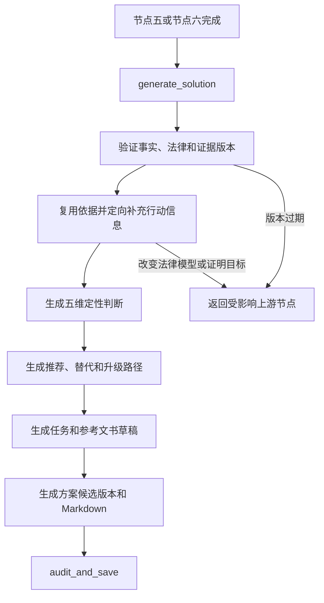

# `generate_solution` 行动方案生成节点说明书

> 文档状态：正式节点说明，已接入 GuideGraph、节点八正式审校保存、FastAPI、Gradio 和电脑网页端行动方案面板
> 编写日期：2026-08-01
> 所属工作流：维权助手 GuideGraph
> 节点序号：节点七
> 关联文档：`维权工作流优化说明书.md`、`plan_evidence节点说明书.md`、`证据评估节点说明书.md`、`知识库数据内容详细说明书.md`

## 1. 节点定位

`generate_solution` 是维权助手目标八节点工作流中的第七个核心节点，负责把已经确认的案件事实、法律模型和证据覆盖转化为用户可以执行的行动方案。

```text
plan_evidence
      |
      +-- 用户暂不提交材料 ------------------+
      |                                     |
      v                                     v
用户提交证据                         条件式方案输入
      |                                     |
      v                                     |
assess_evidence                             |
      |                                     |
      +------------------+------------------+
                         v
                generate_solution
                         |
                         v
                audit_and_save
                         |
                         v
                        END
```

一句话定义：

> `generate_solution` 负责确认“在当前事实、法律依据和证据覆盖条件下，用户应该先做什么、可以走哪些路径、当前维权形势如何，以及后续任务和参考文书如何组织”。

节点七生成的是待审校方案，不直接发布最终版本。节点八完成事实、法条、证据边界、逻辑和 Markdown 审校后，才能保存并向用户展示。

当前实现边界：

| 已实现能力 | 当前行为 |
|---|---|
| 独立图节点 | `GuideGraph` 已暴露 `generate_solution`，节点六完成后先进入节点七 |
| 条件式方案 | 用户暂不提交材料但明确要求出方案时，节点五可直接进入节点七 |
| 上游版本校验 | 绑定事实快照、法律模型、证据计划和证据评估版本；过期状态返回对应上游节点 |
| 五维定性判断 | 输出权利基础、事实清晰度、证据覆盖、程序可行性和履行风险 |
| 四级结果 | 用户可见等级只使用“较有利、条件性有利、不确定、风险较高” |
| 行动规划 | 生成当前行动、推荐路径、替代/升级路径及进入、升级和停止条件 |
| 长期任务 | 任务具有稳定 ID、状态、优先级、依赖和完成标准；不会假装任务已经完成 |
| 参考文书 | 生成文书类型建议和缺失字段，占位信息不得补造 |
| 方案版本 | 生成 `plan_version_candidate`、指纹、变化摘要和定性等级变化 |
| 前端/Gradio | 共用同一结构化方案；网页端单独展示定性等级、五维判断、行动、路径和任务 |

正式流程已经直接进入 `audit_and_save`。节点八通过审校后分配正式 `plan_version`、保存完整版本包并返回最终 Markdown；`conclude` 只保留给旧会话，不再承担正式草稿的默认呈现。

## 2. 节点职责

### 2.1 应当负责

- 验证事实、法律、证据计划和证据评估版本是否匹配；
- 读取用户请求、法律关系、权利基础和程序候选；
- 读取单份材料评估、整体证明目标覆盖和证据缺口；
- 区分已确认、未知、冲突和条件式事实；
- 区分已提交、未提交、明确没有、可调取和待核验材料；
- 从权利基础、事实清晰度、证据覆盖、程序可行性和履行风险五个维度生成结构化判断；
- 使用定性等级表达当前维权可能性；
- 说明提高、降低和限制当前判断的因素；
- 生成当前即可执行的低风险行动；
- 生成推荐路径、替代路径和升级路径；
- 为每条路径说明适用条件、依赖事实、依赖材料和停止条件；
- 必要时定向检索官方办理渠道、程序步骤、材料要求、示范文本和易变信息；
- 将方案拆成可长期管理的行动任务；
- 生成参考文书类型建议和有事实依据的草稿；
- 用户没有提交材料时生成明确标注证据缺口的条件式方案；
- 后续事实、证据或程序进展变化时只重算受影响部分；
- 生成方案版本候选和相对上一版本的变化摘要；
- 将结构化方案草稿交给 `audit_and_save`。

### 2.2 不应负责

- 不从用户原话中重新提取或写入事实；
- 不静默解决事实冲突；
- 不重新固化法律关系、请求权或正式证据清单；
- 不重新解析图片、PDF、DOCX、音频或视频；
- 不重新评估单份材料真实性、合法性、可采性或证明力；
- 不把用户称持有材料写成已经提交或已经评估；
- 不把类案当作现行法律或结果保证；
- 不以网页搜索结果替代现行法条和官方来源；
- 不输出胜诉率、成功率百分比或保证性表述；
- 不猜测对方财产、经营状态或履行能力；
- 不编造办理机构、期限、费用、地址或材料要求；
- 不生成包含虚构姓名、地址、日期、金额或案号的文书；
- 不直接发布、保存或覆盖最终方案版本；
- 不代替节点八完成正式审校。

### 2.3 与节点五、节点六的边界

```text
plan_evidence
→ 本案需要证明什么、建议准备什么

assess_evidence
→ 用户实际提交了什么、当前能支持什么

generate_solution
→ 在当前条件下应该怎么行动
```

节点七只能消费节点五、节点六的结构化结果。发现法律模型或证明目标需要改变时，必须返回上游节点，不能在方案文本中静默修改。

### 2.4 与节点八的边界

```text
generate_solution
→ 生成结构化方案草稿、任务草稿、文书草稿和版本变化候选

audit_and_save
→ 审校事实、法律、证据、逻辑和格式
→ 保存并发布正式方案版本
```

节点七可以执行内部结构验证，但不能把这种验证替代节点八的独立审校。

## 3. 核心设计原则

### 3.1 方案必须绑定当前案件版本

节点七必须绑定：

```text
fact_snapshot_version
fact_snapshot_hash
legal_model_version
evidence_plan_version
evidence_review_version
previous_plan_version
```

如果任一上游版本已经过期，节点七不得使用旧结论覆盖最新状态。

### 3.2 结论必须可追溯

每个核心判断至少绑定一种依据：

- 已确认事实；
- 事实快照中的未知或冲突状态；
- 已校验法律或程序依据；
- 证明目标覆盖状态；
- 单份材料评估；
- 官方办理渠道或程序说明。

没有依据时只能表达为未知、条件式或需要核对。

### 3.3 先说明条件，再给行动

方案不能只给出泛化建议：

```text
建议协商
建议投诉
建议起诉
```

每条路径必须回答：

```text
为什么适用
需要满足什么条件
当前已经满足什么
仍缺少什么
先做哪一步
何时升级或停止
```

### 3.4 维权可能性只做定性分层

用户可见等级固定为：

```text
较有利
条件性有利
不确定
风险较高
```

不得输出具体概率，也不得把内部模型分数直接展示给用户。

### 3.5 证据状态直接影响方案条件

```text
covered
→ 可以作为当前方案的支持因素

partially_covered
→ 必须说明限制和补强方向

conflicted
→ 不能作为稳定支持，应先核对

not_submitted
→ 可以生成条件式方案，但必须标记缺口

explicitly_absent
→ 需要评估替代材料和路径风险

third_party_available
→ 生成调取、申请或保存任务
```

### 3.6 行动优先级以风险和可逆性排序

通常按以下顺序组织：

1. 人身安全、紧迫期限和证据灭失保护；
2. 低成本、低风险、可立即执行的保存和核对行动；
3. 平台、协商、投诉或内部救济；
4. 调解、行政处理或仲裁；
5. 诉讼、保全和其他成本较高的升级路径；
6. 履行或执行阶段的后续安排。

具体案件可以调整顺序，但必须保存原因。

### 3.7 不重复检索或分析全部内容

节点七默认复用节点五、节点六已经校验的依据。只有行动执行信息缺失、易变或过期时才进行定向补充。

### 3.8 方案长期可更新

方案不是一次性答案。案件后续补充事实、材料或程序进展时：

```text
保留旧版本
→ 识别变化范围
→ 只重算受影响判断、路径和任务
→ 生成新版本候选
→ 节点八审校保存
```

## 4. 节点输入

### 4.1 案件和版本状态

```text
case_id
case_generation
workflow_stage
region
procedure_type
fact_snapshot_version
fact_snapshot_hash
legal_model_version
evidence_plan_version
evidence_review_version
previous_plan_version
```

### 4.2 事实状态

```text
confirmed_facts
unknown_fact_ids
conflict_group_ids
conditional_facts
claim_requests
requested_amounts
case_progress
guard_status
deadline_flags
evidence_loss_flags
```

未知和冲突必须原样进入方案边界，不能由节点七补全。

### 4.3 法律模型和依据

```text
legal_relations
claim_models
legal_basis_refs
procedure_basis_refs
limitation_basis_refs
jurisdiction_basis_refs
official_channel_refs
legal_basis_limitations
retrieval_traces
```

### 4.4 证据规划和评估

```text
proof_targets
formal_evidence_requirements
evidence_items
evidence_links
evidence_coverage
evidence_quality_gaps
content_conflicts
basis_refs
assessment_change_summary
```

### 4.5 历史方案和任务

```text
previous_solution
previous_likelihood_tier
previous_case_tasks
previous_document_drafts
changed_fact_keys
changed_evidence_ids
changed_progress_keys
```

首次生成时这些字段可以为空；后续生成时用于局部重算和变化说明。

## 5. 节点触发条件

### 5.1 正常触发

- 节点六完成本批证据评估；
- 用户暂不提交证据并要求按当前信息继续；
- 用户明确表示没有更多材料；
- 用户要求“现在生成方案”且节点五已完成最低法律和证据规划；
- 方案生成后新增或替换材料完成重评；
- 方案生成后事实或程序发生实质变化；
- 用户要求根据当前版本重新生成方案。

### 5.2 不应触发

- 案件边界尚未确认；
- 现实危险仍处于暂停状态；
- 连基本事件、主体和诉求都无法识别；
- 事实快照尚未确认且用户未选择条件式继续；
- 法律模型或证据计划版本已经过期；
- 材料正在上传但批次尚未完成；
- 节点六仍等待本轮唯一一次材料核验。

## 6. 检索边界

### 6.1 默认复用已有依据

节点七默认读取：

```text
节点五已校验的法条、程序、期限、管辖和官方依据
节点六已校验的证据规则和材料评估依据
案件内已经保存的官方渠道和模板
```

不得为了生成更长的回答重新执行无边界全库检索。

### 6.2 允许的定向检索

节点七可以检索：

- 当前救济路径及其适用条件；
- 官方投诉、仲裁、诉讼、调解或法律援助渠道；
- 官方网上办理入口和联系方式；
- 程序步骤、前置条件和提交方式；
- 当前有效的期限、费用和地域性要求；
- 官方材料目录和受理说明；
- 官方示范文本和表单；
- 合法保存、调取或申请证据的方式；
- 经过审核的方案规则和任务模板；
- 必要的类案解释材料。

### 6.3 检索等级

| 等级 | 说明 |
|---|---|
| `reuse` | 复用节点五、节点六已经校验的依据，默认模式 |
| `targeted_action` | 补充办理渠道、步骤、材料、模板等执行信息 |
| `refresh` | 刷新期限、费用、平台规则、地址等易变信息 |
| `return_upstream` | 新结果可能改变法律关系、请求权、证明目标或证据清单 |

节点七不能执行新的完整法律建模。触发 `return_upstream` 时应停止受影响方案部分并返回对应节点。

### 6.4 检索顺序

```text
1. 复用已校验法律和证据依据
2. 确定推荐路径及缺少的执行信息
3. 检索官方渠道和程序条件
4. 检索官方材料要求和示范文本
5. 刷新易变期限、费用和地址
6. 类案只作解释补充
```

### 6.5 允许的数据源

```text
PostgreSQL laws / articles
PostgreSQL authority_sources / authority_versions
Milvus statute_index
Milvus authority_basis_index
经过审核的官方渠道和模板数据
Neo4j 法律、程序和渠道关系辅助图谱
Milvus case_index
可定位来源的外部 MCP
```

Milvus、Neo4j、类案和 MCP 都不能替代 PostgreSQL 或官方来源中的版本、效力和精确定位。

### 6.6 检索结果门槛

用户可见的具体行动依据至少需要：

```text
source_id
source_version_id
title
issuing_authority
locator
effective_status
applicable_region
applicable_procedure
official_url_or_snapshot
retrieved_at
```

`needs_pinpoint`、未审核、已失效或适用范围不明的内容只能形成内部缺口，不得用于确定机构、期限、费用或强制材料要求。

### 6.7 检索失败

检索失败时：

- 不编造机构、条号、期限、费用或地址；
- 不把旧缓存静默当作最新规则；
- 保留可以由现有事实和依据支持的低风险行动；
- 将缺失的执行信息标记为 `action_basis_gap`；
- 建议用户通过对应官方渠道核对；
- 不因一个渠道信息缺失而删除整个条件式方案。

## 7. 维权可能性模型

### 7.1 五个评估维度

| 维度 | 核心问题 |
|---|---|
| `rights_basis` | 用户请求是否有现行法律和程序依据 |
| `fact_clarity` | 核心事实是否明确，是否存在重大未知或冲突 |
| `evidence_coverage` | 关键证明目标是否有实际材料支持 |
| `procedural_feasibility` | 主体、期限、管辖、渠道和前置程序是否可执行 |
| `performance_risk` | 对方身份、送达、履行和执行是否存在已知困难 |

### 7.2 单维度状态

建议内部使用：

```text
favorable
mixed
unfavorable
unknown
not_applicable
```

每个维度必须记录：

```text
status
positive_factors
negative_factors
unknown_factors
basis_refs
limitations
```

### 7.3 综合定性等级

用户可见等级：

| 等级 | 含义 |
|---|---|
| `较有利` | 权利基础和核心事实较清晰，关键证明目标已有较好覆盖，程序路径可执行 |
| `条件性有利` | 主要方向有依据，但仍依赖一个或多个可补充条件、材料或程序确认 |
| `不确定` | 关键事实、证据或程序条件仍不足，暂时不能形成稳定方向 |
| `风险较高` | 存在明显不利事实、重要证据缺失、程序障碍或履行困难 |

综合判断不是简单平均，也不能只由材料数量决定。

### 7.4 禁止百分比

以下表达禁止：

```text
胜诉率 80%
退款成功率 90%
基本稳赢
法院一定支持
```

可以表达：

```text
当前为条件性有利
如果能够补充收款人与卖家身份对应材料，判断可能上调
如果平台记录显示交易已经取消或款项未实际支付，判断可能下调
```

### 7.5 履行风险边界

履行风险只能使用：

- 用户确认的对方身份和联系方式；
- 已提交材料中的可定位观察；
- 经过授权且可验证的公开登记信息；
- 已发生的送达、平台处理或履行情况。

不得凭模型常识猜测对方没有财产、已经失联、具有欺诈意图或一定不会履行。

## 8. 行动方案生成

### 8.1 核心判断

核心判断至少说明：

- 当前法律关系和用户请求；
- 已经有依据支持的方向；
- 当前结论依赖的条件；
- 最关键的不确定性；
- 是否属于条件式方案。

### 8.2 当前可立即执行的行动

优先生成：

- 保存原始材料和原始载体；
- 导出平台、银行或聊天记录；
- 核对主体、金额、日期和订单；
- 保存投诉编号、回执和处理结果；
- 在已确认的紧迫期限前采取保护行动；
- 使用已校验官方渠道咨询或提交。

行动必须具体，但不能超出当前依据。

### 8.3 推荐路径

每条推荐路径建议包含：

```text
route_id
route_type
label
rationale
entry_conditions
current_condition_status
required_fact_ids
required_evidence_ids
authority_refs
first_action
expected_next_event
escalation_condition
stop_condition
risks
```

### 8.4 替代路径和升级路径

替代路径必须说明与推荐路径的差异：

- 适用条件；
- 成本和时间；
- 对主体信息和证据的要求；
- 是否需要前置处理；
- 在什么情况下升级；
- 哪些风险会增加。

不得为了显得完整而列出与当前案件无关的全部救济方式。

### 8.5 证据缺口对行动的影响

每个关键缺口至少映射到一个行动：

```text
收款人身份未对应
→ 获取完整账单、订单支付详情或平台主体信息

平台处理结果未明确
→ 保存工单编号并等待或查询正式回复

对方主体信息不足
→ 通过平台正式程序申请提供或保全主体信息
```

### 8.6 期限、费用和管辖

只有已有精确依据时才显示具体期限、费用或机构。否则使用：

```text
当前依据尚不足以确定具体截止日
建议通过以下官方渠道核对
在核对前先完成不会损害权利的保存和登记行动
```

## 9. 任务模型

节点七将行动拆成可管理任务：

```json
{
  "task_id": "task.platform.followup",
  "title": "保存并跟进平台投诉",
  "status": "pending",
  "priority": "high",
  "route_id": "route.platform_dispute",
  "reason": "平台正在处理且结果尚未明确",
  "depends_on_fact_ids": [],
  "depends_on_requirement_ids": [
    "platform.complaint"
  ],
  "authority_refs": [],
  "recommended_due_at": null,
  "due_basis_ref": null,
  "completion_criteria": "已保存工单编号、提交内容和平台正式回复",
  "blocking_reason": null
}
```

任务状态：

```text
pending
in_progress
completed
blocked
abandoned
superseded
```

具体日期只有在用户提供或检索到可靠期限依据时才填写。无法确定时使用相对条件，不猜测日期。

## 10. 参考文书

### 10.1 文书类型建议

节点七可以建议或生成：

- 协商和催告文本；
- 平台申诉说明；
- 行政投诉材料；
- 调解申请；
- 仲裁申请；
- 起诉状结构或草稿；
- 证据目录；
- 证据保全或财产保全申请的准备清单；
- 其他已有模板和适用依据的文书。

### 10.2 文书生成条件

文书必须绑定：

```text
fact_snapshot_version
legal_model_version
plan_version_candidate
document_type
template_source_ref
```

### 10.3 禁止补造

以下字段缺失时使用明确占位：

```text
[待补充对方姓名或主体名称]
[待补充送达地址]
[待核对具体日期]
[待确认请求金额]
[待确认受理机构]
```

不得根据聊天账号、昵称或模型推测生成真实姓名、地址、身份证号或机构名称。

## 11. 条件式方案

### 11.1 触发条件

- 用户暂不提交证据；
- 用户明确没有某项材料；
- 用户要求按当前信息继续；
- 仍有非阻断性未知或冲突；
- 法律或程序依据部分缺失；
- 证据评估只能形成部分覆盖。

### 11.2 必须展示的限制

条件式方案必须包含：

- 当前结论基于哪些用户陈述；
- 哪些事实尚未确认；
- 哪些证明目标未覆盖；
- 哪些法律或程序信息仍需核对；
- 哪些行动当前仍然低风险；
- 哪个新增事实或材料最可能改变判断。

### 11.3 不得降低为“无法回答”

只要已经存在最低可行动案件模型，节点七应当给出：

```text
证据保存
事实核对
官方渠道确认
低风险投诉或协商准备
后续升级条件
```

不能因为证据不齐只回复“请咨询律师”。

## 12. 版本和局部重算

### 12.1 方案版本候选

节点七输出：

```text
plan_version_candidate
based_on_fact_snapshot_version
based_on_legal_model_version
based_on_evidence_plan_version
based_on_evidence_review_version
previous_plan_version
```

正式 `plan_version` 由节点八审校通过并保存后确定。

### 12.2 变化范围

```text
changed_fact_keys
changed_evidence_ids
changed_proof_target_ids
changed_legal_basis_ids
changed_progress_keys
```

### 12.3 局部重算

| 变化 | 重算范围 |
|---|---|
| 非实质背景补充 | 案件摘要或相关任务 |
| 关键事实变化 | 受影响判断、路径、任务和文书 |
| 新增证据 | 受影响证明目标、定性判断和行动优先级 |
| 材料冲突 | 对应判断、风险和核对任务 |
| 程序进展 | 当前任务、下一步和期限 |
| 法律依据更新 | 依赖该依据的结论、路径和文书 |

### 12.4 可能性变化

输出：

```text
likelihood_change = upgraded | downgraded | unchanged | newly_assessable
likelihood_change_reasons
```

只说明等级变化和原因，不展示隐藏分数。

### 12.5 旧版本保留

旧方案、任务和文书引用不得物理覆盖。节点七只生成候选版本，节点八负责原子保存和版本关系。

## 13. 节点输出

建议输出：

```json
{
  "case_id": "case-001",
  "case_generation": 3,
  "based_on_fact_snapshot_version": 2,
  "based_on_legal_model_version": 2,
  "based_on_evidence_plan_version": 3,
  "based_on_evidence_review_version": 4,
  "plan_version_candidate": "plan-draft:case-001:5",
  "previous_plan_version": "plan:case-001:4",
  "core_judgment": {},
  "likelihood_assessment": {
    "tier": "条件性有利",
    "dimensions": [],
    "positive_factors": [],
    "negative_factors": [],
    "unknown_factors": [],
    "limitations": []
  },
  "evidence_effect_summary": {},
  "recommended_routes": [],
  "alternative_routes": [],
  "immediate_actions": [],
  "case_tasks": [],
  "document_suggestions": [],
  "document_drafts": [],
  "action_basis_refs": [],
  "action_basis_gaps": [],
  "conditional_plan": true,
  "change_summary": {
    "likelihood_change": "unchanged",
    "changed_sections": [],
    "changed_task_ids": []
  },
  "draft_markdown": "",
  "generation_trace_id": "solution-generation-005",
  "next_route": "audit_and_save"
}
```

### 13.1 最小输出字段

```text
plan_version_candidate
core_judgment
likelihood_assessment
evidence_effect_summary
recommended_routes
alternative_routes
immediate_actions
case_tasks
document_suggestions
action_basis_refs
action_basis_gaps
conditional_plan
change_summary
draft_markdown
generation_trace_id
next_route
```

## 14. 用户可见 Markdown

节点七生成的草稿至少包含：

```markdown
## 核心判断

## 已确认事实

## 法律依据与适用条件

## 证据检验结果

## 证据缺口与替代材料

## 有利、不利和不确定因素

## 当前维权可能性

## 推荐行动方案

## 替代与升级路径

## 下一步任务清单

## 参考文书

## 版本变化与限制
```

格式要求：

- 使用标准 Markdown；
- 标题、正文和列表之间保留空行；
- 事实、法律、证据和行动分区展示；
- 重点金额、期限和行动可以加粗；
- 不使用一整段连续长文本；
- 不重复大段用户原话；
- 不展示内部状态键、检索分数、模型推理或调试信息；
- 电脑网页端和 Gradio 使用同一份结构化草稿。

## 15. 路由设计



### 15.1 正常路由

```text
next_route = audit_and_save
```

### 15.2 法律模型需要变化

```text
发现新的请求权条件或法律关系分叉
→ plan_evidence
```

### 15.3 证据评估需要变化

```text
发现材料覆盖版本过期或材料需要重新解析
→ assess_evidence
```

### 15.4 事实需要确认

```text
发现新的案件事实缺口或重大冲突
→ update_facts
→ decide_facts
```

### 15.5 用户暂不提交材料

```text
evidence_review_version 可以为空
conditional_plan = true
→ generate_solution
→ audit_and_save
```

## 16. 与其他节点的接口

| 节点 | 节点七读取或交付的内容 |
|---|---|
| `prepare_case` | 案件归属、事件类型、历史方案和用户控制指令 |
| `guard_case` | 安全、期限、证据灭失和财产紧迫风险 |
| `update_facts` | 只读取已落盘事实，不直接修改 |
| `decide_facts` | 事实充分度、未知、冲突和条件式继续状态 |
| `plan_evidence` | 法律模型、正式依据、证明目标、证据计划和官方渠道 |
| `assess_evidence` | 单份材料报告、整体覆盖、冲突和证据缺口 |
| `audit_and_save` | 交付结构化方案草稿、任务、文书、依据和版本候选 |

## 17. 当前代码映射

当前节点七已经独立接入，旧逻辑继续作为兼容边界：

| 当前实现 | 当前职责 |
|---|---|
| `src/agents/legal_guide/generate_solution.py::run_generate_solution` | 节点七入口，负责版本校验、结构化草稿和路由结果 |
| `src/agents/legal_guide/generate_solution.py::build_likelihood_dimensions` | 生成五个定性评估维度 |
| `src/agents/legal_guide/generate_solution.py::derive_qualitative_likelihood` | 生成四级定性维权可能性 |
| `src/agents/legal_guide/generate_solution.py::build_immediate_actions` | 将风险和证据缺口转换为当前行动 |
| `src/agents/legal_guide/generate_solution.py::build_action_routes` | 生成推荐、替代和升级路径 |
| `src/agents/legal_guide/generate_solution.py::build_case_tasks` | 生成并继承长期任务状态 |
| `src/agents/legal_guide/generate_solution.py::render_solution_markdown` | 将结构化草稿渲染为稳定 Markdown |
| `src/agents/legal_guide/graph.py::node_generate_solution` | GuideGraph 正式节点七入口 |
| `src/agents/legal_guide/audit_and_save.py::run_audit_and_save` | 节点八入口，负责版本门禁、审校、发布和历史版本包 |
| `src/agents/legal_guide/graph.py::node_conclude` | 只保留旧会话的兼容呈现和原生成逻辑 |
| `src/agents/legal_guide/graph.py::_deterministic_conclusion_draft` | 模型失败时的确定性降级方案 |
| `src/agents/legal_guide/graph.py::_ensure_required_plan_sections` | 补齐路径、胜算评估和行动清单 |
| `src/agents/legal_guide/graph.py::_ensure_action_checklist` | 生成旧版行动清单兜底 |
| `src/agents/legal_guide/graph.py::_ensure_decision_uncertainties` | 补充决策边界 |
| `src/agents/legal_guide/graph.py::_ensure_evidence_coverage_section` | 补充证据作用和缺口 |
| `src/agents/legal_guide/graph.py::_ensure_case_reference` | 从结构化类案生成参考说明 |
| `src/agents/legal_guide/prompts.py::CONCLUDE_PROMPT` | 旧版结论提示词 |
| `src/agents/legal_guide/prompts.py::PLAN_AUDIT_PROMPT` | 旧 `conclude` 兼容流程使用的审校提示词；正式节点八不让模型重写事实 |

### 17.1 当前已有能力

- 节点七只读取结构化事实、法律模型和证据覆盖，不修改上游状态；
- 无材料时可以生成明确标注缺口的条件式方案；
- 五个维度均保留因素、依据和限制；
- 定性等级不使用内部置信分数或百分比；
- 已提交、未提交、明确没有和可调取材料保持不同状态；
- 每个关键证据缺口至少映射到一个行动；
- 路径具有进入、首个行动、升级和停止条件；
- 任务状态可以跨方案版本继承；
- 方案候选版本和变化摘要可重复计算和幂等复用；
- 模型不参与事实补造，Markdown 由结构化结果确定性渲染；
- 旧会话仍可进入原 `conclude` 生成路径。

### 17.2 当前仍需后续完善

- 生产环境任务状态变更、程序进展事件和任务审计接口仍需单独接入；
- 节点七当前默认复用节点五、六和现有渠道依据，易变期限、费用、地址的定向刷新可继续补强；
- 参考文书当前以类型建议和缺失字段为主，正式文书草稿仍通过现有文书服务生成；
- 旧 `HIGH/MEDIUM/LOW` 字段为兼容旧流程保留，但节点七用户输出不再使用它。

## 18. 重构建议

### 18.1 推荐模型

```python
class LikelihoodDimension(...)
class QualitativeLikelihoodAssessment(...)
class ActionRoute(...)
class ImmediateAction(...)
class CaseTask(...)
class DocumentSuggestion(...)
class SolutionChangeSummary(...)
class SolutionDraft(...)
```

### 18.2 推荐函数

```python
validate_solution_inputs()
build_likelihood_dimensions()
derive_qualitative_likelihood()
load_reusable_action_basis()
retrieve_targeted_action_basis()
build_immediate_actions()
build_action_routes()
build_case_tasks()
build_document_suggestions()
render_solution_markdown()
build_solution_change_summary()
checkpoint_solution_draft()
```

### 18.3 推荐模块边界

```text
generate_solution.py
├── solution_input_validation.py
├── qualitative_likelihood.py
├── action_basis_retrieval.py
├── action_route_planner.py
├── case_task_planner.py
├── document_suggestion.py
├── solution_versioning.py
└── solution_presenter.py
```

只有 `generate_solution` 是图节点。检索、五维评估、路径规划、任务生成和 Markdown 渲染是节点内部辅助模块。

审校和正式保存必须移动到：

```text
audit_and_save
```

## 19. API、前端和 Gradio

### 19.1 电脑网页端

方案页至少展示：

- 当前定性维权可能性；
- 五维判断及其依据；
- 有利、不利和未知因素；
- 证据覆盖和最关键缺口；
- 当前立即行动；
- 推荐、替代和升级路径；
- 行动任务、状态、依赖和完成标准；
- 参考文书；
- 当前方案版本和相对上一版的变化；
- 事实、证据和程序进展入口。

方案页不得只展示一篇长文章。应使用清晰的 Markdown 分区、证据覆盖表、路径列表和任务区域。

### 19.2 任务交互

用户可以：

- 标记任务开始、完成、阻塞或放弃；
- 记录平台、机构或对方的新回复；
- 补充事实或证据；
- 查看任务依赖的材料；
- 查看任务完成标准；
- 查看任务来自哪一版方案。

任务状态变化由后续案件事件处理，不能由节点七假装任务已经完成。

### 19.3 Gradio 一致性

Gradio 可以使用简化 Markdown 展示，但必须：

- 调用同一 `generate_solution`；
- 使用相同事实、证据和方案版本；
- 显示相同定性等级；
- 显示相同推荐路径和行动任务；
- 不恢复百分比胜率；
- 不绕过节点八审校；
- 支持在同一案件后续补充事实和证据。

## 20. 异常和降级

| 异常 | 处理 |
|---|---|
| 事实快照版本过期 | 不生成正式草稿，返回事实节点重新确认 |
| 法律模型版本过期 | 返回 `plan_evidence` |
| 证据评估版本过期 | 返回 `assess_evidence` 或生成明确条件式草稿 |
| 用户未提交材料 | 使用证据缺口生成条件式方案 |
| 行动检索失败 | 保留低风险行动并标记官方信息待核对 |
| 渠道或地址无法验证 | 不展示确定机构或地址 |
| 期限或费用无法验证 | 不生成具体数值，生成官方核对任务 |
| 类案为空 | 不影响方案，不生成虚构案例 |
| 方案模型超时 | 使用结构化事实、依据和覆盖生成确定性降级草稿 |
| 文书模板缺失 | 只建议文书类型和必要栏目 |
| 任务生成失败 | 保留推荐路径，并由确定性规则生成最小任务 |
| 方案草稿写入失败 | 不进入节点八发布，保存可重试检查点 |

## 21. 示例

### 21.1 闲鱼未发货案件

输入摘要：

```text
事实：用户通过闲鱼向个人卖家付款800元，对方未发货
诉求：退款
证据覆盖：
  交易关系 = partially_covered
  付款事实 = partially_covered
  未履行 = partially_covered
  平台投诉 = covered
未知：
  收款人与卖家身份是否对应
  卖家是否属于持续经营者
```

定性判断：

```text
权利基础 = favorable
事实清晰度 = mixed
证据覆盖 = mixed
程序可行性 = mixed
履行风险 = unknown
综合 = 条件性有利
```

推荐行动：

```text
1. 保存订单、付款账单、聊天和平台工单的原始记录
2. 获取能够显示订单、金额、日期和收款对象的完整支付详情
3. 继续平台退款处理并保存正式回复
4. 平台处理失败后，根据已核验主体和渠道信息选择投诉或民事路径
```

节点七不得写：

```text
卖家已构成诈骗
用户胜诉率90%
法院一定判决退款
```

### 21.2 用户没有提交材料

```text
conditional_plan = true
likelihood_tier = 不确定
```

仍然生成：

- 保存订单和聊天记录的行动；
- 核对付款和收款对象的任务；
- 平台争议处理路径；
- 后续提交材料后重新评估的说明。

## 22. 测试要求

### 22.1 单元测试

至少覆盖：

1. 输入版本一致时可以生成方案草稿；
2. 事实快照过期时不会使用旧事实生成正式草稿；
3. 法律模型过期时正确返回节点五；
4. 证据评估过期时不会静默复用；
5. 用户未提交材料时仍生成条件式方案；
6. `not_submitted` 不会写成明确没有；
7. `explicitly_absent` 会生成替代材料和风险说明；
8. `third_party_available` 会生成合法调取任务；
9. 五个评估维度均有状态、因素和依据；
10. 综合等级只使用四个允许值；
11. 输出不包含百分比胜率；
12. 内部数值分数不会展示；
13. 有利、不利和未知因素分别输出；
14. 推荐路径具有进入、升级和停止条件；
15. 无关救济方式不会为了完整性被全部列出；
16. 立即行动按照风险和可逆性排序；
17. 具体期限只有精确依据时才输出；
18. 具体机构、费用和地址均有有效来源；
19. `needs_pinpoint` 不作为确定行动依据；
20. 检索失败时不编造机构或期限；
21. 类案不替代现行法律；
22. 履行风险不使用无依据猜测；
23. 每个关键证据缺口映射到行动；
24. 文书缺失字段使用占位符；
25. 文书不会补造姓名、地址、日期和金额；
26. 任务具有依赖和完成标准；
27. 无期限依据时任务不生成虚假截止日；
28. 新证据只更新受影响判断和任务；
29. 非实质事实变化不会重建整个方案；
30. 可能性等级变化有明确原因；
31. 旧方案版本不会被节点七覆盖；
32. 模型失败时生成确定性降级草稿；
33. 方案草稿使用完整 Markdown 结构；
34. 节点七不会直接发布或保存正式版本；
35. 网页端和 Gradio 使用相同结构化输出。

### 22.2 集成测试

```text
assess_evidence
→ generate_solution
→ audit_and_save
```

验证证据覆盖、定性判断、路径、任务和审校交接。

```text
plan_evidence
→ 用户暂不提交证据
→ generate_solution
→ audit_and_save
```

验证无材料条件式方案。

```text
generate_solution
→ 定向检索发现法律模型变化
→ plan_evidence
→ generate_solution
```

验证上游回流。

```text
旧方案
→ 用户补交证据
→ assess_evidence
→ generate_solution
→ audit_and_save
```

验证局部重算、等级变化和新方案版本。

### 22.3 前端与 Gradio 一致性

同一案件版本下：

- 定性等级一致；
- 五维判断一致；
- 推荐路径一致；
- 行动任务一致；
- 依据和限制一致；
- 方案版本候选一致；
- 不出现网页端有条件式说明、Gradio 输出确定结论的分叉。

## 23. 最小实施顺序

### 第一阶段：节点和结构化输出

1. 新建独立 `generate_solution` 图节点；
2. 定义输入版本校验；
3. 定义五维定性判断模型；
4. 定义路径、任务、文书和方案草稿模型；
5. 将旧 `node_conclude` 的生成能力迁入节点七。

### 第二阶段：检索和行动规划

1. 复用节点五、节点六依据；
2. 增加定向行动信息检索；
3. 增加来源、版本、定位和刷新策略；
4. 增加推荐、替代和升级路径；
5. 增加低风险行动和证据缺口映射。

### 第三阶段：任务、文书和版本

1. 增加长期任务模型；
2. 增加文书建议和占位符安全；
3. 增加方案版本候选和变化摘要；
4. 增加局部重算；
5. 将正式保存和审校迁移到节点八。

### 第四阶段：联调

1. 接入节点六证据覆盖；
2. 接入无材料条件式方案；
3. 接入电脑网页端方案与进展页；
4. 让 Gradio 使用同一方案节点；
5. 完成后续补事实、补证、任务进展和版本测试。

## 24. 验收标准

满足以下条件才视为节点七完成：

1. 节点七只读取结构化事实，不直接修改事实黑板；
2. 输入与事实、法律、证据计划和评估版本绑定；
3. 法律和证据版本过期时正确回流；
4. 维权可能性基于五个维度形成；
5. 用户可见等级只使用较有利、条件性有利、不确定和风险较高；
6. 不输出胜诉率、成功率百分比或保证性语言；
7. 每个核心判断均有事实、法律或证据依据；
8. 已提交、未提交、明确没有和可调取材料不会混淆；
9. 无材料时仍能生成条件式行动方案；
10. 方案说明提高、降低和限制当前判断的因素；
11. 方案明确当前证据覆盖、缺口和最值得补充的材料；
12. 推荐路径具有适用条件、首个行动、升级条件和风险；
13. 替代路径与推荐路径的差异清晰；
14. 具体机构、期限、费用和材料要求均有有效来源；
15. 检索失败时不编造行动依据；
16. 类案只作解释参考；
17. 履行风险不使用无依据猜测；
18. 任务具有状态、依赖、完成标准和版本归属；
19. 文书草稿不会补造案件事实或主体信息；
20. 后续变化只重算受影响方案部分；
21. 新版本明确说明等级和行动变化；
22. 旧方案、任务和文书引用保留；
23. 节点七只生成候选版本，不直接发布；
24. 节点八可以独立审校和保存节点七输出；
25. 电脑网页端和 Gradio 使用相同方案、等级、任务和路由。

## 25. 最终节点定义

目标工作流中的节点七固定为：

```text
generate_solution
```

节点内部处理链：

```text
验证上游版本
→ 复用法律和证据依据
→ 必要时定向检索行动信息
→ 生成五维定性判断
→ 生成立即行动和推荐路径
→ 生成替代、升级路径
→ 生成任务和参考文书草稿
→ 生成方案版本候选和变化摘要
→ 生成结构化 Markdown 草稿
→ audit_and_save
```

节点七回答：

> 在当前事实、法律依据和证据覆盖条件下，用户应该采取哪些行动，以及当前维权形势处于什么定性等级。

节点八再回答：

> 这份方案是否严格遵守事实、法律、证据和表达边界，并将通过审校的版本可靠保存。
