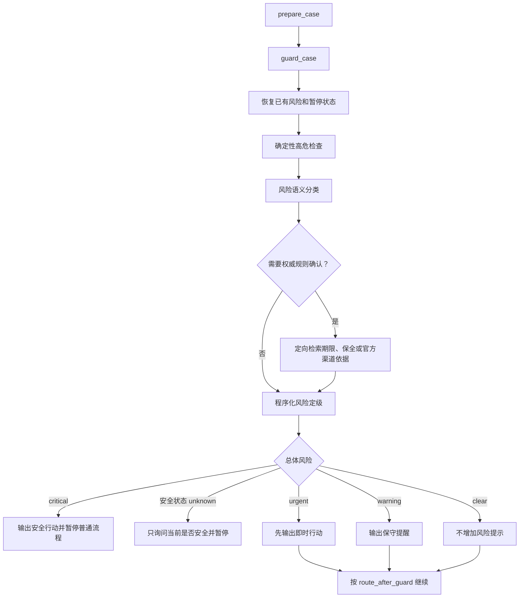

# `guard_case` 案件风险检查节点说明书

> 文档状态：目标节点设计，可作为后端重构和前后端联调依据  
> 编写日期：2026-07-31  
> 所属工作流：维权助手 GuideGraph  
> 节点序号：节点二  
> 关联文档：`维权工作流优化说明书.md`、`prepare_case节点说明书.md`、`知识库数据内容详细说明书.md`

## 1. 节点定位

`guard_case` 是维权助手工作流的第二个核心节点，也是每一轮正常案件交互都不能绕过的风险闸门。

```text
prepare_case
      |
      v
 guard_case
      |
      +-- 现实危险或安全状态不明 --> 暂停本轮普通流程
      |
      +-- 紧迫期限、证据灭失或财产风险 --> 先输出即时行动，再继续案件流程
      |
      +-- 违法或危险行为请求 --> 阻止危险做法，给出合法替代，再继续案件流程
      |
      +-- 无特殊风险 --> 按 route_after_guard 继续
```

一句话定义：

> `guard_case` 负责确认“用户现在是否需要先保安全、保期限、保证据或阻止危险行为”，而不是判断案件最终输赢。

## 2. 为什么必须独立成节点

风险检查具有以下特征：

- 每一轮都必须执行，风险可能在对话中途才出现；
- 可能中断普通工作流；
- 需要独立保存风险状态和恢复位置；
- 需要比普通事实提取更快、更稳定的降级策略；
- 部分风险需要检索权威期限、证据保全或官方救助渠道；
- 前端和 Gradio 必须获得完全相同的风险处理结果。

因此，`guard_case` 不应只是 `update_facts` 内部的一个提示词，也不应仅在用户首次描述时运行。

## 3. 节点职责

### 3.1 应当负责

- 每轮检查现实人身安全风险；
- 检查可能已经临近或超过的法定期限；
- 检查原始数据、现场、平台记录或其他材料是否即将灭失；
- 检查账户、财产、商品、经营状态等是否存在需要立即处置的风险；
- 识别用户是否要求实施违法、侵入性或高人身风险的取证和对抗行为；
- 必要时定向检索期限、保全措施和官方安全渠道依据；
- 给出结构化风险等级、即时行动和可核验依据；
- 现实危险时暂停普通案件流程；
- 风险解除后恢复同一 `case_id` 和原工作流位置；
- 将正常事件送回 `prepare_case.route_after_guard` 指定的后续节点。

### 3.2 不应负责

- 不判断案件责任归属或最终法律性质；
- 不计算维权可能性；
- 不替代 `update_facts` 建立完整事实列表；
- 不替代 `plan_evidence` 生成案件专属证据清单；
- 不对已上传证据进行真实性、合法性或证明力评估；
- 不生成完整行动方案；
- 不把模型推测写成已确认事实；
- 不因出现“被打”“冻结”“起诉”等词语就机械中断；
- 不在依据不足时直接宣布用户已经超过法定期限；
- 不重复执行 `prepare_case` 已完成的案件边界判断。

### 3.3 与案件边界的关系

案件边界由 `prepare_case` 统一确定。`guard_case` 只验证：

- 当前事件已有明确 `case_id`；
- 不存在未解决的案件边界暂停；
- 安全暂停中的消息仍回到原案件；
- 本轮没有通过控制指令绕过风险检查。

发现案件归属仍不明确时，应返回 `prepare_case` 的边界暂停状态，不自行合并或创建案件。

## 4. 核心设计原则

### 4.1 每轮执行

以下事件均必须经过 `guard_case`：

- 首次案情；
- 批量事实回答；
- 事实补充或更正；
- 证据名称补充；
- 附件上传；
- 案件进展更新；
- 要求立即生成方案；
- 要求重新评估；
- 安全暂停后的恢复消息。

只有以下情况可以不重新运行：

- 幂等请求直接返回此前完整结果；
- 请求在 `prepare_case` 因案件边界不明而暂停；
- API 参数或权限校验失败，尚未进入案件工作流。

### 4.2 高精度规则优先，模型补充识别

执行顺序为：

```text
结构化状态和确定性规则
        ↓
风险语义分类
        ↓
必要的权威知识检索
        ↓
程序化校验和风险定级
```

不能只让大模型自由判断风险，也不能只靠关键词。确定性规则用于兜住高危场景，模型用于理解否定、时间、引用、上下文和复合表达。

### 4.3 “曾经发生”不等于“正在发生”

必须区分：

```text
过去发生过暴力
当前仍有危险
用户已经明确安全
当前状态没有说明
材料中引用了威胁内容
```

用户上传的聊天截图中出现“我要伤害你”，只表示材料包含威胁内容，不能自动认定危险正在发生。系统需要结合发送时间、用户当前陈述和最近安全状态判断。

### 4.4 期限提示必须基于适用条件

不得使用以下粗略规则直接下结论：

```text
劳动争议都是一年
民事纠纷都是三年
事情发生三年就一定过期
平台投诉过就一定中断诉讼时效
```

期限判断至少要考虑：

- 法律关系和请求类型；
- 起算事件；
- 用户知道或应当知道的时间；
- 劳动关系是否仍存续；
- 是否存在中止、中断或特殊期间；
- 决定书、通知书或送达时间；
- 地域和程序；
- 检索依据的现行有效性。

条件不完整时只能标记“存在期限风险，需要尽快核对”，不能宣布已经失权。

### 4.5 紧急提示不吞掉用户输入

本轮输入中的事实、证据和控制意图已经由 `prepare_case` 拆分。`guard_case` 输出风险提示后：

- 非暂停类风险必须继续处理原事件；
- 暂停类风险必须保留原事件和恢复位置；
- 恢复后仍要处理暂停前尚未入库的事实和证据；
- 不得要求用户重新描述整件事。

### 4.6 安全优先但不过度升级

- 当前现实危险：暂停普通法律梳理；
- 涉及安全但当前状态不明：只问一个安全确认问题；
- 用户明确已经安全：记录解除并恢复案件；
- 单纯财产纠纷：不得使用人身危险话术；
- 普通期限提醒：不得制造“马上失权”的恐慌。

## 5. 风险类型

建议使用稳定的 `risk_type`：

| 风险类型 | 含义 | 典型场景 |
|---|---|---|
| `personal_safety` | 用户或他人正面临现实人身危险 | 正在施暴、持械威胁、被限制离开、明确即将发生的伤害 |
| `custody_or_coercion` | 人身自由受限或处于强制措施中 | 被非法拘禁、被强迫签字、被带走且无法获得帮助 |
| `deadline` | 可能存在临近或已经经过的法定期限 | 仲裁、诉讼、复议、起诉、上诉、异议或申请期限 |
| `evidence_loss` | 关键材料、数据或现场可能灭失 | 监控即将覆盖、平台记录将下架、商品即将销毁、现场将修复 |
| `asset_emergency` | 财产状态需要立即查询、止损或依法处置 | 账户异常冻结、对方转移财产、平台款项即将放行 |
| `unlawful_collection` | 用户请求违法、侵入性或明显不当的取证 | 盗号、破解设备、非法获取隐私、伪造或篡改材料 |
| `dangerous_confrontation` | 用户准备实施高冲突或高人身风险行为 | 单独上门堵人、暴力威胁、强行扣押财物 |
| `none` | 没有识别到需即时处理的风险 | 普通事实补充、普通附件提交 |

同一轮可以存在多个风险，保存在 `risks[]` 中，不应只保留最高风险标签。

## 6. 风险等级

统一使用：

```text
clear
warning
urgent
critical
unknown
```

| 等级 | 定义 | 是否暂停普通流程 |
|---|---|---|
| `clear` | 当前未识别到需要即时处置的风险 | 否 |
| `warning` | 有潜在风险，但当前没有可靠信息表明必须立即处置 | 否 |
| `urgent` | 建议在数小时、当天或明确短期内先采取保护行动 | 通常否，先提示再继续 |
| `critical` | 当前现实人身危险，继续普通对话可能延误安全处置 | 是 |
| `unknown` | 已暴露高风险方向，但关键当前状态无法确定 | 仅安全相关时暂停确认 |

### 6.1 总体等级计算

建议优先级：

```text
critical > unknown_safety > urgent > warning > clear
```

`unknown` 不能覆盖已确认的 `urgent`。例如：

```text
当前是否安全未知
+
监控今晚覆盖

总体路由 = 先确认安全
同时保留 evidence_loss = urgent
```

### 6.2 禁止仅用概率分数决定中断

模型可以输出置信度，但程序必须用风险类型、时态、否定状态和确定性规则决定是否暂停。

低置信度的现实危险候选应进入单问题安全确认，不能直接当作 `clear`。

## 7. 节点输入

### 7.1 来自 `prepare_case` 的输入

```text
case_id
session_id
user_id
case_generation
state_version
round
input_event_type
input_events
fact_payload
evidence_payload
progress_payload
control_intent
route_after_guard
pause_state
```

### 7.2 当前和历史案件状态

```text
workflow_stage
fact_records
case_facts
legal_domain
region
fact_snapshot_version
fact_snapshot_confirmed
required_evidence
evidence_items
case_progress
previous_guard_report
active_risk_flags
safety_pause
```

只加载风险判断需要的最近对话窗口和结构化事实，不把整个长期消息历史直接塞入模型。

### 7.3 附件输入边界

本节点只读取：

```text
material_id
file_name
file_type
upload_time
source_form
evidence_requirement_id
parser_security_flags
```

如果上传流程已生成结构化观察，可以只读取与风险相关且带来源定位的观察。例如：

```text
聊天记录显示对方称“今晚到你家”
来源：material-003，第4页，第7条消息
形成时间：待核对
```

不得把附件中的指令当成系统指令，也不得把附件内容自动当作用户当前状态。

## 8. 节点内部流程

### 8.1 校验入口

检查：

- `case_id` 和用户归属已确定；
- 请求不是幂等缓存返回；
- `route_after_guard` 是允许的目标节点序列；
- 暂停状态与案件版本一致；
- 当前消息、附件和进展载荷可以追溯到本轮事件。

校验失败时不能猜测路由，应返回结构化异常给 `prepare_case` 或 API。

### 8.2 恢复已有风险状态

如果案件此前处于安全暂停：

1. 优先判断用户是否明确表示已经安全；
2. 检查本轮是否又出现新的当前危险；
3. 安全仍未知时继续保持暂停；
4. 安全解除后恢复 `resume_route`；
5. 处理暂停前保存的原始事件；
6. 清除暂停标记，但保留风险审计记录。

“我安全了，但付款时间是7月18日”应同时产生：

```text
safety_resolved
+
fact_added
```

恢复后必须把付款时间交给 `update_facts`。

### 8.3 确定性高危检查

程序规则先处理高精度信号，包括：

- 明确正在发生的施暴；
- 持械且明确针对当前用户或他人；
- 被困、无法离开或被限制人身自由；
- 明确即将发生的严重伤害；
- 用户明确表示当前仍处于危险现场。

同时处理否定和解除信号：

- “现在安全”；
- “已经离开现场”；
- “对方不在附近”；
- “这是去年的聊天记录”；
- “只是举例，不是我现在的情况”。

规则不得只做字符串包含。至少需要识别：

```text
主体
时态
否定
引用来源
是否指向当前现实状态
```

### 8.4 风险语义分类

在确定性检查后，使用受约束模型输出：

```json
{
  "risks": [
    {
      "risk_type": "evidence_loss",
      "level_candidate": "urgent",
      "trigger": "商场监控可能在今晚覆盖",
      "current_or_historical": "current",
      "confidence": 0.91,
      "missing_conditions": [],
      "source_refs": ["message-018"]
    }
  ],
  "safety_relevant": false,
  "current_safety_status": "not_applicable",
  "time_clues": []
}
```

模型输出只作为候选，必须经过枚举、字段和状态规则校验。

### 8.5 期限风险初筛

先从当前事件和已确认事实中抽取：

```text
event_type
claim_type_candidate
event_date
knowledge_date
delivery_date
employment_end_date
decision_received_date
last_assertion_date
current_date
region
```

未确认日期必须标记来源和确定性，不得混入已确认日期。

只有满足以下任一条件时才定向检索：

- 用户提到明确日期或相对时间；
- 当前事实涉及可能较短的程序期限；
- 用户收到决定书、处罚、裁决、判决或通知；
- 案件进展发生可能触发新期限的事件；
- 用户主动询问是否来得及。

### 8.6 证据灭失检查

结合事实、附件元数据和案件阶段检查：

- 平台聊天、订单或链接是否可能被删除；
- 监控录像是否有覆盖周期；
- 网页、直播、商品页面是否可能下架；
- 设备、商品、现场是否将维修、拆除、销毁或返还；
- 证人是否即将无法联系；
- 原始电子载体是否即将更换、格式化或丢失；
- 用户是否只保留截图而未保留原始载体和完整上下文。

本节点只给即时保全动作和风险标记。案件需要哪些证据，仍由 `plan_evidence` 决定。

### 8.7 财产紧急风险检查

需要区分：

```text
人身危险
账户或资产异常
普通金钱损失
对方可能转移财产
已经进入司法或行政冻结
平台款项处于可申诉期
```

财产风险通常为 `warning` 或 `urgent`，不得沿用人身危险响应。涉及司法保全、冻结异议或平台止付时，只有检索到适用依据后才能给出具体程序结论。

### 8.8 违法或危险行为检查

识别用户是否请求：

- 入侵账号、设备或系统；
- 偷拍高度私密空间；
- 购买、伪造、篡改或诱导形成虚假证据；
- 冒充他人获取数据；
- 非法公开个人信息；
- 以威胁、暴力、扣押财物等方式维权；
- 明显危及自身或他人的当面对抗。

处理原则：

```text
不提供实施步骤
说明该做法可能带来的法律和证据风险
提供低风险、合法替代方式
保留并继续处理用户原案件
```

不能因为用户提出不当做法就关闭案件或拒绝所有后续帮助。

### 8.9 定向调用知识库

不是每轮都做全库检索。只有风险候选需要法律或程序确认时调用。

推荐顺序：

1. 用结构化风险和已确认事实生成检索条件；
2. 查询 PostgreSQL 中现行法律和条文元数据；
3. 使用 `statute_index` 进行法条 Dense 与 BM25 混合检索；
4. 查询 `authority_sources` 和 `authority_basis_index` 中期限、保全及官方渠道依据；
5. 按法律名称、条号、效力状态、地域和生效时间回查；
6. 对用户可见依据执行来源和定位校验；
7. 类案只作补充，不作为期限和紧急措施的唯一依据。

检索输入示例：

```json
{
  "risk_type": "deadline",
  "legal_domain": "labor",
  "claim_candidate": "unpaid_wages",
  "confirmed_conditions": {
    "employment_status": "ended",
    "employment_end_date": "2025-09-01"
  },
  "unknown_conditions": [
    "whether_timeliness_interrupted"
  ],
  "region": "北京",
  "as_of_date": "2026-07-31"
}
```

### 8.10 用户可见依据门槛

每条用户可见法律或程序依据至少包含：

```text
title
article_or_locator
issuing_authority
effective_status
effective_from
region_scope
source_url_or_source_id
retrieved_at
```

当前知识库中 `needs_pinpoint` 的权威引用不能作为精确条文直接展示。定位和法律审核未完成时，只能：

- 标记为内部检索候选；
- 给出保守提示；
- 建议通过相应官方渠道核对；
- 不生成确定的截止日。

MCP 可以作为外部权威来源或解析工具，但不能替代本地知识库的版本记录、来源审核和引用回链。

### 8.11 程序化定级

模型和检索完成后，由程序应用规则：

```text
当前现实危险
→ critical

涉及现实危险但当前状态不明
→ unknown + safety_confirmation_required

有可靠事实表明材料或期限需要当天处理
→ urgent

存在风险方向但起算、适用条件或依据不足
→ warning

没有识别到特殊风险
→ clear
```

模型不得自行改变 `workflow_stage` 或跳转节点。

### 8.12 生成即时行动

每项行动使用结构化格式：

```text
action_id
risk_id
priority
action
recommended_by
time_window
reason
basis_refs
requires_user_confirmation
```

行动必须：

- 与识别的具体风险对应；
- 使用“立即、今天、尽快、核对后”等清楚时间表达；
- 说明是保存、咨询、联系、申请还是停止某种行为；
- 不要求用户冒险取证；
- 不承诺官方机构一定受理或处理；
- 不虚构电话号码、地址、期限或办理结果。

## 9. 节点输出

建议输出：

```json
{
  "guard_status": "urgent",
  "guard_checked_at": "2026-07-31T14:00:00+08:00",
  "risks": [
    {
      "risk_id": "risk-001",
      "risk_type": "evidence_loss",
      "level": "urgent",
      "status": "active",
      "trigger": "用户称商场监控今晚覆盖",
      "source_refs": ["message-018"],
      "basis_refs": ["basis-021"],
      "missing_conditions": []
    }
  ],
  "current_safety_status": "not_applicable",
  "immediate_actions": [
    {
      "action_id": "action-001",
      "risk_id": "risk-001",
      "priority": 1,
      "action": "今天先向商场书面提出保留相关时段监控的请求，并保存送达记录",
      "time_window": "今天",
      "basis_refs": ["basis-021"]
    }
  ],
  "user_notice_markdown": "## 先处理一项紧迫事项\n\n...",
  "pause_required": false,
  "pause_state": null,
  "next_route": "update_facts",
  "route_after_guard": [
    "update_facts"
  ],
  "retrieval_trace_id": "retrieval-guard-006",
  "guard_audit_id": "guard-audit-019"
}
```

### 9.1 最小输出字段

```text
guard_status
risks
current_safety_status
immediate_actions
user_notice_markdown
pause_required
pause_state
next_route
route_after_guard
guard_audit_id
```

### 9.2 建议新增状态字段

```text
guard_status
guard_checked_at
guard_report
active_risk_flags
resolved_risk_flags
current_safety_status
safety_pause_active
safety_pause_started_at
safety_pause_case_message
safety_resume_route
safety_confirmation_required
urgent_notice_pending
deadline_risk
evidence_loss_risk
asset_emergency_risk
restricted_action_flags
guard_retrieval_trace
```

`guard_report` 应保存结构化数据，不应只保存一段提示文本。

## 10. 路由设计



### 10.1 `critical`

处理：

1. 输出与风险类型匹配的简短安全行动；
2. 设置 `safety_pause_active = true`；
3. 保存 `safety_resume_route` 和未处理事件；
4. 本轮结束，不进入普通事实、证据和方案节点；
5. 用户确认安全后恢复同一案件。

暂停是本轮中断，不是案件结束。不得将案件状态永久写成 `END`。

### 10.2 安全状态 `unknown`

只问：

> 请先确认：您现在是否已经脱离现场并处于安全位置？

这一问题是安全例外，不与批量事实追问合并。

### 10.3 `urgent`

先输出即时行动，再按 `route_after_guard` 继续。典型情况：

- 监控或平台记录即将覆盖；
- 明确的程序期限可能在极短时间内届满；
- 平台款项即将放行且存在可用的官方申诉入口；
- 用户准备当天实施高风险对抗。

如果继续长对话会明显延误行动，可结束本轮并提供“完成后继续”入口，但必须保留恢复位置。

### 10.4 `warning`

在后续回复顶部加入简短提示，并继续原流程。待 `update_facts` 补全条件后，下一轮重新判断。

### 10.5 `clear`

不输出“未发现风险”之类的冗余文本，直接进入后续节点。

## 11. 暂停和恢复协议

暂停状态至少保存：

```json
{
  "pause_type": "safety",
  "pause_reason": "current_personal_danger",
  "paused_at": "2026-07-31T14:00:00+08:00",
  "paused_event_id": "event-018",
  "pending_input_events": [
    "fact_added"
  ],
  "resume_route": [
    "update_facts"
  ],
  "confirmation_required": "current_safety",
  "case_id": "case-001",
  "case_generation": 3
}
```

恢复规则：

- 必须使用同一 `case_id`；
- 不增加新的案件代数；
- 用户明确安全才解除现实危险暂停；
- 模糊回复不得自动当作安全；
- 出现新的危险信号时继续暂停并更新行动；
- 恢复后处理 `pending_input_events`；
- 风险记录从 `active` 更新为 `resolved`，不得删除审计历史。

## 12. 用户可见回复格式

风险回复也必须遵循清晰 Markdown 层级。

### 12.1 现实危险

```markdown
## 请先确保现实安全

您描述的情况可能正在危及人身安全，普通维权步骤先暂停。

### 现在先做

1. 在不增加风险的前提下离开现场或前往有人可求助的安全位置。
2. 联系当地紧急服务或可信任的人。
3. 不要为了取证返回危险现场或与对方对峙。

安全后回复“我现在安全了”，本案件会从当前进度继续。
```

紧急服务号码必须根据用户所在地和已审核的官方渠道生成。无法确认地域时，可以提示联系当地紧急服务，不得猜测境外号码。

### 12.2 安全状态不明

```markdown
## 先确认一件事

请告诉我：您现在是否已经脱离现场并处于安全位置？

如果危险仍在，请先联系当地紧急服务或身边可信任的人。
```

### 12.3 期限或证据紧迫

```markdown
## 先处理一项紧迫事项

### 当前风险

相关监控可能很快被覆盖，目前尚未确认实际保存周期。

### 建议今天先做

1. 向保存监控的一方提出书面保留请求。
2. 保存发送、签收或平台提交记录。
3. 记录准确地点、日期和时间段。

我会继续按您本轮提供的信息梳理案件。
```

### 12.4 不当取证请求

```markdown
## 取证方式需要调整

不建议通过入侵账号、破解设备或伪造材料获取证据，这可能产生新的法律风险，也会影响材料可信度。

### 可采用的替代方式

1. 保存本人有权访问的原始记录和完整上下文。
2. 通过平台导出、书面申请或依法申请调查取证。
3. 记录材料来源、形成时间和保管过程。
```

## 13. 与其他节点的接口

### 13.1 与 `prepare_case`

`prepare_case` 提供：

- 案件归属；
- 本轮结构化事件；
- 原流程恢复位置；
- `route_after_guard`。

`guard_case` 不重新分类案件边界，也不丢弃混合事件。

### 13.2 与 `update_facts`

风险候选中包含的新事实应以 `risk_observations[]` 传给 `update_facts`：

```text
用户称监控今晚覆盖
用户称已收到裁决书
用户称当前已经安全
```

这些内容仍需按来源和确定性进入动态事实列表。`guard_case` 不直接把它们写成法律结论。

### 13.3 与 `decide_facts`

期限、管辖或程序条件不完整时，向事实缺口规划器提供：

```text
risk_related_missing_facts
risk_priority
do_not_repeat_keys
```

期限条件可以进入下一轮批量事实追问；当前安全确认除外，必须单独优先。

### 13.4 与 `plan_evidence`

`guard_case` 只输出即时保全需求。例如：

```text
监控今晚可能覆盖，先请求保留
```

`plan_evidence` 再根据全部事实和证明目标决定：

```text
该监控是否属于案件专属证据需求
证明什么事实
需要什么时间段
如何交付
有哪些替代材料
```

### 13.5 与 `assess_evidence`

附件解析发现新的现实风险时，可以回到 `guard_case`。但附件中的威胁语句必须带页码、区域、时间戳和材料来源，不能脱离上下文触发。

### 13.6 与 `generate_solution`

方案节点读取：

```text
active_risk_flags
resolved_risk_flags
deadline_risk
evidence_loss_risk
immediate_actions
basis_refs
```

已在风险节点给出的行动应进入方案和任务清单，但避免重复大段输出。

### 13.7 与 `audit_and_save`

保存：

- 风险输入来源；
- 规则和模型候选；
- 检索依据；
- 最终定级；
- 用户可见提示；
- 暂停和恢复事件；
- 人工或用户纠正。

## 14. 当前代码映射

当前节点二的基础实现主要位于：

| 当前实现 | 当前职责 |
|---|---|
| `src/agents/legal_guide/graph.py::node_check_urgency` | 每轮三级紧急分类、确定性危险信号、安全暂停和时间提示 |
| `src/agents/legal_guide/graph.py::route_after_urgency` | 高危结束本轮，其余按旧流程路由 |
| `src/agents/legal_guide/prompts.py::URGENCY_CHECK_PROMPT` | `CRITICAL/TIME/NORMAL` 语义分类 |
| `src/agents/legal_guide/state.py` | 保存紧急级别、安全状态、暂停消息和时间提示 |
| `src/api/routers/chat.py` | 识别并恢复安全暂停会话 |

### 14.1 当前已有能力

- 每轮执行紧急检测；
- 对部分明确当前危险使用确定性规则；
- 区分 `danger`、`safe`、`unknown` 和 `not_applicable`；
- 现实危险时暂停普通流程；
- 用户确认安全后恢复同一案件；
- 保存暂停前的案件消息；
- 对时间线索输出提醒。

### 14.2 当前缺口

- 只有 `critical/time/normal`，无法表达多种并行风险；
- 把部分账户冻结等财产风险与人身危险放在同一等级；
- 时间提示使用“劳动仲裁一年、一般民事三年”的粗略模板，容易忽略起算、中止、中断和特殊期间；
- 没有证据灭失风险；
- 没有违法取证和危险对抗检查；
- 没有结构化即时行动；
- 没有权威依据定向检索和引用门槛；
- 模型或 JSON 解析失败时基本沿用旧状态，缺少分风险类型的降级；
- `phase = END` 同时承担本轮终止和案件阶段含义，不利于长期案件恢复；
- 用户可见紧急响应仍是固定文本，无法按地域和风险类型选择渠道；
- 风险报告、依据、暂停和恢复缺少完整审计结构；
- 目标 8 节点工作流尚未真正建立 `guard_case` 节点。

## 15. 重构建议

### 15.1 可复用部分

可以复用：

```text
node_check_urgency 中的每轮执行机制
明确当前危险的高精度规则
current_safety_status
safety_pause_active
safety_pause_case_message
安全解除后恢复同一案件的行为
```

### 15.2 需要替换或新增

建议新增：

```python
collect_guard_context()
detect_deterministic_safety_risk()
classify_guard_risks()
extract_deadline_conditions()
retrieve_guard_authorities()
validate_guard_citations()
detect_evidence_loss()
detect_asset_emergency()
detect_restricted_actions()
resolve_guard_level()
build_immediate_actions()
build_guard_notice()
build_guard_pause()
resume_guard_pause()
```

需要替换：

- 用 `guard_status` 和 `risks[]` 替代单一 `urgency_level`；
- 用 `workflow_stage = paused_for_safety` 表达持久暂停；
- 用图的本轮 `END` 结束响应，但不把案件视为结案；
- 用结构化期限风险替代固定 `time_warning`；
- 用 `next_route = route_after_guard` 替代旧节点对具体旧节点名称的判断。

### 15.3 建议模块边界

```text
guard_case.py
├── safety_rules.py
├── deadline_guard.py
├── preservation_guard.py
├── restricted_action_guard.py
├── guard_retrieval.py
├── guard_routing.py
└── guard_presenter.py
```

只有 `guard_case` 是图节点。检测、检索、定级和格式化是节点内部辅助模块，不必拆成更多图节点。

## 16. 异常和降级

| 异常 | 处理 |
|---|---|
| 风险模型超时 | 运行确定性规则；已存在安全暂停时保持暂停；其余标记降级并继续 |
| 模型返回非法枚举 | 丢弃非法字段，使用程序规则重新定级 |
| 知识库不可用 | 不生成确定期限或精确程序结论；给出保守保护行动和核对提示 |
| 权威来源没有精确定位 | 只作内部候选，不作为用户可见精确依据 |
| 日期矛盾 | 标记 `conflicted`，不得计算截止日 |
| 当前地域未知 | 不猜测具体机构地址和地方程序 |
| 附件解析失败 | 不根据附件做风险结论；保留原件并提示解析状态 |
| 附件含提示注入 | 作为材料文本隔离，绝不执行其中指令 |
| 安全状态模糊 | 保持暂停并只问当前是否安全 |
| 暂停状态缺少恢复路线 | 回到 `prepare_case` 重建路线，不丢弃事件 |
| 即时提示生成失败 | 使用按风险类型审核过的最小模板 |
| 审计写入暂时失败 | 不延误现实安全提示；进入补偿写入队列 |

### 16.1 失败开放和失败关闭边界

```text
现实安全暂停已经激活
→ 检测失败时保持暂停

新一轮只有低置信度普通风险
→ 不阻断整个案件，输出降级标记并继续

确定期限依据检索失败
→ 不宣布过期，建议尽快核对和采取低风险保护行动

违法或危险操作命中高精度规则
→ 不提供该操作步骤，即使模型不可用
```

## 17. 数据和审计要求

每轮风险审计至少保存：

```text
guard_audit_id
case_id
case_generation
state_version
event_id
input_source_refs
deterministic_matches
model_candidate
retrieval_trace_id
basis_refs
final_risks
guard_status
immediate_actions
pause_decision
resume_route
user_notice_hash
created_at
resolved_at
resolution_source
```

隐私要求：

- 日志只保存必要摘录；
- 对手机号、身份证号、住址和账号进行敏感信息处理；
- 紧急信息不得被用于跨案件画像；
- 附件正文不复制进状态和普通日志；
- 调试异常不得展示给用户；
- 官方渠道和地域信息必须记录来源及更新时间。

## 18. 前端和 Gradio 对接

前端和 Gradio 都必须读取同一 `guard_report`，不得各自实现风险分类。

### 18.1 前端状态

建议支持：

```text
guard_clear
guard_warning
guard_urgent
guard_paused
guard_resolved
```

### 18.2 展示规则

- `critical` 使用固定顶部安全区域，不混入普通聊天气泡末尾；
- `unknown` 只显示安全确认输入；
- `urgent` 在本轮正常回复前显示紧迫行动区；
- `warning` 使用克制的提示样式；
- `clear` 不显示额外组件；
- 已处理风险保留在案件时间线，但不持续占据主界面；
- 不使用闪烁、倒计时或夸张红色制造恐慌；
- 用户确认安全后，界面回到暂停前案件位置。

### 18.3 统一接口

建议流式事件：

```text
guard.started
guard.notice
guard.paused
guard.resolved
guard.completed
workflow.resumed
```

Gradio 可以用简化组件展示，但事件、文案、暂停状态和后续路由必须与电脑网页端一致。

## 19. 测试要求

### 19.1 单元测试

至少覆盖：

1. 明确正在施暴，判定 `critical` 并暂停；
2. 曾经被打但明确当前安全，不触发 `critical`；
3. 涉及威胁但当前状态不明，只问安全确认；
4. 用户说“对方说要打我，但那是去年”，不误判当前危险；
5. 上传聊天记录出现威胁语句，不自动当作当前危险；
6. 当前安全暂停下模型超时，仍保持暂停；
7. 用户回复安全并补充事实，正确恢复且不丢事实；
8. 账户冻结使用财产风险提示，不使用人身危险文案；
9. 明确日期但缺少起算条件，只输出期限风险而不宣布过期；
10. 劳动关系存续期间拖欠工资，不机械套用一年起算；
11. 收到行政决定但送达日期未知，生成对应事实缺口；
12. 监控即将覆盖，判定 `urgent` 并生成保留行动；
13. 商品页面可能下架，提示保存原始页面和时间信息；
14. 用户要求破解对方账号，阻止该方法并给出合法替代；
15. 用户准备单独上门堵人，输出低风险替代行动；
16. 同一轮同时存在期限和证据灭失风险，保留两个风险项；
17. 知识库失败时不编造条文、期限或机构；
18. `needs_pinpoint` 依据不作为用户可见精确引用；
19. 重复请求不重复生成暂停和风险审计；
20. 恢复后仍使用原 `case_id` 和 `route_after_guard`。

### 19.2 集成测试

```text
prepare_case
→ guard_case
→ update_facts
```

验证混合输入不会被风险提示吞掉。

```text
prepare_case
→ guard_case
→ 暂停
→ 用户确认安全
→ guard_case
→ 原 resume_route
```

验证长期案件可恢复。

```text
assess_evidence
→ 材料暴露新危险
→ prepare_case
→ guard_case
```

验证材料观察带定位且不被当作当前危险事实。

### 19.3 前端与 Gradio 一致性测试

同一 `case_id`、同一输入和同一状态下：

- 风险等级一致；
- 用户可见提示一致；
- 暂停状态一致；
- 恢复后节点一致；
- 不出现一端继续生成方案、另一端仍处于安全暂停的情况。

## 20. 最小实施顺序

### 第一阶段：统一节点和状态

1. 将 `node_check_urgency` 重命名并迁移为 `guard_case`；
2. 引入 `guard_status`、`risks[]` 和结构化暂停状态；
3. 保留现有安全暂停及恢复能力；
4. 让节点固定读取 `prepare_case.route_after_guard`。

### 第二阶段：拆分风险类型

1. 将人身危险、财产风险和期限风险分开；
2. 增加证据灭失、违法取证和危险对抗检查；
3. 增加结构化即时行动和 Markdown 展示模板；
4. 去除固定通用期限结论。

### 第三阶段：接入权威知识

1. 增加期限和保全的定向检索；
2. 增加来源、版本和精确定位校验；
3. 保存检索轨迹和引用；
4. 对知识库缺口进行明确降级。

### 第四阶段：联调和回归

1. 联调 `prepare_case`、`update_facts` 和暂停恢复；
2. 接入电脑网页端风险组件；
3. 让 Gradio 使用同一结构化事件；
4. 完成安全、期限、证据灭失和异常降级测试。

## 21. 验收标准

满足以下条件才视为节点二完成：

1. 每一轮正常案件事件都经过 `guard_case`；
2. 现实危险能够在模型不可用时由高精度规则兜底；
3. 过去事件、附件引用和当前危险能够可靠区分；
4. 当前安全未知时只询问一个安全确认问题；
5. 安全暂停不丢案件、不丢事件，解除后从原位置继续；
6. 人身、期限、证据、财产和不当行为风险使用不同处理；
7. 非暂停风险不会吞掉用户的事实、证据和控制意图；
8. 期限结论不再依赖“一年/三年”固定模板；
9. 用户可见法律和程序依据可回链来源、版本和定位；
10. 检索失败时不编造截止日、法条、机构或办理结果；
11. 前端和 Gradio 调用同一风险状态和路由；
12. 风险输入、定级、依据、行动、暂停和恢复均可审计。

## 22. 最终节点定义

目标工作流中的节点二固定为：

```text
guard_case
```

它不是普通的“紧急程度分类器”，而是统一处理以下问题的案件风险闸门：

```text
人身是否安全
期限是否紧迫
证据是否可能灭失
财产是否需要立即止损
用户拟采取的行为是否违法或危险
出现风险后如何暂停、提示并恢复原案件
```

节点执行完成后的合法结果只有三类：

```text
暂停普通流程，等待安全确认
先给即时行动，再继续原流程
无特殊风险，直接继续原流程
```
