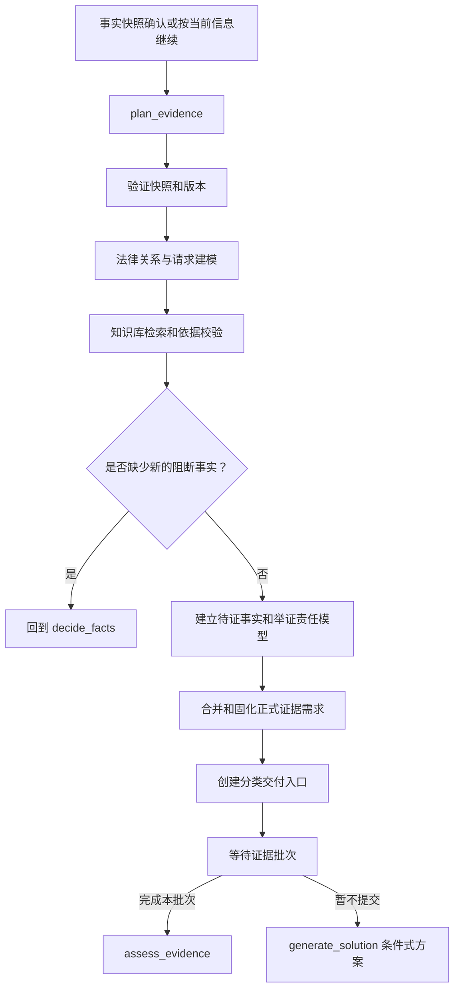

# `plan_evidence` 法律与证据规划节点说明书

> 文档状态：正式节点说明，已接入 GuideGraph、FastAPI DebugInfo 和电脑网页端证据工作台
> 编写日期：2026-08-01
> 所属工作流：维权助手 GuideGraph
> 节点序号：节点五
> 关联文档：`维权工作流优化说明书.md`、`update_facts节点说明书.md`、`decide_facts节点说明书.md`、`知识库数据内容详细说明书.md`、`证据评估节点说明书.md`

> 当前实现边界：节点五在事实快照确认后运行；正常完成后将案件暂停在 `await_evidence_batch`，由前端按正式证据需求开放逐项提交通道。节点五只规划证据，不评估材料真实性、合法性、可采性或最终证明力。旧 `assess_retrieve` 路径仍保留用于兼容旧状态和旧测试，不是新流程的首选入口。

## 0. 当前实现状态

| 能力 | 当前状态 |
|---|---|
| 事实快照版本和过期校验 | 已实现 |
| 法律关系、请求模型和待证事实建模 | 已实现 |
| 法律依据检索、来源过滤和降级记录 | 已实现 |
| 正式证据需求、稳定编号和版本幂等 | 已实现 |
| 每项需求的交付入口和提交模式 | 已实现 |
| 节点五回流节点四的阻断事实路径 | 已实现 |
| 事实阶段默认隐藏上传入口 | 电脑网页端已实现 |
| “完成本批次并评估”控制 | 电脑网页端已接入，路由至 `assess_evidence` |
| Gradio 同一状态字段展示 | 保留兼容，需按 Gradio 页面逐步补齐可视化 |

## 1. 节点定位

`plan_evidence` 是维权助手工作流的第五个核心节点，负责将用户确认的事实快照转化为法律模型、待证事实模型和正式证据清单。

```text
decide_facts
      |
      v
事实快照确认
      |
      v
plan_evidence
      |
      +-- 法律模型或关键事实不足 --> 回到 decide_facts
      |
      +-- 证据清单形成 --> 开放分类交付入口
      |
      +-- 用户暂不提交 --> 保留清单并允许条件式方案
```

处理顺序：

```text
确认后的事实快照
        |
        v
识别法律关系和责任主体
        |
        v
明确用户请求和请求权候选
        |
        v
检索适用法律、程序和权威依据
        |
        v
建立待证事实和举证责任模型
        |
        v
合并节点四累计的内部证据需求
        |
        v
固化正式证据清单和交付入口
```

一句话定义：

> `plan_evidence` 负责确认“为了支持用户的具体诉求，需要证明哪些事实、准备哪些材料，以及用户如何提交这些材料”。

## 2. 节点职责

### 2.1 应当负责

- 验证事实快照已确认，或用户已选择按当前信息继续；
- 读取确认事实、未知事实、冲突事实和用户诉求；
- 建立法律关系和责任主体候选；
- 将用户诉求拆分为请求权或程序目标候选；
- 按事实快照和诉求构造法律知识库检索输入；
- 检索现行法律、程序规则、期限、管辖和权威办理依据；
- 校验法律来源的版本、生效状态、发布机关和精确定位；
- 建立待证事实和证明目标；
- 结合程序类型和适用规则提出举证责任提示；
- 合并节点四累计的内部证据需求；
- 按稳定 `requirement_id` 去重、更新、停用和恢复证据需求；
- 为每个待证事实建立建议材料、替代材料和用途说明；
- 将建议需求分为必需、重要和补强；
- 关联用户已提到的证据名称和已经暂存的材料；
- 创建分类证据交付入口；
- 创建证据清单版本和变化摘要；
- 将证据清单交给前端和 Gradio 的证据工作台；
- 允许用户暂不提交、分批提交或明确没有某项材料；
- 发现新的阻断性事实缺口时回流 `decide_facts`；
- 将清单状态持久化，支持长期案件继续补证。

### 2.2 不应负责

- 不从用户消息中提取新的事实；
- 不自行确认或覆盖事实冲突；
- 不用用户声称持有材料替代法律和证明目标分析；
- 不判断用户上传材料的真实性；
- 不判断材料取得方式最终是否合法；
- 不认定材料具有最终可采性或证明力；
- 不保证某项请求一定成立；
- 不把系统建议表述成法院、仲裁机构或行政机关的固定材料目录；
- 不生成完整行动方案或维权可能性；
- 不要求用户一次上传全部证据；
- 不因没有提交全部材料而阻断条件式方案；
- 不把类案或系统规则当作现行法律条文；
- 不引用未定位、未审核或已失效的法律依据。

### 2.3 与节点四的边界

```text
decide_facts
→ 判断事实是否足够
→ 维护内部、临时、可变化的证据需求候选

plan_evidence
→ 结合法律关系、诉求、法律依据和举证责任
→ 固化正式待证事实和证据清单
```

节点五不重新启动普通事实问卷。法律建模产生新的关键事实缺口时，应通过结构化事件回到节点四。

### 2.4 与节点六的边界

```text
plan_evidence
→ 规划“应当证明什么、可以准备什么”

assess_evidence
→ 评估“用户提交的这份材料实际包含什么、能支持到什么程度”
```

节点五只能将材料标记为：

```text
用户称持有
已上传待评估
暂缺
可调取
明确没有
待归类
```

不能把任何材料标记为已证明。

## 3. 核心设计原则

### 3.1 事实快照是规划基线

节点五必须绑定：

```text
fact_snapshot_version
fact_blackboard_version
snapshot_hash
```

如果事实黑板已经发生变化，原快照标记为 `stale`，不能静默继续使用。

### 3.2 先法律分析，再固化证据

不能根据材料名称直接生成正式清单：

```text
用户说有付款截图
→ 不能直接认定付款截图是本案必需证据
```

必须先确定：

```text
用户诉求
→ 需要证明的事实
→ 适用的法律和程序
→ 证据可能承担的证明角色
→ 正式证据需求
```

### 3.3 证据需求不是证据结论

```text
建议准备付款记录
≠ 用户已经提交付款记录
≠ 付款记录真实完整
≠ 付款记录一定能证明付款
≠ 付款记录一定会被采信
```

### 3.4 “必需”是系统规划等级

`必需`、`重要`和`补强`表示对当前案件规划的相对优先级，不表示受理机构公布的强制清单。

用户可见文案必须使用：

```text
建议优先准备
通常有助于证明
如果无法提供，可考虑以下替代材料
```

避免使用：

```text
法院必须要求
没有该材料就不能立案
该材料一定可以胜诉
```

除非有明确、现行、精确定位的官方依据支持。

### 3.5 需求稳定、材料可变

同一个待证事实的证据需求使用稳定编号。材料可以新增、替换、停用或重新关联，但不重复创建证明目标。

```text
requirement_id = transaction.payment
proof_target_id = proof.transaction.payment
material_ids = [material-01, material-09]
```

### 3.6 保留缺口，不强迫上传

正式证据清单开放后：

- 用户可以暂不提交；
- 用户可以标记暂时找不到；
- 用户可以标记可向第三方调取；
- 用户可以明确没有；
- 用户可以先提交部分材料；
- 用户可以在方案生成后继续补充。

缺少材料只影响证据覆盖和方案置信度，不自动阻断事实流程或条件式方案。

### 3.7 知识库引用必须可审计

用户可见的法律依据至少需要：

```text
法律或规则名称
条文或精确定位
发布机关
版本和生效状态
适用地域或程序范围
官方来源或来源 ID
检索时间
```

当前知识库中 `needs_pinpoint` 或未完成法律审核的来源不能作为精确用户依据。

## 4. 节点输入

### 4.1 事实和案件状态

```text
case_id
case_generation
state_version
fact_blackboard
fact_blackboard_version
fact_snapshot_version
fact_snapshot_hash
fact_snapshot_confirmed
proceed_under_uncertainty
legal_domain_candidate
issue_candidates
region
claim_request
```

### 4.2 事实不确定性

```text
unknown_fact_ids
conflict_group_ids
advisory_gaps
unresolved_fact_keys
```

未知和冲突必须原样进入法律模型，不能由节点五补全。

### 4.3 节点四的内部需求

```text
internal_evidence_requirements
evidence_requirement_changes
requirement_dependency_fact_keys
```

节点五读取并进行法律依据校验、合并和正式化。

### 4.4 证据名称和已有材料

```text
evidence_name_inventory
submitted_material_refs
staged_material_refs
material_ids
material_hashes
```

用户称持有的材料和已经上传的材料都必须保留原始状态。上传记录不等于评估完成。

### 4.5 当前版本

```text
previous_evidence_plan_version
previous_legal_model_version
previous_plan_version
changed_fact_keys
changed_evidence_ids
```

首次规划没有前一版本，后续事实或证据变化时执行增量重算。

## 5. 法律模型

### 5.1 法律关系候选

建议输出：

```json
{
  "relation_id": "online_sale_transaction",
  "label": "网络交易买卖关系候选",
  "parties": [
    {
      "role": "buyer",
      "fact_refs": ["fact-001"]
    },
    {
      "role": "seller",
      "fact_refs": ["fact-002"]
    }
  ],
  "supporting_fact_keys": [
    "platform.name",
    "transaction.payment.pay_01.amount",
    "performance.delivery.status"
  ],
  "missing_conditions": [],
  "confidence_tier": "candidate",
  "basis_refs": []
}
```

法律关系候选不是最终责任结论。多个候选并存时必须保留差异和依赖条件。

### 5.2 用户请求模型

请求至少拆分为：

```text
request_id
request_type
requested_amount
requested_action
request_scope
supporting_fact_keys
unknown_conditions
```

例如：

```text
request_type = refund
requested_amount = 800 CNY
request_scope = 解除交易并返还付款
```

如果用户同时要求退款、赔偿和继续履行，应拆成多个请求目标，不能混成一个“解决问题”。

### 5.3 法律依据模型

每个法律模型结论必须关联：

```text
legal_model_id
candidate_relation
request_id
statute_refs
procedure_refs
limitation_refs
jurisdiction_refs
evidence_basis_refs
unknown_conditions
created_at
```

## 6. 知识库调用

### 6.1 检索输入

检索输入由程序从事实快照构造：

```json
{
  "case_id": "case-001",
  "legal_domain": "consumer_market",
  "relation_candidates": [
    "online_sale_transaction"
  ],
  "requests": [
    "refund"
  ],
  "confirmed_fact_summary": [
    "用户通过闲鱼向个人卖家付款800元",
    "卖家未发货"
  ],
  "unknown_conditions": [
    "卖家是否属于持续经营者",
    "双方是否约定具体发货日期"
  ],
  "region": "用户提供的地区或未知",
  "procedure_context": "平台处理进行中",
  "as_of_date": "2026-08-01"
}
```

未经确认的事实必须单独放进 `unknown_conditions`，不能混入检索的确定条件。

### 6.2 检索顺序

建议顺序：

```text
1. 法律领域和关系候选
2. 请求权或程序目标相关法条
3. 待证事实和证据规则
4. 期限、管辖和程序渠道
5. 官方办理指南和示范文本
6. 经过审核的类案和专业资料
```

类案不能替代现行法律、程序规则或证据依据。

### 6.3 数据源

当前可使用：

```text
PostgreSQL laws / articles
Milvus statute_index
Milvus authority_basis_index
authority_sources / authority_versions
Milvus case_index
Neo4j 法律关系辅助图谱
```

Neo4j 和类案索引只用于关系和候选检索，不替代法律原文、来源版本或精准引用。

### 6.4 混合检索

法律法条检索可使用：

```text
BM25
Dense
RRF
重排
PostgreSQL 精确查询兜底
```

查询应同时包含：

- 标准法律术语；
- 用户诉求；
- 已确认事实；
- 请求权候选；
- 程序类型；
- 地域和生效时间。

口语事实和法律术语不能无区分地喂入同一字面匹配通道。

### 6.5 依据校验

对每条候选依据检查：

```text
来源是否存在
版本是否具体
是否现行有效
是否完成法律审核
是否符合地域和程序范围
是否定位到条文、页码或栏目
是否支持当前表述
```

只有满足以下条件才允许进入用户可见依据：

```text
status = active
version = valid
review_status = approved
locator = precise
source_url_or_id = present
```

### 6.6 证据规则的当前边界

当前知识库可以支持：

- 初步证明目标映射；
- 材料可能用途；
- 替代材料建议；
- 领域事实规则；
- 部分程序和材料栏目。

当前不能支撑：

- 所有领域完整举证责任；
- 所有程序下的统一证明标准；
- 最终真实性、合法性、可采性和证明力；
- 电子数据规则的全面结论；
- 取得方式风险的最终判断。

节点五必须将这些限制记录到 `basis_limitations`，不能用法条数量替代证据规则完整性。

### 6.7 检索失败

检索不到可靠依据时：

- 不编造法条、条号、期限或机构；
- 不把相似法条改写为确定结论；
- 不把类案观点写成普遍规则；
- 记录 `retrieval_gap`；
- 继续建立保守的事实—证明目标映射；
- 允许先开放材料整理和低风险保全入口；
- 向用户提示需要通过官方渠道或专业人士核对。

## 7. 待证事实和证明目标

### 7.1 待证事实

待证事实是为了支持某个请求或程序，需要被材料、陈述或其他合法手段证明的事实命题。

例如：

```text
proof_target_id = proof.transaction.payment
label = 用户已经支付款项
purpose = 证明付款金额、时间和收款对象
dependent_fact_keys = [
  transaction.payment.pay_01.amount,
  transaction.payment.pay_01.date,
  transaction.payment.pay_01.payee
]
```

### 7.2 证明目标模型

建议：

```json
{
  "proof_target_id": "proof.transaction.payment",
  "relation_id": "online_sale_transaction",
  "request_id": "request.refund",
  "label": "用户已经付款",
  "proposition": "用户已向对方或平台支付约定款项",
  "dependent_fact_keys": [
    "transaction.payment.pay_01.amount",
    "transaction.payment.pay_01.date"
  ],
  "proof_roles": [
    "payment",
    "transaction",
    "time"
  ],
  "importance": "essential",
  "status": "active",
  "basis_refs": [],
  "unknown_conditions": []
}
```

### 7.3 证明目标与法律依据

每个目标应记录：

```text
request_id
legal_condition
fact_proposition
procedure_relevance
burden_note
basis_refs
limitations
```

`burden_note` 只能使用保守表述：

```text
通常需要准备能够支持该事实的材料
建议保留由用户控制的原始记录
具体证明责任可能受程序和对方抗辩影响
```

不能无依据地写成“全部由用户承担举证责任”。

## 8. 证据需求正式化

### 8.1 三层对象

```text
evidence_name_inventory
→ 用户提到或上传了什么

internal_evidence_requirements
→ 节点四根据事实变化生成的候选需求

formal_evidence_requirements
→ 节点五结合法律、证明目标和举证责任固化的清单
```

节点五可以调整节点四需求：

- 合并相同证明目标；
- 拆分不同主体或不同时间；
- 补充法律用途；
- 增加替代材料；
- 降低或提高当前规划重要性；
- 标记不适用；
- 关联用户已经提交的材料引用。

### 8.2 正式需求模型

```json
{
  "requirement_id": "transaction.payment",
  "proof_target_id": "proof.transaction.payment",
  "label": "付款记录",
  "purpose": "支持付款金额、时间和收款对象",
  "importance": "essential",
  "status": "active",
  "dependent_fact_keys": [
    "transaction.payment.pay_01.amount",
    "transaction.payment.pay_01.date"
  ],
  "recommended_materials": [
    "支付平台账单",
    "银行流水",
    "平台订单付款详情"
  ],
  "alternative_materials": [
    "平台导出记录",
    "收款方确认",
    "与订单绑定的其他支付凭证"
  ],
  "submission_modes": [
    "text",
    "image",
    "pdf",
    "docx",
    "native_electronic"
  ],
  "user_material_state": "user_claimed_present",
  "matched_evidence_name_ids": [
    "ename-003"
  ],
  "submitted_material_ids": [],
  "basis_refs": [],
  "basis_limitations": [],
  "generation_round": 3,
  "last_updated_round": 3,
  "change_reason": "fact_snapshot_confirmed"
}
```

### 8.3 重要程度

建议使用：

```text
essential
important
reinforcing
```

展示给用户时翻译为：

```text
优先准备
重要补强
可选补充
```

不得将 `essential` 解释为机关必然要求。

### 8.4 需求状态

```text
active
pending_fact_confirmation
not_submitted
temporarily_unavailable
user_claimed_unavailable
available_for_third_party_request
submitted
awaiting_assessment
partially_supported
stale
not_applicable
superseded
```

节点五只负责规划层状态。材料评估后的 `partially_supported` 等状态由节点六更新。

### 8.5 需求合并

以以下组合去重：

```text
proof_target_id
+ request_id
+ subject_scope
+ event_scope
+ time_scope
+ procedure_type
```

以下名称可归入同一需求：

```text
付款截图
支付凭证
微信支付记录
平台账单
```

但不同订单、不同主体、不同付款和不同程序事件必须拆分。

### 8.6 需求停用和恢复

事实变化时：

| 事实变化 | 需求处理 |
|---|---|
| 新增 | 创建或激活相关需求 |
| 未变化 | 复用 |
| 细化 | 补充范围、用途或材料形式 |
| 明确替代 | 重算依赖旧事实的需求 |
| 否认 | 将只依赖该事实的需求标记不适用 |
| 冲突 | 保留需求，标记待事实核对 |
| 旧事实被替代 | 停用旧关联但保留历史 |

物理删除需求会破坏长期案件和版本审计，禁止直接删除。

## 9. 证据交付入口

### 9.1 每项需求的入口

每项正式需求至少支持：

```text
text_input
image_upload
pdf_upload
docx_upload
native_electronic_upload
mark_later
mark_unavailable
mark_third_party
mark_not_available
```

用户可补充：

```text
source_form
acquisition_method
original_carrier_available
formation_time_known
identity_visibility
completeness_note
user_note
```

这些字段只是交付和后续评估输入，不是节点五的证据结论。

### 9.2 预上传材料

事实清单开放前已经上传的材料：

```text
保留 material_id 和文件指纹
标记 staged
不丢弃原件
不提前给出最终评估
正式清单生成后按证明目标归类
```

### 9.3 未列入清单的材料

用户提交未列入当前清单的材料时：

```text
接收
→ 标记 unclassified
→ 保留原始文件和来源
→ 节点六评估后关联一个或多个证明目标
```

不能拒收，也不能静默丢弃。

### 9.4 分批提交

清单开放后：

- 用户可以只提交一部分；
- 用户可以先填写文字说明；
- 用户可以标记暂缺；
- 用户可以点击“完成本批次并评估”；
- 未操作项保持 `not_submitted`；
- 方案生成后仍保持证据入口开放。

节点五不因材料未齐而循环要求用户上传。

## 10. 证据清单版本

### 10.1 版本字段

```text
evidence_plan_version
previous_version
fact_snapshot_version
legal_model_version
added_requirement_ids
updated_requirement_ids
deactivated_requirement_ids
reactivated_requirement_ids
changed_proof_target_ids
change_summary
created_at
```

### 10.2 初次固化

```text
evidence_plan_version = 1
previous_version = null
status = active
```

### 10.3 事实变化后

```text
事实实质变化
→ 重新确认或生成事实快照
→ 只更新受影响的证明目标和需求
→ 新 evidence_plan_version
```

已有材料和评估状态必须继承，不得要求用户重新提交未变化材料。

### 10.4 方案后补证

纯证据补充通常不需要重新建立法律关系：

```text
新增材料
→ assess_evidence
→ 更新覆盖
→ 生成新方案版本
```

如果材料暴露新事实或冲突：

```text
assess_evidence
→ update_facts
→ decide_facts
→ 必要时重新 plan_evidence
```

## 11. 节点内部流程

### 11.1 验证入口

检查：

- 事实快照属于当前 `case_id`；
- 用户已经确认快照，或明确选择按当前信息继续；
- 快照版本没有被新事实标记为 `stale`；
- 案件没有未解除的安全暂停；
- 本轮没有未处理的事实更正；
- 当前用户具有案件访问权限；
- 请求不是重复的清单生成请求。

### 11.2 读取事实基线

只读取：

```text
active facts
unknown facts
conflict groups
claim requests
case progress
region
internal evidence requirements
evidence name inventory
```

`superseded` 事实不得进入当前法律模型。

### 11.3 生成法律检索输入

程序从结构化事实生成查询，不让模型直接拼接未经验证的法律结论。

### 11.4 调用知识库

按第六节顺序执行检索，并保存：

```text
retrieval_trace_id
query_hash
retrieved_ids
scores
rerank_scores
source_versions
applied_filters
```

### 11.5 构建法律模型

结合检索结果和事实快照建立：

```text
relation_candidates
request_models
procedure_candidates
limitation_conditions
jurisdiction_conditions
proof_targets
evidence_basis_refs
```

法律模型中的每个结论都必须能回链事实和依据。

### 11.6 检查新阻断事实

如果法律模型需要的事实在快照中没有，且会改变关系、诉求、期限、管辖或证明目标：

```text
返回 decide_facts
missing_fact_keys = [...]
reason = "法律建模发现新的阻断性事实条件"
```

节点五不在内部直接追问用户。

### 11.7 建立证明目标

把每个请求拆为：

```text
请求目标
→ 法律条件
→ 待证事实
→ 推荐材料类别
→ 替代材料
→ 依据和限制
```

### 11.8 合并内部证据需求

根据 `requirement_id`、证明目标和事实依赖合并节点四需求。若法律模型与内部候选不一致，以当前有效法律模型为准，并保留变化原因。

### 11.9 关联用户材料

将节点三的：

```text
evidence_name_id
material_id
availability
```

映射到正式需求：

```text
matched_evidence_name_ids
submitted_material_ids
user_material_state
```

只建立可能关联，不做材料效力判断。

### 11.10 固化清单

正式清单必须包括：

```text
evidence_plan_version
proof_targets
formal_requirements
user_material_state
submission_modes
alternative_materials
basis_refs
limitations
change_summary
```

### 11.11 创建交付入口

每项需求创建稳定入口 ID：

```text
delivery_entry_id
requirement_id
accepted_input_modes
upload_limits
text_schema
status
```

入口必须与案件和清单版本绑定，不能用前端临时索引代替。

### 11.12 持久化

在返回用户证据工作台前保存：

- 法律模型版本；
- 检索轨迹；
- 证明目标；
- 正式证据需求；
- 证据清单版本；
- 交付入口；
- 未知条件和依据限制；
- 旧版本关联。

## 12. 节点输出

建议输出：

```json
{
  "case_id": "case-001",
  "fact_snapshot_version": 4,
  "legal_model_version": 2,
  "evidence_plan_version": 1,
  "plan_status": "active",
  "relation_candidates": [],
  "request_models": [],
  "retrieval_trace_id": "retrieval-plan-008",
  "proof_targets": [],
  "formal_requirements": [],
  "evidence_name_links": [],
  "delivery_entries": [],
  "unknown_conditions": [],
  "basis_limitations": [],
  "evidence_requirement_changes": [],
  "change_summary": "首次根据确认事实快照建立证据规划",
  "next_route": "await_evidence_batch",
  "plan_audit_id": "plan-audit-001"
}
```

### 12.1 计划状态

```text
draft
active
conditional
needs_fact_update
stale
retrieval_degraded
```

### 12.2 最小输出字段

```text
case_id
fact_snapshot_version
legal_model_version
evidence_plan_version
plan_status
relation_candidates
request_models
proof_targets
formal_requirements
evidence_name_links
delivery_entries
unknown_conditions
basis_limitations
next_route
plan_audit_id
```

### 12.3 建议新增状态字段

```text
legal_model
legal_model_version
legal_model_status
relation_candidates
request_models
retrieval_trace
retrieval_gap
proof_targets
formal_evidence_requirements
evidence_plan_version
evidence_plan_status
evidence_name_links
delivery_entries
plan_basis_refs
plan_basis_limitations
plan_change_summary
```

## 13. 路由设计



### 13.1 正常路由

```text
plan_evidence
→ await_evidence_batch
```

### 13.2 新阻断事实

```text
plan_evidence
→ decide_facts
→ update_facts
→ decide_facts
→ plan_evidence
```

循环必须记录原因和版本，不能无限回流。

### 13.3 证据清单开放前的预上传材料

```text
prepare_case 暂存材料
→ plan_evidence 正式归类
→ assess_evidence 批次评估
```

### 13.4 用户暂不提交

```text
plan_evidence
→ 保留清单和缺口
→ generate_solution
```

条件式方案必须显示证据尚未提交和可能影响。

## 14. 与其他节点的接口

### 14.1 与 `prepare_case`

`prepare_case` 提供：

- 快照确认事件；
- 按当前信息继续事件；
- 证据名称、上传引用和程序进展；
- 当前版本和案件归属。

节点五不能直接消费没有案件归属的材料。

### 14.2 与 `guard_case`

如果节点二标记：

```text
证据灭失风险
期限风险
紧急财产风险
```

节点五应将即时保全行动和正式证据需求关联，但不能用规划清单替代即时安全处置。

### 14.3 与 `update_facts`

法律建模发现阻断事实时，返回结构化缺口：

```text
missing_fact_keys
decision_effects
reason
source_basis_refs
```

不直接写入事实，也不直接追问。

### 14.4 与 `decide_facts`

节点四提供：

```text
fact_snapshot
internal_evidence_requirements
evidence_name_inventory
unknown_conditions
```

节点五可以确认、合并或停用内部需求，但需保留节点四原始版本。

### 14.5 与 `assess_evidence`

节点五提供：

```text
formal_requirements
proof_targets
delivery_entries
evidence_name_links
```

节点六返回：

```text
material_assessments
evidence_links
coverage
quality_gaps
```

节点五不提前代替这些评估。

### 14.6 与 `generate_solution`

方案节点读取：

```text
legal_model
proof_targets
formal_requirements
evidence_coverage
basis_limitations
unknown_conditions
```

方案中必须区分：

```text
建议准备的材料
用户已提交的材料
材料尚未评估的部分
当前证明目标缺口
```

## 15. 当前代码映射

当前节点五的部分能力分散在：

| 当前实现 | 当前职责 |
|---|---|
| `src/agents/legal_guide/graph.py::node_assess_retrieve` | 旧流程中的问题检索、评分、充分度和部分证据覆盖 |
| `src/agents/legal_guide/retrieval_query.py` | 根据法律问题和事实构造检索输入 |
| `src/agents/legal_guide/evidence_analysis.py::evaluate_evidence` | 生成证明目标、证据链接和覆盖报告 |
| `src/agents/legal_guide/evidence_analysis.py::ProofTarget` | 证明目标结构 |
| `src/agents/legal_guide/evidence_analysis.py::EvidenceLink` | 材料与证明目标的关联结构 |
| `src/agents/legal_guide/evidence_analysis.py::EvidenceCoverage` | 证明目标覆盖结构 |
| `src/agents/legal_guide/evidence_rules.py` | 领域材料规则和替代材料 |
| `src/agents/legal_guide/state.py` | 保存 `proof_targets`、`evidence_links`、`evidence_coverage` |
| `src/agents/legal_guide/graph.py::node_conclude` | 当前方案中展示证据覆盖摘要 |

### 15.1 当前已有能力

- 法律领域和法条检索；
- 法条 Dense/BM25 混合检索和 PostgreSQL 兜底；
- 领域证据规则目录；
- `ProofTarget`、`EvidenceLink` 和 `EvidenceCoverage` 数据结构；
- 建议材料和替代材料目录；
- 材料名称与证明目标的初步匹配；
- 证据覆盖状态的保守分级；
- 评估结果中的证据边界免责声明。

### 15.2 当前缺口

- 目标 `plan_evidence` 尚未成为独立图节点；
- 旧 `node_assess_retrieve` 同时承担事实充分度、法律检索、追问和证据状态；
- 当前证据规则目录仍主要由领域规则和追问规则提供，举证责任结构化不足；
- 当前 `ProofTarget` 缺少请求、程序、事实版本和权威依据关联；
- `EvidenceLink` 主要在材料评估阶段生成，正式需求入口尚未独立；
- `evidence_confirmed` 旧字段混合了用户声称持有和已上传材料；
- 缺少正式 `evidence_plan_version` 和需求变化记录；
- 缺少根据法律建模回流 `decide_facts` 的阻断事实接口；
- 知识库引用定位和来源审核不能在当前旧节点中统一保证；
- 当前方案可能在证据清单未正式固化前展示最终证据覆盖。

## 16. 重构建议

### 16.1 可复用部分

可以复用：

```text
EvidenceItem
ProofTarget
EvidenceLink
EvidenceCoverage
EvidenceEvaluationReport
evaluate_evidence() 中的目标和链接结构
evidence_rules.py 的用途和替代材料目录
retrieval_query.py 的事实检索输入
知识库来源和引用校验函数
```

### 16.2 需要新增

建议新增：

```python
class LegalModel(...)
class RequestModel(...)
class ProofTargetModel(...)
class FormalEvidenceRequirement(...)
class DeliveryEntry(...)
class EvidencePlanChange(...)

validate_fact_snapshot()
build_legal_model_input()
retrieve_plan_authorities()
validate_plan_citations()
build_request_models()
build_proof_targets()
build_burden_notes()
merge_internal_evidence_requirements()
formalize_evidence_requirements()
link_evidence_name_inventory()
build_delivery_entries()
version_evidence_plan()
detect_blocking_fact_gaps()
checkpoint_evidence_plan()
```

### 16.3 推荐模块边界

```text
plan_evidence.py
├── legal_model_builder.py
├── plan_retrieval.py
├── citation_validator.py
├── proof_target_builder.py
├── evidence_requirement_formalizer.py
├── evidence_inventory_linker.py
├── delivery_entry_builder.py
└── evidence_plan_versioning.py
```

只有 `plan_evidence` 是图节点。法律检索、证明目标、需求合并和入口生成是节点内部辅助模块。

## 17. 版本、幂等和并发

### 17.1 幂等键

建议：

```text
case_id
+ fact_snapshot_version
+ legal_model_version
+ evidence_plan_request_id
```

同一快照重复规划时返回已有证据清单版本，不重复创建入口。

### 17.2 版本冲突

如果事实快照已过期：

```text
拒绝使用旧快照固化清单
→ 回到 decide_facts
→ 重新生成或确认快照
```

如果只是用户重复打开证据中心：

```text
返回当前 active evidence_plan_version
```

### 17.3 局部重算

后续事实变化时，只重算依赖变化的：

```text
legal_model
proof_targets
requirements
delivery_entries
```

没有变化的需求和材料关联继续继承。

## 18. 异常和降级

| 异常 | 处理 |
|---|---|
| 事实快照不存在 | 返回 `needs_fact_update`，不创建清单 |
| 快照版本过期 | 回到节点四重新判断，不使用旧快照 |
| 法律关系不明确 | 保留多个候选或回到节点四补充事实 |
| 法条检索失败 | 不编造依据，生成保守需求和依据不足提示 |
| 权威来源无精确定位 | 不作为用户可见精确引用 |
| 法律来源已失效 | 排除或标记历史参考，不作为当前规则 |
| 举证责任数据不足 | 使用保守“建议准备”表述并记录限制 |
| 证据规则缺失 | 依靠事实和通用材料目录，标记 `basis_limitation` |
| 内部需求格式非法 | 丢弃非法项，保留稳定需求和变更审计 |
| 用户材料名称无法匹配 | 建立待归类入口，不拒绝材料 |
| 交付入口创建失败 | 保存需求，重试入口创建，不丢失清单 |
| 版本写入失败 | 不向用户展示已固化清单，进入重试队列 |
| 区域未知 | 不猜测地方机构、地址或办理期限 |
| 知识库部分可用 | 只使用已校验依据，标记检索降级 |

### 18.1 最小降级清单

知识库完全不可用时，仍可提供：

```text
事实对应的通用证明目标
用户已提到的证据名称整理
原始材料保全提示
替代材料的非权威整理建议
后续核对事项
```

不能提供：

```text
确定的法律条文
确定的举证责任结论
确定的受理机构和期限
材料最终证明力
保证结果的表述
```

## 19. 数据和审计要求

每次证据规划至少保存：

```text
plan_audit_id
case_id
fact_snapshot_version
fact_blackboard_version
legal_model_version
evidence_plan_version
retrieval_trace_id
relation_candidates
request_models
proof_target_ids
requirement_changes
evidence_name_links
delivery_entry_ids
basis_refs
basis_limitations
unknown_conditions
stale_dependencies
next_route
created_at
```

隐私要求：

- 不在普通日志中保存附件正文；
- 法律检索查询进行敏感信息最小化；
- 用户身份、账号、订单号和支付信息只在必要字段保存；
- 证据名称不能泄露到其他案件；
- 清单删除或案件删除按精确 `case_id` 执行；
- 调试检索分数和内部索引信息不直接返回用户。

## 20. 前端和 Gradio 对接

### 20.1 证据工作台

电脑网页端按待证事实分组显示：

```text
证明目标
建议材料
重要程度
当前材料状态
替代材料
用途说明
来源和依据限制
上传或文字入口
```

不使用单一总上传框作为唯一入口。

### 20.2 状态展示

用户可见状态：

```text
建议优先准备
重要补强
可选补充
已提交待评估
暂未提交
暂时找不到
可向第三方调取
待归类
已停用
```

内部状态键、检索分数和模型置信度不展示。

### 20.3 Markdown 说明

```markdown
## 证据准备清单

### 优先准备

#### 1. 付款记录

- **用于证明：** 付款金额、时间和收款对象
- **可提交：** 支付平台账单、银行流水、平台订单付款详情
- **替代材料：** 平台导出记录、收款方确认
- **当前状态：** 您称已持有，尚未提交评估

### 重要补强

#### 2. 未发货或未履行记录

- **用于证明：** 对方未按约定履行
- **可提交：** 物流状态、催发货聊天、平台客服记录
- **当前状态：** 尚未提交

> 以上是根据当前案件整理的建议清单，不代表受理机构固定要求。材料提交后还需要单独评估。
```

### 20.4 Gradio 一致性

Gradio 可以使用简化布局，但必须：

- 调用同一 `plan_evidence`；
- 使用相同 `evidence_plan_version`；
- 显示相同需求状态和替代材料；
- 支持文字、文件、暂缺和待归类；
- 不绕过事实快照；
- 不把建议清单显示成固定机关材料目录；
- 不把用户称持有显示为已评估。

## 21. 示例

### 21.1 闲鱼付款未发货

确认事实：

```text
用户通过闲鱼向个人卖家付款800元
卖家未发货
用户已向平台反馈
用户希望退款
```

节点五建立：

```text
法律关系候选：网络交易买卖关系
请求目标：退款
```

证明目标：

```text
交易关系
付款事实
约定履行内容
未发货或未履行
平台处理经过
```

正式需求：

```text
transaction.relationship
transaction.payment
delivery.non_performance
platform.complaint
```

每项需求都开放独立入口，但暂不判断用户材料最终效力。

### 21.2 用户没有任何材料

节点五仍然建立正式清单：

```text
付款记录 = not_submitted
订单信息 = not_submitted
聊天记录 = not_submitted
平台工单 = not_submitted
```

可以生成条件式方案，不得因为没有材料而声称无法继续任何帮助。

### 21.3 用户已经上传材料

```text
订单截图 material-001
付款记录 material-002
```

节点五只建立关联：

```text
transaction.relationship ← material-001
transaction.payment ← material-002
```

随后由节点六执行单份材料评估和整体覆盖计算。

### 21.4 法律建模发现关键事实缺口

如果是否属于经营者会改变适用规则：

```text
plan_evidence
→ 识别 blocking_fact = counterparty.business_status
→ 返回 decide_facts
→ 批量追问或记录 unknown
→ 新快照后再次 plan_evidence
```

节点五不能自行补写“对方是经营者”。

### 21.5 检索依据不完整

输出：

```text
法律依据状态：部分检索到，部分来源尚未完成精确定位
证据清单：保留保守证明目标和材料建议
用户提示：具体受理要求和期限请通过官方渠道核对
```

不能展示未定位来源的确定条文。

## 22. 测试要求

### 22.1 单元测试

至少覆盖：

1. 已确认事实快照可以进入节点五；
2. 未确认快照不会固化正式证据清单；
3. 过期快照不会覆盖新事实；
4. 用户按当前信息继续可以生成条件式清单；
5. 法律关系和请求目标能够结构化保存；
6. 多个用户诉求被拆成多个请求模型；
7. 法律检索输入不包含未知事实作为确定条件；
8. 检索结果保存来源、版本和定位；
9. `needs_pinpoint` 来源不作为用户可见精确依据；
10. 检索失败不编造法条；
11. 关系候选不被误写成最终责任结论；
12. 待证事实能够关联请求和依赖事实；
13. 举证责任不足时使用保守提示；
14. 节点四内部需求能够按稳定编号合并；
15. 自然语言名称不同但证明目标相同的需求能够去重；
16. 不同订单和不同主体的需求不会错误合并；
17. 事实否认能够停用只依赖旧事实的需求；
18. 事实冲突能够保留待核对需求；
19. 需求版本变化可以审计；
20. 用户称持有材料不会标记为已评估；
21. 预上传材料能够安全暂存并在清单固化后归类；
22. 未列入清单的材料能够进入待归类区；
23. 每项需求都创建稳定交付入口；
24. 用户可以标记稍后提交和暂时找不到；
25. 未提交材料不阻断条件式方案；
26. 证据计划重复请求保持幂等；
27. 新阻断事实可以回到节点四；
28. 没有新事实时重开证据中心不创建新版本；
29. 事实变化只重算受影响需求；
30. 旧材料关联不会被物理删除；
31. 法律模型和证据清单版本关联正确；
32. 前端和 Gradio 使用相同需求状态；
33. 清单生成前写入失败时不向用户展示半成品；
34. 区域未知时不猜测地方渠道。

### 22.2 集成测试

```text
decide_facts
→ fact_snapshot_confirmation
→ plan_evidence
→ evidence_workbench
```

验证事实快照、正式清单和交付入口。

```text
plan_evidence
→ await_evidence_batch
→ assess_evidence
```

验证分批材料提交。

```text
plan_evidence
→ blocking_fact_gap
→ decide_facts
→ update_facts
→ decide_facts
→ plan_evidence
```

验证法律建模发现新事实缺口的回流。

### 22.3 前端与 Gradio 一致性测试

同一事实快照下：

- 法律关系候选一致；
- 待证事实一致；
- 正式证据需求编号一致；
- 材料状态一致；
- 交付入口一致；
- 版本号一致；
- 缺口和依据限制一致；
- 不出现一端显示固定清单、另一端显示自由上传的分叉行为。

## 23. 最小实施顺序

### 第一阶段：独立节点和清单模型

1. 新建 `plan_evidence` 图节点；
2. 增加事实快照版本验证；
3. 从旧 `node_assess_retrieve` 拆出法律与证据规划；
4. 定义 `LegalModel`、`ProofTarget` 和 `FormalEvidenceRequirement`；
5. 固定清单版本和幂等行为。

### 第二阶段：知识库和依据

1. 接入现行法律、程序和权威来源检索；
2. 增加版本、生效状态和精确定位校验；
3. 增加依据限制和检索降级；
4. 将领域证据规则升级为证明目标数据。

### 第三阶段：证据清单和交付入口

1. 合并节点四内部证据需求；
2. 关联节点三证据名称库存；
3. 创建分类交付入口；
4. 接收预上传和待归类材料；
5. 支持分批提交和方案后继续补证。

### 第四阶段：回流和联调

1. 法律模型发现阻断事实时回流节点四；
2. 接入节点六材料评估；
3. 接入证据计划版本变化；
4. 接入电脑网页端证据工作台；
5. 让 Gradio 调用同一证据计划；
6. 完成知识库降级和长周期案件测试。

## 24. 验收标准

满足以下条件才视为节点五完成：

1. 只有确认或条件式继续的事实快照才能建立正式证据清单；
2. 法律关系、用户请求和待证事实均有结构化模型；
3. 法律检索按现行来源、版本和精确定位校验；
4. 检索失败时不编造法律依据；
5. 类案和系统规则不会替代现行法律；
6. 举证责任不足时使用保守表述并记录限制；
7. 节点四内部需求能够稳定合并、去重和版本化；
8. 事实变化能够只更新受影响的证明目标和需求；
9. 正式需求有稳定 `requirement_id` 和 `proof_target_id`；
10. 每项正式需求都有用途、建议材料、替代材料和当前状态；
11. 必需、重要和补强只是系统规划等级；
12. 用户声称持有材料不等于已提交或已评估；
13. 预上传材料不会丢失，正式清单生成后能够归类；
14. 未列入清单的材料可以进入待归类区；
15. 每项需求都能创建独立的文字或文件交付入口；
16. 用户可以分批提交、暂不提交或标记无法提供；
17. 未提交全部材料不阻断条件式方案；
18. 节点五不判断材料真实性、合法性、可采性或最终证明力；
19. 法律建模发现阻断事实时正确回流节点四；
20. 证据计划版本、来源、依据限制和变化均可审计；
21. 案件长期保存后仍可继续补证和更新清单；
22. 电脑网页端和 Gradio 使用相同清单、版本和交付状态。

## 25. 最终节点定义

目标工作流中的节点五固定为：

```text
plan_evidence
```

它不是“上传文件节点”，而是法律和证据规划节点：

```text
事实快照
→ 法律关系和请求模型
→ 权威法律与程序检索
→ 待证事实和举证责任
→ 正式证据清单
→ 分类交付入口
```

节点五回答：

> 为了支持用户当前的具体诉求，哪些事实需要被证明、哪些材料值得优先准备，以及用户如何交付这些材料。

节点六再回答：

> 用户提交的每份材料实际包含什么，能对哪些证明目标形成何种程度的初步支持。
