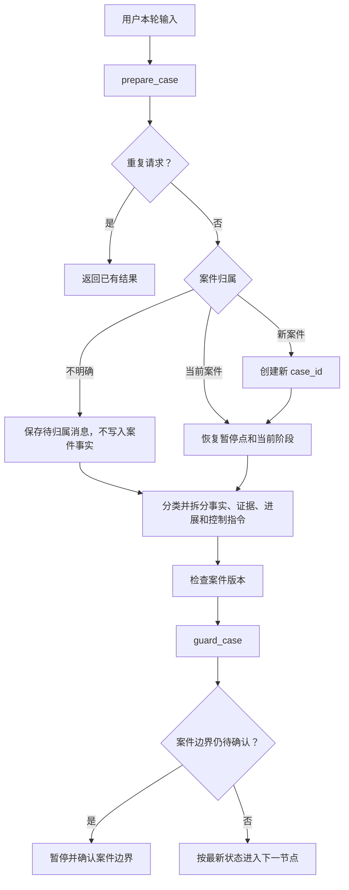

# `prepare_case` 案件准备节点说明书

> 文档状态：目标节点设计，可作为后端重构和前后端联调依据  
> 编写日期：2026-07-31  
> 所属工作流：维权助手 GuideGraph  
> 关联文档：`维权工作流优化说明书.md`、`证据评估节点说明书.md`

## 1. 节点定位

`prepare_case` 是维权助手工作流的第一个核心节点，也是每一轮案件交互的统一入口。

```text
用户发送消息、补充事实、上传证据或更新进展
                |
                v
          prepare_case
                |
                v
           guard_case
```

它负责恢复案件、识别用户本次操作、检查案件边界和版本、恢复暂停点，并为后续节点准备一个结构化的本轮事件。

一句话定义：

> `prepare_case` 负责确认“这是哪个案件、用户这次做了什么、当前应该从哪里继续”。

## 2. 节点职责

### 2.1 应当负责

- 根据 `case_id`、`session_id` 和用户身份恢复案件状态；
- 判断用户消息属于当前案件、另一案件还是无法确定；
- 识别首次案情、事实补充、事实更正、证据补充、案件进展和控制指令；
- 拆分同一条消息中的事实、证据和流程控制意图；
- 识别用户是否正在回答事实追问、确认事实快照或完成证据批次；
- 检查请求幂等、案件版本和重复文件；
- 恢复上次中断或暂停的工作流阶段；
- 加载必要的用户上下文和长期案件信息；
- 生成审计记录；
- 将结构化事件交给 `guard_case`。

### 2.2 不应负责

- 不判断用户或对方是否违法、违约、侵权或犯罪；
- 不判断谁承担责任；
- 不检索法条、类案或证据规则；
- 不生成事实追问；
- 不评估证据；
- 不生成行动方案；
- 不直接执行删除案件等不可逆操作；
- 不把附件识别结果直接写成已确认案件事实。

### 2.3 不属于本节点的功能

普通法律知识问答应由前端模式或 Supervisor 路由到法律问答 Agent。`prepare_case` 只处理案件维权模式中的消息。

用户在案件对话中询问“这条规定是什么意思”时，可以标记为 `case_related_question`，后续由案件流程或法律问答能力结合当前案件回答，但不能因此新建事实。

## 3. 核心设计原则

### 3.1 `case_id` 是案件标识

`session_id` 是对话或传输标识，`case_id` 才是长期案件实体的稳定标识。

```text
user_id
    └── case_id
          ├── session_id
          ├── fact_snapshot_version
          ├── evidence_plan_version
          ├── evidence_review_version
          └── plan_version
```

新前端应尽量采用“一项案件对应一个可管理对话”。`case_generation` 主要用于兼容现有同一会话内切换案件的实现。

### 3.2 每轮只推进一次

用户轮次、事件序号和案件版本只能由 `prepare_case` 推进一次。后续节点不得重复增加：

- `round`；
- `total_rounds`；
- `event_sequence`；
- `case_generation`。

### 3.3 先确定案件归属，再修改案件

任何新消息在写入事实、证据或方案状态之前，必须先确定：

```text
继续当前案件
新建独立案件
案件归属不明确
```

无法确定时暂停并询问用户，不允许为了继续流程而默认合并。

### 3.4 控制指令不是案件事实

以下内容属于流程控制：

```text
现在生成方案
不要再问
继续补充
重新评估
确认并继续
完成本批次
生成投诉信
```

它们不能进入事实列表。

一条消息可能同时包含控制指令和事实：

> 付款时间是7月18日，现在按这些信息生成方案。

应识别为：

```text
fact_corrected
+
control_conclude_now
```

必须先更新事实，再执行生成方案的控制意图。

### 3.5 安全检查不能被入口路由绕过

除幂等请求直接返回此前已经完成的完整结果外，所有包含新用户输入的事件都必须先进入 `guard_case`。

案件边界不明确时，`prepare_case` 不得把消息写入任何案件事实，但仍要将本轮输入以只读风险检查上下文交给 `guard_case`。只有 `guard_case` 没有触发安全暂停或其他即时处置时，才展示案件边界确认。

`prepare_case` 可以确定安全检查后的下一跳，但不能直接绕过安全、期限和证据灭失检查，也不能预先保证后续整条处理链一定执行。

## 4. 节点输入

### 4.1 请求信封

```text
request_id
idempotency_key
user_id
case_id
session_id
message_id
client_timestamp
base_case_generation
base_state_version
frontend_mode
event_hint
```

### 4.2 用户本次输入

```text
message_text
attachments[]
form_updates[]
control_action
```

附件只传引用和基础元数据，不在本节点执行完整证据评估：

```text
material_id
file_name
file_type
sha256
upload_status
evidence_requirement_id
evidence_batch_id
```

### 4.3 可恢复状态

```text
workflow_stage
case_generation
state_version
case_facts
fact_records
pending_ask_details
pending_followup_ids
fact_snapshot_version
fact_snapshot_confirmed
required_evidence
evidence_collection_status
evidence_batch_id
evidence_review_version
plan_version
case_tasks
case_progress
```

### 4.4 用户上下文

只加载后续节点真正需要的非敏感上下文：

- 用户标识；
- 已授权保存的地区；
- 该用户的案件列表；
- 当前案件长期状态；
- 经用户授权的长期偏好；
- 最近一次未完成的案件操作。

不得把其他案件事实自动注入当前案件。

## 5. 输入事件类型

建议使用稳定的 `input_event_type`：

| 事件 | 含义 |
|---|---|
| `case_started` | 用户首次描述新案件 |
| `case_continued` | 用户继续当前案件但没有明确新增类型 |
| `fact_added` | 新增案件事实 |
| `fact_corrected` | 更正已有事实 |
| `fact_denied` | 明确否认已有事实 |
| `fact_batch_answered` | 回答批量事实问题 |
| `fact_snapshot_confirmed` | 确认事实快照 |
| `evidence_named` | 只说明材料名称或称持有 |
| `evidence_added` | 新增上传材料 |
| `evidence_replaced` | 替换已有材料 |
| `evidence_status_changed` | 修改为暂缺、可调取、明确没有等 |
| `evidence_batch_completed` | 完成本批证据提交 |
| `evidence_verification_answered` | 回答本批材料来源、完整性或原始载体核验问题 |
| `case_progress_updated` | 更新投诉、协商、仲裁或诉讼进展 |
| `control_conclude_now` | 要求按当前信息生成方案 |
| `control_continue_gathering` | 要求继续追问或继续补充 |
| `control_regenerate` | 要求重新生成评估或方案 |
| `document_requested` | 请求生成参考文书 |
| `case_related_question` | 针对当前案件提出解释性问题 |
| `case_boundary_answered` | 回答案件归属确认 |
| `mixed_update` | 同时包含两种以上事件，包括事实、证据、进展或控制意图 |
| `unknown` | 无法可靠分类 |

`input_event_type` 用于主要路由，详细事件同时保存在 `input_events[]` 中，避免混合消息只保留一个标签。

## 6. 节点内部流程

### 6.1 验证请求信封

检查：

- `user_id`、`case_id` 和 `session_id` 格式；
- 当前用户是否有案件访问权限；
- `request_id` 和 `idempotency_key` 是否存在；
- 请求大小和附件数量是否超限；
- `frontend_mode` 是否为案件模式；
- 客户端版本是否支持当前事件协议。

认证和基础参数校验可以在 API 层完成，但结果必须作为可信请求上下文传入节点。

### 6.2 幂等检查

根据以下字段检查重复：

```text
user_id
+ case_id
+ request_id
+ idempotency_key
```

重复请求的处理：

```text
已完成
→ 返回此前节点输出或回复引用

处理中
→ 返回 processing，不重复启动图

已失败且允许重试
→ 使用同一事件记录重试
```

附件还应使用 SHA-256 检查重复上传。

### 6.3 恢复案件状态

读取顺序建议：

1. 当前工作流 Checkpointer；
2. Redis 活跃案件状态；
3. PostgreSQL 长期案件快照；
4. 附件和方案版本元数据；
5. 必要时进行历史状态迁移。

恢复后验证：

- `case_id` 一致；
- 用户归属一致；
- `workflow_stage` 合法；
- `state_version` 连续；
- 暂停点仍然存在；
- 引用的附件和版本没有丢失。

### 6.4 新案件初始化

没有现有状态时创建：

```text
case_id
case_generation = 1
state_version = 1
workflow_stage = case_intake
round = 1
created_at
updated_at
user_context
```

首次消息记录为 `case_started`，但不在本节点中提取法律结论。

### 6.5 案件边界判断

已有案件时比较：

- 双方主体；
- 争议事件；
- 法律关系；
- 标的或金额；
- 时间线；
- 用户目标；
- 当前等待回答的问题；
- 当前上传证据的归属。

结果：

```text
continue
new
uncertain
```

#### `continue`

继续当前案件，允许后续节点处理输入。

#### `new`

不得清空或覆盖原案件。应当：

1. 保存原案件当前版本；
2. 创建新的 `case_id`；
3. 将本次消息交给新案件；
4. 在案件列表中同时保留两个案件；
5. 记录边界判断审计。

#### `uncertain`

先标记为待确认，但不立即绕过风险检查：

```text
为了避免把两个案件混在一起，请确认这条消息是在继续当前案件，还是新建独立案件？
```

待归属消息保存在 `pending_case_message`，用户确认前不得写入当前案件或候选新案件的事实。

处理顺序固定为：

```text
case_relation = uncertain
→ 保存待归属消息和候选案件引用
→ 以只读上下文进入 guard_case
→ guard_case 如发现现实危险则先处理危险
→ 无需即时处置时暂停并等待案件边界确认
```

`guard_case` 只检查本轮消息中的安全、期限、证据灭失和其他即时风险，不重新判断消息属于哪个案件。风险检查产生的普通事实观察也只能暂存，待边界确认后再写入对应案件。

### 6.6 恢复暂停点

检查当前是否等待：

- 批量事实回答；
- 事实快照确认；
- 证据批次提交；
- 证据核验回答；
- 案件边界确认；
- 安全状态确认。

用户输入优先解释为当前暂停点的回复，但不能强制套用。

例如当前等待事实快照确认，用户直接上传材料：

```text
事实快照仍未确认
→ 接收并暂存材料
→ 不执行完整证据评估
→ 提醒完成事实确认或按当前信息继续
```

### 6.7 识别控制意图

优先识别：

```text
conclude_now
continue_gathering
regenerate
confirm
complete_batch
document_request
other
```

规则：

- 控制意图不写入事实；
- 有事实或证据同时出现时，保留二者；
- `conclude_now` 不允许丢弃同一消息中的新事实；
- `complete_batch` 只结束本批证据提交，不关闭整个案件；
- `document_request` 交给现有文书服务，不重新进入事实抽取。

### 6.8 识别事实和证据事件

本节点只做事件级分类和载荷拆分：

```text
fact_payload
evidence_payload
progress_payload
control_payload
```

它不完成事实原子化，也不判断材料内容。

示例：

> 我之前说错了，付款时间是7月18日。这是完整支付账单，现在生成方案。

输出：

```text
input_event_type = mixed_update
input_events =
  fact_corrected
  evidence_added
  control_conclude_now
```

处理优先级：

```text
事实更正
→ update_facts 更新事实黑板
→ decide_facts 判断变化是否实质影响案件
→ 必要时重新确认事实快照并更新证明目标
→ 按最新证据清单归类和评估材料
→ 用户要求时生成新方案版本
```

### 6.9 检查版本冲突

客户端提交：

```text
base_state_version
base_case_generation
```

服务端比较当前版本：

- 相同：继续；
- 客户端版本较旧但事件可安全合并：记录合并；
- 客户端版本较旧且可能覆盖新事实或材料状态：返回版本冲突；
- `case_generation` 不一致：禁止写入，提示刷新案件。

事实补充通常可以追加；事实更正、证据替换和删除操作必须进行严格版本检查。

### 6.10 确定预期后续处理

本节点输出 `resume_target` 或 `requested_route`，但正常情况下仍先进入 `guard_case`：

| 事件 | 安全检查后的目标 |
|---|---|
| 首次案情 | `update_facts` |
| 事实补充、更正或批量回答 | `update_facts` |
| 事实快照确认 | `plan_evidence` |
| 只提到证据名称 | 当前事实阶段或 `plan_evidence` |
| 证据清单开放后的证据批次 | `assess_evidence` |
| 证据清单开放前的附件 | 暂存后返回当前事实阶段 |
| 案件进展更新 | `update_facts`，必要时再进入证据评估 |
| 立即生成方案且包含新事实或进展 | `update_facts`，再由 `decide_facts` 按停止追问意图继续 |
| 立即生成方案且法律模型缺失或已失效 | `decide_facts` 或 `plan_evidence`，完成必要建模后再生成条件式方案 |
| 立即生成方案且事实、法律模型和证据评估仍有效 | `generate_solution` |
| 重新评估 | `assess_evidence` |
| 文书请求 | 文书服务 |
| 案件边界不明确 | `guard_case` 只读检查后暂停并等待用户确认 |

`control_conclude_now` 表示停止继续追问并按现有信息生成条件式方案，不表示允许跳过以下必要处理：

```text
本轮事实和案件进展入库
事实充分度及重大冲突判断
法律关系和用户请求建模
适用法律、期限和程序检索
现有证据状态的必要重算
```

当法律模型缺失、事实变化使模型失效，或者本轮新增证据尚未评估时，不能从 `prepare_case` 无条件直达 `generate_solution`。

`requested_route` 表示 `guard_case` 通过后的立即下一跳。`route_after_guard` 如使用数组，只能表示按当前状态推测的候选处理顺序；每个后续节点仍必须依据最新状态重新决定下一跳，不能把该数组当成绕过 `decide_facts` 或 `plan_evidence` 的固定执行脚本。

## 7. 节点输出

建议输出：

```json
{
  "case_id": "case-001",
  "session_id": "conversation-001",
  "case_generation": 3,
  "state_version": 18,
  "round": 9,
  "input_event_type": "mixed_update",
  "input_events": [
    {
      "type": "fact_corrected",
      "payload_ref": "fact-payload-001"
    },
    {
      "type": "evidence_added",
      "payload_ref": "batch-003"
    },
    {
      "type": "control_conclude_now"
    }
  ],
  "fact_payload": {},
  "evidence_payload": {},
  "progress_payload": {},
  "control_intent": "conclude_now",
  "pause_state": null,
  "requested_route": "update_facts",
  "route_after_guard": [
    "update_facts",
    "decide_facts",
    "plan_evidence",
    "assess_evidence",
    "generate_solution"
  ],
  "audit_entry_id": "audit-001"
}
```

上述 `route_after_guard` 是候选顺序。`plan_evidence` 和 `assess_evidence` 是否执行，分别由事实、法律模型和证据批次的最新状态决定。

### 7.1 最小输出字段

```text
case_id
session_id
case_generation
state_version
round
input_event_type
input_events
control_intent
requested_route
route_after_guard
pause_state
```

### 7.2 建议新增状态字段

```text
workflow_stage
state_version
event_sequence
input_event_type
input_events
current_request_id
current_idempotency_key
requested_route
route_after_guard
fact_payload
evidence_payload
progress_payload
pause_state
last_processed_request_id
last_processed_message_id
```

## 8. 路由设计



`prepare_case` 到 `guard_case` 应为所有新用户输入的固定边。案件边界待确认只阻止事实写入和普通案件路由，不能阻止只读风险检查。

## 9. 案件边界审计

每次边界判断保存：

```text
case_id
message_id
message_excerpt
relation
confidence
reason
decision_source
control_intent
event_sequence
created_at
```

边界分类器输出是不可信候选，程序必须应用置信度门槛。低于门槛时统一转为 `uncertain`。

分类失败时不能默认继续旧案件，应当安全降级为用户确认。

## 10. 暂停点处理

### 10.1 事实追问暂停

用户回复可能一次回答多个问题。`prepare_case` 标记：

```text
fact_batch_answered
```

实际事实提取由 `update_facts` 完成。

### 10.2 事实快照暂停

用户回复：

```text
确认并继续
```

标记：

```text
fact_snapshot_confirmed
```

用户回复包含更正时，标记为 `mixed_update`，先更新事实。

### 10.3 证据提交暂停

用户上传材料但未完成批次：

```text
evidence_added
```

用户点击“完成本批次并评估”：

```text
evidence_batch_completed
```

只有完成批次后才触发完整 `assess_evidence`。

### 10.4 证据核验暂停

用户回答材料来源、原始载体或完整性问题：

```text
evidence_verification_answered
```

返回 `assess_evidence`，但不得开启第二轮核验。

### 10.5 安全暂停

当前案件处于现实危险暂停时，任何消息都必须继续当前案件并进入 `guard_case`，直到安全状态明确解除。

不能因为消息看起来像新案件而绕开安全确认。

## 11. 长期案件和多案件管理

案件默认长期保存，直到用户手动删除。

`prepare_case` 只恢复用户主动打开或请求中明确指定的案件，不应自动选择最近案件并写入。

案件列表至少包含：

```text
case_id
case_title
legal_domain
workflow_stage
last_updated_at
fact_snapshot_version
evidence_review_version
plan_version
task_progress
```

删除案件由独立 API 处理，执行前验证：

- 用户归属；
- 精确 `case_id`；
- 附件范围；
- 方案和任务范围；
- 是否需要二次确认。

删除不是 `prepare_case` 的控制意图。

## 12. 当前代码映射

当前节点一的职责分布在三处：

| 当前实现 | 当前职责 |
|---|---|
| `src/api/routers/chat.py::_prepare_case_turn` | 案件边界判断、边界确认和新案件隔离 |
| `src/agents/legal_guide/case_lifecycle.py` | 语义边界分类、审计记录和新案件状态 |
| `src/agents/legal_guide/graph.py::node_prepare_turn` | 首轮用户上下文、轮次推进和控制意图 |

当前已有能力：

- `continue/new/uncertain` 案件边界；
- 低置信度安全确认；
- `conclude_now/continue_gathering/case_detail/other` 控制意图；
- 边界审计；
- 新案件隔离；
- 首轮历史上下文加载；
- 用户轮次只在 `prepare_turn` 推进；
- 方案后继续补充。

当前缺口：

- API 层和图节点职责分散；
- 没有统一 `input_event_type`；
- 混合输入没有完整事件列表；
- 缺少统一 `state_version` 和请求幂等字段；
- `session_id` 和 `case_id` 的长期管理边界还需要明确；
- 证据批次、事实快照和任务进展暂停点尚未统一；
- 文书请求仍在 API 层提前分流；
- 新目标工作流尚未真正建立 `prepare_case` 图节点。

## 13. 重构建议

### 13.1 合并职责

目标结构：

```text
API
→ 只负责认证、参数校验、上传和流式响应

prepare_case
→ 案件恢复、案件边界、事件分类、版本和暂停点

guard_case
→ 安全、期限、证据灭失和案件边界后的风险检查
```

### 13.2 复用现有代码

可以复用：

```text
decide_case_boundary
resolve_pending_boundary
boundary_audit_entry
start_isolated_case
node_load_context
现有控制意图识别逻辑
```

需要新增：

```python
classify_input_events()
split_mixed_payload()
restore_pause_state()
check_request_idempotency()
check_state_version()
build_prepare_case_output()
```

### 13.3 避免双重执行

迁移完成后：

- API 层不得再次执行案件边界分类；
- `prepare_case` 不得调用旧 `node_prepare_turn` 再增加轮次；
- `guard_case` 不得重新分类输入事件；
- 后续节点只读取结构化事件载荷。

## 14. 异常和降级

| 异常 | 处理 |
|---|---|
| 找不到案件 | 明确返回不存在或已删除，不创建同 ID 新案件 |
| Redis 状态缺失 | 尝试 PostgreSQL 长期快照和 Checkpointer |
| 历史状态迁移失败 | 只读恢复并提示当前无法继续写入 |
| 案件边界分类失败 | 暂停并询问用户，不默认继续 |
| 输入事件分类失败 | 标记 `unknown`，仍进入 `guard_case` 后进行澄清 |
| 重复请求 | 返回已缓存结果 |
| 请求正在处理 | 返回 `processing`，不重复运行 |
| 客户端版本过旧 | 返回版本冲突并要求刷新 |
| 附件引用不存在 | 保留文本事件，附件标记缺失 |
| 长期记忆不可用 | 不阻断当前案件，使用案件自身状态 |
| 用户上下文加载失败 | 使用最小用户上下文继续 |
| 控制意图和事实混合 | 先保留事实事件，再执行控制意图 |

## 15. 安全与隐私

- 不在日志中记录完整身份证号、手机号、账号或附件正文；
- `message_excerpt` 只保存必要长度并进行敏感信息处理；
- 用户标识不得直接作为附件目录名；
- 只能恢复当前用户有权限访问的案件；
- 不能将一个用户的长期记忆注入另一个用户；
- 不能把其他案件事实自动合并到当前案件；
- 对删除、替换证据等操作使用严格版本检查；
- 附件只传引用，不在节点状态中复制大块二进制数据；
- 调试信息不得返回前端。

## 16. 示例

### 16.1 首次创建案件

输入：

> 我在闲鱼买东西付了800元，对方没发货。

输出：

```text
input_event_type = case_started
input_events = [fact_added]
workflow_stage = case_intake
requested_route = update_facts
```

路由：

```text
prepare_case
→ guard_case
→ update_facts
```

### 16.2 同时更正事实和补充证据

输入：

> 我之前说错了，付款时间是7月18日，这是完整支付账单。

输出：

```text
input_event_type = mixed_update
input_events =
  fact_corrected
  evidence_added
requested_route = update_facts
route_after_guard =
  update_facts
  decide_facts
  plan_evidence（事实变化影响法律模型或证据清单时）
  assess_evidence（证据清单已经开放且材料可归类时）
```

事实更正可能改变待证事实和证据用途，因此不能从 `update_facts` 固定直达 `assess_evidence`。证据清单尚未开放时，账单先暂存；事实和证明目标稳定后再归类。

### 16.3 要求立即生成方案但包含新事实

输入：

> 平台已经拒绝退款了，现在生成方案。

输出：

```text
input_event_type = mixed_update
input_events =
  case_progress_updated
  control_conclude_now
requested_route = update_facts
route_after_guard =
  update_facts
  decide_facts
  plan_evidence（法律模型缺失或已失效时）
  assess_evidence（本轮证据需要评估时）
  generate_solution
```

不能直接跳过“平台拒绝退款”这一新事实，也不能因用户要求立即生成而跳过必要的事实决策和法律建模。

### 16.4 疑似新案件

当前案件是闲鱼未发货，用户输入：

> 另外公司拖欠我三个月工资。

输出：

```text
case_relation = new
→ 保存闲鱼案件
→ 创建新的 case_id
→ 将工资问题交给新案件
```

### 16.5 案件边界不明确

输入：

> 另一个人也不还钱。

输出：

```text
case_relation = uncertain
requested_route = guard_case_read_only
pause_state = awaiting_case_boundary
```

路由：

```text
prepare_case
→ guard_case（只读检查当前风险）
→ 无即时风险时等待案件边界确认
```

用户确认前，不把这条消息写入当前案件。若消息同时包含现实危险，先处理安全风险，安全状态稳定后再恢复案件边界确认。

## 17. 验收标准

### 17.1 案件恢复

- 刷新网页后能够恢复正确案件和暂停点；
- 多个案件不会串案；
- 已结束案件可以继续补充并生成新版本；
- 长期案件不因普通 TTL 到期丢失；
- 删除案件后不会重新创建同一 `case_id`。

### 17.2 输入分类

- 首次案情、事实补充、事实更正和证据补充可以正确区分；
- 一条消息中的多个事件全部保留；
- 控制指令不会写入事实；
- 控制指令与事实混合时不会丢弃事实；
- 证据清单开放前的材料只暂存；
- 案件进展可以触发事实或证据更新。

### 17.3 案件边界

- 明确继续时继承当前案件；
- 明确新案件时创建独立案件；
- 低置信度时要求用户确认；
- 分类失败时不会静默串案；
- 边界判断保存审计记录；
- 安全暂停期间不会错误新建案件。

### 17.4 幂等和版本

- 同一请求不会重复增加轮次；
- 同一附件不会重复创建材料记录；
- 旧页面不能覆盖新事实或证据状态；
- 可安全追加的事实不会因轻微版本差异全部失败；
- 每个事件具有稳定请求和审计标识。

### 17.5 路由

- 除幂等缓存返回外，所有新用户输入始终先进入 `guard_case`；
- 案件边界不明确时仍执行只读风险检查，但不写入案件事实；
- 事实事件进入 `update_facts`；
- 事实快照确认进入 `plan_evidence`；
- 完成证据批次进入 `assess_evidence`；
- 立即生成方案不会丢弃同条消息里的事实和案件进展；
- 法律模型缺失或失效时不会因 `conclude_now` 跳过必要建模；
- `route_after_guard` 不会成为绕过后续节点状态判断的固定脚本；
- 案件边界不明确时先完成风险检查，再正确暂停。

## 18. 最小实现顺序

1. 为 `GuideState` 增加 `workflow_stage`、`state_version` 和结构化事件字段；
2. 将 `_prepare_case_turn` 的案件边界逻辑迁入图节点；
3. 将 `node_prepare_turn` 的轮次和控制意图逻辑合并到 `prepare_case`；
4. 实现 `input_event_type` 和 `input_events`；
5. 实现混合输入载荷拆分；
6. 统一事实、事实快照、证据和安全暂停点；
7. 增加请求幂等和客户端版本检查；
8. 将所有新用户输入固定为 `prepare_case → guard_case`，边界未确认时使用只读风险上下文；
9. 删除 API 层重复的案件边界和轮次逻辑；
10. 补充新旧案件、边界不明但含现实危险、立即生成方案、混合输入、重复请求和刷新恢复测试。
