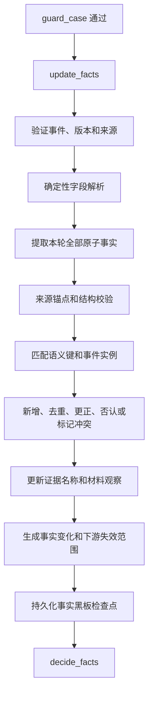

# `update_facts` 动态事实更新节点说明书

> 文档状态：目标节点设计，可作为后端重构和前后端联调依据  
> 编写日期：2026-08-01  
> 所属工作流：维权助手 GuideGraph  
> 节点序号：节点三  
> 关联文档：`维权工作流优化说明书.md`、`prepare_case节点说明书.md`、`guard_case节点说明书.md`

## 1. 节点定位

`update_facts` 是维权助手工作流的第三个核心节点，负责建立和持续维护案件的动态事实黑板。

```text
prepare_case
      |
      v
 guard_case
      |
      v
update_facts
      |
      v
decide_facts
```

它接收用户首次描述、批量事实回答、主动补充、事实更正、案件进展以及材料中发现的待确认观察，从本轮输入中提取全部原子事实，与案件已有事实进行匹配、更新、去重、冲突处理和版本记录。

一句话定义：

> `update_facts` 负责确认“用户本轮到底提供了哪些事实，以及案件事实账本发生了什么变化”。

## 2. 节点职责

### 2.1 应当负责

- 从用户本轮输入中一次提取全部可识别案件事实；
- 处理首次案情、批量回答、主动补充、事实更正和案件进展；
- 将复合描述拆成可追溯的原子事实；
- 为每条事实分配稳定语义键和不可变 `fact_id`；
- 对主体、交易、事件和程序进行实例化，避免多个金额或日期错误合并；
- 使用用户原话、表单字段或材料定位作为来源锚点；
- 规范化日期、金额、币种、地区、主体和状态表达；
- 合并语义相同且值一致的重复事实；
- 保留显式更正前的旧值并标记为 `superseded`；
- 对未经明确更正的新旧矛盾标记 `conflicted`；
- 记录用户的明确否认、不知道和含糊回答；
- 更新用户提到的证据名称和声称持有状态；
- 将材料中发现的新信息保存为待用户确认的材料观察；
- 生成本轮事实变化集和下游失效范围；
- 将事实变化标记为节点四定向法律检索和事实依赖重算的触发条件；
- 在进入用户暂停点之前持久化事实黑板检查点；
- 将更新后的事实状态交给 `decide_facts`。

### 2.2 不应负责

- 不生成下一轮批量问题；
- 不判断事实是否达到决策充分度；
- 不决定停止追问；
- 不判断谁违法、违约、侵权或承担责任；
- 不计算诉讼时效、仲裁期限或管辖结论；
- 不确定最终法律关系和请求权；
- 不生成案件专属证据清单；
- 不评估材料真实性、合法性、可采性或证明力；
- 不生成行动方案或维权可能性；
- 不把知识库检索结果写成用户事实；
- 不在本节点调用法律、类案或证据规则检索；
- 不根据法律检索结果自行激活事实槽位或生成追问；
- 不把材料中的陈述自动升级为用户确认事实；
- 不直接向用户展示追问或事实快照。

### 2.3 与节点四的边界

`update_facts` 只更新事实，`decide_facts` 才决定如何使用这些事实。

```text
update_facts
→ 哪些事实新增、修改、否认、未知或冲突

decide_facts
→ 还缺哪些高价值事实
→ 是否需要批量追问
→ 是否达到决策充分度
→ 是否生成事实快照等待确认
```

即使 `update_facts` 发现明显缺少付款时间，也不能自行向用户提问。

节点三可以接收节点四回传的结构化决策事件或检索触发标记，但只把其中明确属于用户本轮陈述的内容写入事实黑板：

```text
节点四定向检索发现“卖家经营者身份可能影响法律路径”
→ 不能写成 seller.is_operator = true
→ 只能由节点四生成 seller.operator_status 的追问候选
→ 用户回答后再由节点三提取为事实
```

## 3. 核心设计原则

### 3.1 每轮提取全部事实

用户一条消息可能同时回答多个问题，也可能主动补充未被询问的信息。节点必须处理整条消息，不能只解析第一个答案或当前问题对应的字段。

输入：

> 对方是闲鱼个人卖家。我7月18日付了800元，约定三天内发货，但现在还没发，平台正在处理，我希望退款。

应一次提取：

```text
counterparty.identity
platform.name
transaction.payment.date
transaction.payment.amount
agreement.delivery_period
performance.delivery.status
procedure.platform_complaint.status
claim.primary_request
```

### 3.2 事实必须有来源锚点

每条事实必须能够回到：

- 当前用户消息中的逐字原文；
- 用户提交的结构化表单字段；
- 用户对事实快照的明确确认；
- 已解析材料的页码、区域、消息序号或时间戳；
- 风险节点保存的用户原始陈述引用。

大模型生成的摘要不是事实来源。找不到来源锚点的候选不得写入事实黑板。

### 3.3 用户明确陈述不等于客观证实

事实状态中的 `confirmed` 表示：

> 用户已经清楚、肯定地陈述了该事实。

它不表示：

- 系统已经核验证据；
- 对方承认；
- 平台或机构确认；
- 法院将会采信。

因此必须将事实陈述状态和核验状态分开：

```text
fact_status = confirmed
verification_status = user_stated
```

### 3.4 不静默覆盖

新值与旧值不一致时：

- 用户明确说“之前说错了”“更正为”时，可以替代；
- 没有明确更正关系时，不能默认采用最新说法；
- 材料观察与用户陈述不一致时，不能用材料覆盖用户陈述；
- 冲突必须保留两个版本和来源。

### 3.5 不把法律判断写成事实

以下属于事实：

```text
用户支付了800元
卖家没有发货
平台显示申诉处理中
用户希望退款
```

以下不属于事实：

```text
卖家构成诈骗
用户一定可以解除合同
案件已经超过诉讼时效
某法院必然有管辖权
现有证据足以胜诉
```

法律判断应在后续法律建模、证据评估和方案节点完成。

### 3.6 控制指令不进入事实黑板

以下内容不属于案件事实：

```text
现在生成方案
不要再问
继续补充
确认并继续
完成本批次
重新评估
```

一条消息同时包含控制指令和事实时，只提取事实，控制意图继续保存在 `prepare_case` 的结构化事件中。

### 3.7 不预建无限缺失字段

`not_provided` 只用于当前案件已经激活的事实模型，不应预先创建所有法律领域、所有场景的空字段。

例如尚未识别为劳动关系时，不需要提前创建：

```text
employment.salary_cycle
employment.work_location
employment.termination_date
```

这些依赖事实由 `decide_facts` 在相应条件暴露后激活，再交给本节点维护状态。

### 3.8 定向检索结果不进入事实黑板

事实黑板只记录用户陈述、用户表单和有定位的材料观察。节点四在后续阶段可能根据事实变化调用法律检索，但检索结果属于分析依据，不是本案已经发生的事实。

因此必须严格区分：

```text
用户说“卖家是个人”
→ fact: seller.identity_type = individual

法条或规则提示“经营者身份可能影响请求路径”
→ retrieval_observation: operator_status_may_change_path
→ 由节点四决定是否追问
```

检索命中、法律术语映射、关系候选和证明目标候选都只能保存在节点四的决策审计中，不能由节点三直接写入 `fact_blackboard`。

## 4. 节点输入

### 4.1 来自 `prepare_case` 的事件

```text
case_id
session_id
user_id
case_generation
state_version
round
event_sequence
input_event_type
input_events
fact_payload
progress_payload
control_intent
message_id
message_text
form_updates
attachments
```

### 4.2 来自 `guard_case` 的信息

```text
guard_status
risk_observations
current_safety_status
deadline_clues
evidence_loss_clues
asset_risk_clues
source_refs
```

风险节点产生的法律判断不能进入事实黑板。只有能够回链用户原话的事实观察可以进入，例如：

```text
用户表示当前已经离开现场
用户表示商场监控今晚可能覆盖
用户表示昨天收到平台通知
```

### 4.3 当前事实状态

```text
fact_blackboard
fact_blackboard_version
active_fact_schema
fact_aliases
fact_conflict_groups
fact_snapshot_version
fact_snapshot_confirmed
legal_model_version
evidence_plan_version
evidence_review_version
plan_version
```

### 4.4 材料观察

证据评估或预解析流程可能返回：

```text
material_id
observation_id
observation_type
normalized_value
source_locator
parser_confidence
requires_user_confirmation
```

材料观察必须和用户陈述事实分开存储，不能直接以 `confirmed` 写入。

## 5. 事实来源和可信边界

建议使用稳定的 `source_type`：

| 来源 | 含义 | 默认处理 |
|---|---|---|
| `user_message` | 用户自由文本中的明确陈述 | 可写为用户确认事实 |
| `structured_form` | 用户主动填写的表单字段 | 可写为用户确认事实 |
| `user_confirmation` | 用户确认事实快照或冲突选项 | 可更正或确认事实 |
| `guard_observation` | 风险节点从用户原话提取的事实观察 | 有原文锚点时可合并 |
| `material_observation` | 图片、PDF、聊天或其他材料中的观察 | 待确认，不覆盖用户事实 |
| `case_progress_event` | 用户提交的平台、机构或程序进展 | 按用户陈述写入 |
| `system_import` | 从旧案件状态迁移的事实 | 标记迁移来源和原状态 |
| `long_term_memory` | 用户授权保存的长期记忆 | 只作候选，不自动写入当前案件 |

### 5.1 大模型不是来源

大模型只承担提取和规范化候选的工作。事实记录中的来源必须指向原始输入，而不是：

```text
source_type = llm
```

模型名称、提示词版本和输出置信度可以保存在提取审计中，但不能代替事实来源。

### 5.2 知识库不是案件事实来源

法律、案例、程序指南和证据规则属于分析依据，不属于本案已经发生的事实。

知识库可以帮助识别事实类别或规范术语，但不能补全：

- 对方身份；
- 实际付款时间；
- 用户所在地；
- 是否已经发货；
- 是否签署协议；
- 用户实际损失。

## 6. 事实数据模型

建议每条事实记录包含：

```json
{
  "fact_id": "fact-018",
  "semantic_key": "transaction.payment.pay_01.date",
  "category": "time",
  "entity_scope": "transaction-001",
  "subject_id": "user",
  "predicate": "paid_at",
  "object_value": "2026-07-18",
  "normalized_value": {
    "type": "date",
    "value": "2026-07-18",
    "precision": "day"
  },
  "statement": "用户于2026年7月18日付款",
  "status": "confirmed",
  "verification_status": "user_stated",
  "source_type": "user_message",
  "source_refs": [
    {
      "message_id": "message-009",
      "source_text": "我是7月18日付的钱"
    }
  ],
  "first_seen_round": 3,
  "last_updated_round": 3,
  "created_at": "2026-08-01T10:00:00+08:00",
  "updated_at": "2026-08-01T10:00:00+08:00",
  "supersedes_fact_id": null,
  "superseded_by_fact_id": null,
  "conflict_group_id": null,
  "extraction_trace_id": "extract-003"
}
```

### 6.1 不可变字段

建议保持不可变：

```text
fact_id
case_id
first_seen_round
created_at
initial_source_ref
```

事实更正时创建新版本，不直接篡改历史记录。

### 6.2 可更新字段

可以更新：

```text
status
verification_status
source_refs
last_updated_round
updated_at
superseded_by_fact_id
conflict_group_id
```

### 6.3 核验状态

建议使用：

| 核验状态 | 含义 |
|---|---|
| `user_stated` | 仅有用户明确陈述 |
| `material_observed` | 材料中观察到，但尚未核验和确认 |
| `corroborated` | 与其他独立材料或用户确认相互印证 |
| `disputed` | 与其他陈述或材料存在争议 |
| `not_verified` | 尚无可靠核验 |
| `not_applicable` | 不需要材料核验的流程偏好等信息 |

`corroborated` 只能由后续证据评估结果或明确的用户确认事件更新，本节点不能仅凭材料类型自行判定。

## 7. 稳定语义键设计

### 7.1 基础语义键

基础维度包括：

```text
actor.user.identity
actor.counterparty.identity
relationship.type
event.core_behavior
event.timeline
transaction.amount
transaction.date
location.platform
location.performance_place
claim.request
procedure.history
harm.loss
deadline.clue
safety.current_status
evidence.named
```

### 7.2 必须支持实例作用域

简单的 `transaction.date` 不足以表达多次付款。建议使用实例键：

```text
transaction.payment.pay_01.date
transaction.payment.pay_01.amount
transaction.payment.pay_01.payee
transaction.payment.pay_02.date
transaction.payment.pay_02.amount
```

类似地：

```text
procedure.complaint.complaint_01.submitted_at
procedure.complaint.complaint_01.status
procedure.notice.notice_01.received_at
procedure.notice.notice_01.issuer
```

否则两次付款、两次投诉或多个对方主体会被错误标记为冲突。

### 7.3 键复用规则

- 相同主体、相同谓词和相同事件实例使用同一语义键；
- 同一事实新增细节时使用原键的下级键；
- 新事件创建新实例编号；
- 用户明确更正时沿用语义键，但创建新 `fact_id`；
- 模型无法可靠确定实例时，先使用待归属实例，不强行合并；
- 语义键由程序校验和规范化，不能完全信任模型自由生成。

### 7.4 事实别名

维护 `fact_aliases`，例如：

```text
付款金额
支付金额
转账金额
transaction.payment.pay_01.amount
```

别名用于匹配，不改变正式语义键。

## 8. 事实状态

统一使用：

| 状态 | 含义 | 后续处理 |
|---|---|---|
| `confirmed` | 用户已经明确陈述 | 不因缺失而重复询问 |
| `denied` | 用户明确否认对应命题 | 不重复询问同一命题 |
| `unclear` | 用户表达含义不清 | 允许节点四生成针对性澄清 |
| `conflicted` | 同一事实存在未解决的不同版本 | 允许节点四生成冲突核对 |
| `unknown` | 用户明确表示不知道或无法确认 | 不换一种说法重复询问 |
| `not_provided` | 当前激活事实槽位尚未提供 | 交给节点四评估是否值得追问 |
| `superseded` | 旧值已被明确的新值替代 | 保留历史但不参与当前分析 |

### 8.1 状态与用户追问的关系

`update_facts` 不生成问题，但必须为 `decide_facts` 提供正确状态：

```text
confirmed  → 不作为缺失事实追问
denied     → 不作为缺失事实追问
unknown    → 不重复追问
unclear    → 只允许针对含义澄清
conflicted → 只允许核对冲突版本
not_provided → 可以进入高价值缺口候选
superseded → 不参与当前事实计算
```

### 8.2 “没有”的语义

用户回复“没有”时，必须结合当前问题和上下文判断：

```text
没有签合同
→ agreement.written_contract = denied

没有聊天记录
→ evidence.chat_record.availability = unavailable

没有更多损失
→ harm.additional_loss = denied

不知道对方姓名
→ counterparty.legal_name = unknown
```

不能把所有“没有”都写成同一种证据缺失。

## 9. 节点内部流程

### 9.1 验证输入事件

检查：

- `case_id`、`case_generation` 和用户权限；
- `event_sequence` 是否已经处理；
- `state_version` 和 `fact_blackboard_version` 是否匹配；
- 事实载荷是否属于当前消息；
- 案件边界是否已经确认；
- 当前是否允许写入事实。

案件边界仍未确认时不得运行事实写入。`guard_case` 的只读风险检查结束后应停留在边界确认暂停点。

### 9.2 选择可处理输入

处理：

```text
fact_payload
progress_payload
structured_form
risk_observations
confirmed_material_observations
```

忽略：

```text
纯控制指令
附件二进制正文
知识库法律文本
其他案件事实
没有来源锚点的模型摘要
```

### 9.3 建立本轮提取上下文

模型上下文只包含：

- 当前用户消息；
- 当前消息对应的表单字段；
- 必要的近期语境；
- 已有活跃事实及稳定语义键；
- 当前待回答的批量问题编号；
- 本轮材料观察引用；
- 当前事件类型。

已有事实只用于匹配和识别更正，不允许模型重新总结后覆盖。

### 9.4 确定性字段解析

优先使用程序解析：

- 表单中的金额、日期和选项；
- 附件名称、文件类型和上传状态；
- 用户点击的确认、否认和不知道操作；
- 已有题目 ID 与答案字段的对应关系；
- ISO 日期、币种和数值格式；
- 稳定的主体及事件实例 ID。

自由文本再由受约束模型提取。

### 9.5 全量原子事实提取

模型必须输出结构化候选：

```json
{
  "fact_updates": [
    {
      "semantic_key": "transaction.payment.pay_01.amount",
      "category": "amount",
      "statement": "用户支付800元",
      "subject": "用户",
      "predicate": "支付",
      "object_value": "800元",
      "certainty": "asserted",
      "operation": "add",
      "source_text": "我付了800元"
    }
  ]
}
```

要求：

- 只提取本轮新增、更正、否认或明确未知的内容；
- 不把已有事实重新换一种说法输出；
- 不添加法律结论；
- 不把问题中的假设当作用户回答；
- `source_text` 必须逐字来自当前用户输入；
- 一条消息中的多个事实全部输出；
- 输出必须通过结构化模型校验。

### 9.6 来源锚点校验

程序逐条检查：

```text
source_text 是否存在于当前消息
form_field 是否属于当前请求
material locator 是否存在
message_id 是否与本轮一致
事实值是否能由来源合理支持
```

无法通过校验的候选：

- 不写入事实黑板；
- 记录到提取审计；
- 必要时进入解析降级；
- 不显示给用户。

逐字原文存在只能证明来源可追溯，不自动证明模型理解正确，因此仍要执行状态、否定和类型校验。

### 9.7 值规范化

保留原始值，同时生成规范值：

```text
“八百块” → 800 CNY
“7月18日” → 2026-07-18 或 year_unknown-07-18
“三天内” → duration = P3D
“闲鱼” → platform_code = xianyu
“个人卖家” → counterparty_type = individual
```

规则：

- 缺少年份时不得默认当前年份，除非上下文明确；
- 相对日期必须记录解析基准；
- 金额必须记录币种是否明确；
- 地区只能规范化用户明确提供的范围；
- 原始表达始终保留，规范值不能替代来源文本。

### 9.8 匹配事实和事件实例

按以下顺序匹配：

1. 明确 `fact_id` 或表单字段 ID；
2. 稳定语义键和事件实例；
3. 主体、谓词、对象和时间组合；
4. 已登记别名；
5. 无法可靠匹配时创建新实例候选。

不能只用文本相似度决定是否为同一事实。

### 9.9 合并和归约

程序拥有最终合并权，模型只提出操作候选。

#### 新事实

```text
不存在相同语义键或相同事件实例
→ 创建新 fact_id
```

#### 完全重复

```text
语义键、规范值和状态相同
→ 不创建重复事实
→ 追加新的 source_ref
```

#### 补充细节

```text
原事实：用户已经付款
新增事实：通过支付宝付款
→ 保留原事实
→ 新增 transaction.payment.pay_01.channel
```

#### 明确更正

```text
原事实：付款时间7月17日
用户：之前说错了，是7月18日
→ 原事实 status = superseded
→ 新事实 status = confirmed
→ 建立双向 supersedes 引用
```

#### 未明确更正的矛盾

```text
原事实：付款800元
新陈述：付款900元
没有“更正”语义
→ 两条事实 status = conflicted
→ 写入同一 conflict_group_id
```

#### 明确否认

```text
原事实：双方签过书面合同
用户：没有签过合同
→ 原事实 superseded 或 conflicted，取决于是否明确否定旧说法
→ 新记录 status = denied
```

### 9.10 更新证据名称目录

节点三维护的是“证据名称与材料库存”，不是正式证据需求，也不是证据有效性结论。

首次描述或事实回答中，用户说到已有材料时，只盘点材料名称和用户声称状态：

```text
evidence_name
availability
source_type
source_ref
named_at_round
```

可用状态：

```text
user_claimed_present
user_claimed_unavailable
unknown
uploaded_copy
```

“我有付款记录”只能表示：

```text
availability = user_claimed_present
```

不能表示：

```text
真实性已确认
内容完整
能够证明付款
法院会采信
```

### 9.10.1 三层证据数据必须分开

案件中同时存在三种不同对象：

```text
证据名称库存
→ 用户提到或已经上传了什么材料

证据需求
→ 根据待证事实建议准备什么材料

实际材料评估
→ 用户提交的文件具体能证明什么、有什么局限
```

节点三只负责第一层，并把事实变化交给节点四。三层关系如下：

```text
update_facts
→ evidence_name_inventory

decide_facts
→ internal evidence requirements（内部增量需求）

plan_evidence
→ formal evidence checklist（正式证据清单和交付入口）

assess_evidence
→ material assessment and coverage（材料评估与证明目标覆盖）
```

不能把下面三个概念混用：

```text
用户称持有付款记录
≠ 系统已经提出付款记录证据需求
≠ 付款记录已经证明付款事实
```

### 9.10.2 证据名称库存模型

建议每个材料名称记录：

```json
{
  "evidence_name_id": "ename-003",
  "case_id": "case-001",
  "name": "付款记录",
  "normalized_name": "transaction.payment.record",
  "availability": "user_claimed_present",
  "source_form": "user_statement",
  "source_refs": [
    {
      "message_id": "message-009",
      "source_text": "我手上有付款记录"
    }
  ],
  "material_ids": [],
  "named_at_round": 3,
  "last_updated_round": 3,
  "status": "active",
  "requires_upload": true
}
```

说明：

- `evidence_name_id` 是材料名称库存的稳定 ID；
- `normalized_name` 仅用于合并名称，不代表证明目标；
- `material_ids` 为空表示用户称持有但尚未提交；
- `requires_upload` 只表示后续可能需要交付，不表示用户必须现在上传；
- `status=active` 表示名称仍与当前案件相关。

### 9.10.3 名称库存的合并

以下表达可以合并到同一名称库存，但保留用户原话：

```text
付款截图
支付凭证
微信支付记录
付款记录
```

建议归入：

```text
normalized_name = transaction.payment.record
```

以下情况必须分开：

- 两次不同付款；
- 不同平台或不同订单；
- 原件与截图；
- 用户自己的记录与平台导出；
- 不同案件或不同主体的材料。

名称合并不能替代材料指纹去重。用户上传文件后，节点六还需使用 `material_id`、哈希和原始载体信息去重。

### 9.10.4 证据名称状态变化

| 用户输入或系统事件 | 名称库存处理 |
|---|---|
| “我有付款记录” | `user_claimed_present` |
| “没有聊天记录” | `user_claimed_unavailable` |
| “不确定有没有物流记录” | `unknown` |
| 直接上传付款记录 | 新增或关联 `material_id`，`availability=uploaded_copy` |
| 用户说之前提到的材料找不到了 | 更新为 `user_claimed_unavailable`，保留历史 |
| 用户补充原件仍在 | 保留旧记录，更新原始载体或新增材料版本 |
| 用户说材料属于另一个订单 | 拆分证据名称实例，不合并 |
| 用户明确更正材料名称 | 旧名称标记 `superseded`，新名称建立关联 |

“明确没有”是证据库存状态变化，不等同于案件事实被否认，也不等同于该证明目标永久不适用。

### 9.10.5 节点三不得生成正式证据需求

节点三可以输出：

```text
evidence_name_changes
evidence_inventory_changes
evidence_availability_changes
```

节点三不得输出未经节点四和节点五建模的：

```text
正式 requirement_id
必需/重要/补强结论
证明目标覆盖结论
材料证明力结论
法院或仲裁机构固定材料目录
```

事实变化只用于触发节点四重新计算内部证据需求：

```text
新增付款事实
→ 通知节点四重新检查 transaction.payment 需求
```

而不是：

```text
新增付款事实
→ 节点三直接创建“必需上传付款记录”
```

完整证据目录、证明目标和交付入口由 `plan_evidence` 建立。

### 9.11 处理材料观察

材料解析发现：

```text
账单显示金额为800元
聊天截图显示日期为7月18日
合同页面出现另一主体名称
```

应建立：

```text
source_type = material_observation
verification_status = material_observed
status = unclear
requires_user_confirmation = true
material_id
source_locator
```

材料观察只能：

- 补充待确认线索；
- 触发冲突；
- 交给节点四判断是否需要用户确认；
- 在证据评估后更新核验状态。

不能直接覆盖用户事实，也不能仅凭 OCR 文本建立确定事实。

### 9.12 生成事实变化集

每轮生成：

```text
added_fact_ids
updated_fact_ids
superseded_fact_ids
conflicted_fact_ids
denied_fact_ids
unknown_fact_ids
unchanged_fact_ids
material_observation_ids
changed_semantic_keys
```

事实变化集是后续增量重算的依据，不能仅比较整段案件摘要。

### 9.13 计算下游失效范围

节点三只标记可能失效的对象，不重新计算结论：

| 事实变化 | 可能失效对象 |
|---|---|
| 对方主体变化 | 法律关系、责任主体、管辖、证据清单、方案 |
| 用户诉求变化 | 请求权模型、待证事实、证据清单、方案 |
| 付款金额变化 | 损失计算、证据需求、方案 |
| 关键日期变化 | 期限、程序、行动任务、方案 |
| 履行地点变化 | 管辖和办理渠道 |
| 平台处理状态变化 | 程序路径和行动任务 |
| 新证据名称 | 更新材料库存，并通知节点四重新检查相关证据需求 |
| 非关键联系方式变化 | 通常只更新摘要 |

输出：

```text
invalidate_legal_model
invalidate_fact_snapshot
invalidate_evidence_plan
invalidate_evidence_review
invalidate_solution
invalidate_case_tasks
```

失效只标记 `stale`，不得删除旧版本。

### 9.14 更新黑板版本

只有事实或材料观察真正变化时才增加：

```text
fact_blackboard_version
```

以下情况不增加版本：

- 相同 `event_sequence` 重复提交；
- 完全重复事实且没有新增来源价值；
- 只有控制指令；
- 所有候选均未通过来源校验。

`fact_snapshot_version` 不在本节点增加。事实快照由 `decide_facts` 生成并在确认后保存。

### 9.15 持久化检查点

事实追问和事实快照都会暂停等待用户，因此节点三完成后必须持久化：

- 当前事实黑板；
- 本轮变化集；
- 冲突组；
- 事件处理标记；
- 黑板版本；
- 下游失效标记；
- 提取审计引用。

不能等到最终方案的 `audit_and_save` 才保存事实，否则刷新或跨日继续时会丢失进度。

## 10. 合并决策表

| 旧状态 | 本轮输入 | 操作 | 新状态 |
|---|---|---|---|
| 无记录 | 明确陈述 | 新增 | `confirmed` |
| 无记录 | 明确否认 | 新增否认命题 | `denied` |
| 无记录 | 明确不知道 | 新增 | `unknown` |
| `not_provided` | 明确陈述 | 填充槽位 | `confirmed` |
| `unclear` | 明确说明 | 新版本替代 | 旧值 `superseded`，新值 `confirmed` |
| `confirmed` | 相同陈述 | 合并来源 | `confirmed` |
| `confirmed` | 明确更正 | 替代 | 旧值 `superseded`，新值 `confirmed` |
| `confirmed` | 不同值但未说明更正 | 建立冲突组 | 双方 `conflicted` |
| `unknown` | 后续明确说明 | 新版本替代 | 旧值 `superseded`，新值 `confirmed` |
| `denied` | 后续明确表示存在 | 建立更正或冲突 | 依上下文判断 |
| `conflicted` | 用户选择其中一个 | 解决冲突 | 选中值 `confirmed`，其余 `superseded` |
| `confirmed` | 材料观察不同 | 不覆盖 | 用户事实保留，材料观察待确认 |
| 任意 | 重复事件 | 幂等返回 | 不变化 |

## 11. 节点输出

建议输出：

```json
{
  "case_id": "case-001",
  "case_generation": 3,
  "state_version": 19,
  "fact_blackboard_version": 7,
  "fact_blackboard": [],
  "fact_changes": {
    "added_fact_ids": [
      "fact-018",
      "fact-019"
    ],
    "superseded_fact_ids": [
      "fact-011"
    ],
    "conflicted_fact_ids": [],
    "changed_semantic_keys": [
      "transaction.payment.pay_01.date",
      "procedure.platform_complaint.status"
    ]
  },
  "evidence_name_inventory": [],
  "evidence_name_changes": [],
  "evidence_availability_changes": [],
  "material_observations": [],
  "downstream_invalidations": {
    "fact_snapshot": true,
    "legal_model": true,
    "evidence_plan": true,
    "evidence_review": false,
    "solution": true,
    "case_tasks": true,
    "fact_decision_retrieval": true,
    "provisional_evidence_requirements": true
  },
  "control_intent": "conclude_now",
  "next_route": "decide_facts",
  "extraction_trace_id": "extract-003",
  "fact_update_audit_id": "fact-audit-019"
}
```

### 11.1 最小输出字段

```text
case_id
case_generation
state_version
fact_blackboard_version
fact_blackboard
fact_changes
evidence_name_changes
evidence_name_inventory
evidence_availability_changes
material_observations
downstream_invalidations
control_intent
next_route
fact_update_audit_id
```

### 11.2 建议新增状态字段

```text
fact_blackboard
fact_blackboard_version
active_fact_schema
fact_aliases
fact_changes
fact_conflict_groups
material_fact_observations
evidence_name_inventory
evidence_name_inventory_version
evidence_inventory_changes
downstream_invalidations
last_fact_event_sequence
fact_extraction_trace
```

## 12. 路由设计



### 12.1 正常路由

```text
update_facts
→ decide_facts
```

节点三不得根据自己提取到的事实直接跳到：

```text
plan_evidence
assess_evidence
generate_solution
```

### 12.2 用户要求立即生成方案

```text
用户补充事实并要求现在生成方案
→ update_facts 完整入库本轮事实
→ decide_facts 读取 conclude_now
→ 不再生成普通事实追问
→ 必要时 plan_evidence
→ generate_solution 输出条件式方案
```

### 12.3 证据暴露新事实

```text
assess_evidence
→ 产生带定位的材料观察
→ update_facts
→ decide_facts 判断是否需要用户确认
```

### 12.4 方案后补充事实

```text
plan_issued
→ 用户补充或更正事实
→ prepare_case
→ guard_case
→ update_facts
→ decide_facts 判断是否属于实质变化
```

节点三只标记下游失效范围，节点四决定重新确认事实、局部更新或保持原阶段。

## 13. 与其他节点的接口

### 13.1 与 `prepare_case`

`prepare_case` 负责：

- 确定案件归属；
- 拆分事实、证据、进展和控制事件；
- 检查幂等和案件版本；
- 保存 `control_intent`。

`update_facts` 只处理已经确认属于当前案件的事实载荷。

### 13.2 与 `guard_case`

`guard_case` 负责即时风险定级。它可以提交带用户原话引用的 `risk_observations`，但：

- 安全和期限法律结论不写入事实黑板；
- 案件边界未确认时不得写入；
- 风险解除状态可以作为当前案件事实更新；
- 风险审计和事实审计分别保存。

### 13.3 与 `decide_facts`

向节点四提供：

```text
最新事实黑板
本轮变化集
冲突组
当前激活的 not_provided 槽位
unknown 和 denied 状态
材料待确认观察
下游失效范围
control_intent
```

节点四负责：

- 评估信息增益；
- 激活新的事实依赖；
- 生成批量追问；
- 判断停止条件；
- 生成事实快照。

### 13.4 与 `plan_evidence`

节点三只维护用户提到的证据名称。`plan_evidence` 读取确认后的事实快照，建立：

- 法律关系；
- 用户请求；
- 待证事实；
- 举证责任；
- 案件专属证据清单；
- 每项证据交付入口。

### 13.5 与 `assess_evidence`

`assess_evidence` 可以：

- 根据材料更新事实核验状态；
- 提交材料观察；
- 标记材料与用户陈述冲突；
- 触发事实回流。

它不能直接静默修改事实黑板，必须通过 `update_facts` 的归约和审计。

### 13.6 与 `generate_solution`

方案节点只读取：

- 当前有效事实；
- 已确认事实快照；
- 明确未知和冲突；
- 事实版本；
- 下游模型版本匹配状态。

不得使用 `superseded` 事实生成当前方案。

### 13.7 与 `audit_and_save`

`update_facts` 保存可恢复的事实检查点；`audit_and_save` 负责：

- 审校事实与方案引用是否一致；
- 保存正式事实快照版本；
- 关联法律模型、证据评估和方案版本；
- 生成版本变化说明。

## 14. 当前代码映射

当前节点三的部分能力分散在：

| 当前实现 | 当前职责 |
|---|---|
| `src/agents/legal_guide/graph.py::node_extract_issues` | 提取法律问题、事实、证据名称和领域 |
| `src/agents/legal_guide/graph.py::node_parse_details` | 解析追问回答、主动补充、事实冲突和证据状态 |
| `src/agents/legal_guide/case_model.py::normalize_case_updates` | 校验原文锚点、规范事实候选 |
| `src/agents/legal_guide/case_model.py::reduce_case_facts` | 跨轮合并、更正、冲突和历史保留 |
| `src/agents/legal_guide/case_model.py::active_case_facts` | 排除 `superseded` 事实 |
| `src/agents/legal_guide/case_model.py::evidence_from_case_facts` | 从事实原子提取用户声称持有或缺少的证据 |
| `src/agents/legal_guide/state.py::GuideState` | 保存 `case_facts`、`fact_records` 和证据状态 |
| `src/agents/legal_guide/prompts.py` | 定义原子事实提取字段和来源约束 |

### 14.1 当前已有能力

- 原子事实结构；
- 稳定语义键候选；
- 用户原话锚点校验；
- `add/replace/deny` 操作；
- 重复事实合并；
- 显式更正时保留旧事实；
- 未明确更正的不同值标记冲突；
- `superseded` 历史保留；
- 事实和证据名称基础拆分；
- 材料内容不自动当作用户确认事实；
- 追问回答中主动补充事实的解析。

### 14.2 当前缺口

- 首次事实提取和追问回答解析仍分属两个旧图节点；
- 法律问题标准化、领域判断和事实更新耦合；
- 当前状态主要使用 `asserted/uncertain/denied/conflicted/superseded`，尚未统一为目标七状态；
- `confirmed` 和客观证实的语义尚未完全分离；
- 缺少不可变 `fact_id` 和完整事实版本关系；
- 简单语义键可能错误合并多次付款、多个主体或多个程序事件；
- 缺少统一 `fact_blackboard_version`；
- 缺少结构化 `fact_changes`；
- 缺少下游失效范围；
- 材料观察与用户事实还需要更明确的数据隔离；
- 事实检查点、正式快照和方案版本之间的关系尚未统一；
- `evidence_confirmed` 这个旧字段同时承载“用户称持有”和“已上传材料”含义，容易误导后续节点；
- 节点三尚未明确区分证据名称库存、内部证据需求和实际材料评估；
- 目标 8 节点工作流尚未真正建立 `update_facts` 图节点。

## 15. 重构建议

### 15.1 可复用部分

可以复用：

```text
CaseFactUpdate
normalize_case_updates()
reduce_case_facts()
active_case_facts()
latest_case_facts()
fact_statements()
evidence_from_case_facts()
format_case_context()
现有 source_text 原文校验
现有 replace/deny/conflict 归约逻辑
```

### 15.2 需要新增

建议新增：

```python
class FactRecord(...)
class FactSourceRef(...)
class FactChangeSet(...)
class MaterialFactObservation(...)

collect_fact_update_context()
extract_all_fact_candidates()
normalize_fact_values()
resolve_entity_scope()
resolve_fact_semantic_key()
validate_fact_entailment()
reduce_fact_blackboard()
resolve_fact_conflicts()
update_evidence_name_inventory()
normalize_evidence_name()
reduce_evidence_name_inventory()
build_evidence_inventory_changes()
build_fact_change_set()
calculate_downstream_invalidations()
checkpoint_fact_blackboard()
```

### 15.3 需要拆出

从 `node_extract_issues` 拆出：

- 当前用户消息中的事实提取；
- 事实原子化；
- 证据名称盘点；
- 地区、金额和时间事实更新。

从 `node_parse_details` 拆出：

- 批量回答解析；
- 主动补充事实解析；
- 更正和冲突处理；
- 明确不知道和否认状态；
- 材料观察回流。

证据相关迁移：

- 旧 `evidence_confirmed` 拆分为 `evidence_name_inventory` 和 `submitted_material_refs`；
- `evidence_from_case_facts()` 只作为兼容迁移函数，不再把名称库存命名为“已确认证据”；
- 正式 `requirement_id` 由节点四或节点五创建；
- 材料质量、真实性、合法性和证明力由节点六处理。

法律问题标准化和领域识别不应由 `update_facts` 持有最终决定权。

### 15.4 推荐模块边界

```text
update_facts.py
├── fact_schema.py
├── fact_extractor.py
├── fact_normalizer.py
├── fact_reducer.py
├── fact_provenance.py
├── fact_invalidation.py
└── fact_checkpoint.py
```

只有 `update_facts` 是图节点。提取、规范化、归约和失效计算是内部辅助模块。

## 16. 并发、幂等和版本

### 16.1 幂等键

建议使用：

```text
case_id
+ case_generation
+ event_sequence
+ message_id
```

相同事件重复执行时返回此前 `fact_update_audit_id` 和事实版本，不重复创建事实。

### 16.2 乐观并发

输入包含：

```text
base_state_version
base_fact_blackboard_version
```

处理：

- 版本一致：正常提交；
- 只有可追加的新事实：重新读取后安全合并；
- 涉及事实更正、冲突解决或否认：版本不一致时重新匹配；
- 无法安全合并：返回版本冲突，不覆盖新状态。

### 16.3 版本关系

```text
fact_blackboard_version
→ 每次事实账本有效变化

fact_snapshot_version
→ 节点四生成或用户确认事实快照

legal_model_version
→ 节点五根据事实快照建立法律模型

evidence_plan_version
→ 节点五固化证据清单

plan_version
→ 节点七生成方案
```

事实黑板变化不能直接修改旧方案正文，只能标记关联版本失效。

## 17. 异常和降级

| 异常 | 处理 |
|---|---|
| 事实提取模型超时 | 使用表单、确定性解析和用户原文保守降级 |
| 模型输出非法结构 | 丢弃非法候选，不污染事实黑板 |
| `source_text` 不存在 | 拒绝写入该事实 |
| 日期无法确定年份 | 保存原表达并标记精度不足 |
| 金额缺少币种 | 保存数值和币种未知状态 |
| 语义键无法匹配 | 创建待归属实例，不强行覆盖 |
| 用户新旧说法冲突 | 建立冲突组，交给节点四处理 |
| 材料观察与用户陈述冲突 | 保留双方，材料观察不得覆盖 |
| 附件解析失败 | 保留附件记录，不产生材料事实 |
| 案件边界未确认 | 不写事实，保持边界暂停 |
| 事实版本冲突 | 重新读取并合并；无法合并时要求刷新 |
| 检查点写入失败 | 不进入用户暂停点，返回可重试错误 |
| 长期记忆不可用 | 不阻断当前事实提取 |
| 知识库不可用 | 不影响事实更新，后续法律建模再降级 |

### 17.1 最小降级

结构化模型不可用时，可以将当前用户整段原话保存为：

```text
category = event
status = unclear
source_type = user_message
requires_structuring = true
```

但不能把模型自由摘要当作替代事实。恢复后可以重新结构化，并保留原始事件引用。

## 18. 数据和审计要求

每次事实更新审计至少保存：

```text
fact_update_audit_id
case_id
case_generation
event_sequence
message_id
input_source_refs
extractor_version
prompt_version
raw_candidate_hash
accepted_fact_ids
rejected_candidate_reasons
fact_changes
conflict_groups
downstream_invalidations
fact_blackboard_version_before
fact_blackboard_version_after
created_at
```

隐私要求：

- 普通日志不保存完整身份证号、手机号、住址或账号；
- `source_text` 仅保存支持事实所需的最小原文；
- 附件正文不复制到事实状态；
- 一个案件的事实不得进入另一个案件；
- 长期记忆只能在授权范围内使用；
- 删除案件时按照精确 `case_id` 删除或匿名化关联事实；
- 调试信息不得返回前端。

## 19. 前端和 Gradio 对接

`update_facts` 通常不直接输出一条聊天回复，但它的结构化结果驱动案件事实面板。

### 19.1 前端事实面板

电脑网页端可以展示：

```text
已确认
待澄清
存在冲突
用户不知道
材料中发现、待确认
历史更正
```

规则：

- 用户可查看事实来源摘要；
- 用户可以发起更正，但更正仍作为新事件进入 `prepare_case`；
- 不允许前端直接覆盖数据库中的旧值；
- `superseded` 默认折叠，可在历史中查看；
- 材料观察必须标明“来自材料，尚待确认”；
- “已确认”应解释为用户已确认，不显示为“证据已证明”。

### 19.2 Gradio 一致性

Gradio 与电脑网页端必须调用同一 `update_facts`：

- 使用相同事实状态；
- 使用相同语义键和黑板版本；
- 使用相同冲突处理；
- 使用相同下一跳；
- 不保留一套旧的单问题事实解析逻辑。

Gradio 可以只展示 Markdown 事实摘要，但不能绕过结构化事实黑板。

## 20. 回复格式要求

节点三本身不生成追问。节点四需要展示事实变化或事实快照时，应读取结构化数据并使用统一 Markdown。

建议事实变化摘要：

```markdown
## 本轮已更新

- 付款时间：2026年7月18日
- 平台处理状态：正在等待处理

## 需要核对

- 付款金额出现两个说法：800元、900元
```

不得输出：

- 内部 `fact_id`、语义键或置信度；
- 大段重复用户原话；
- “系统认定事实属实”等误导性措辞；
- 未经用户确认的材料观察作为确定事实。

## 21. 示例

### 21.1 首次案情

输入：

> 我7月18日在闲鱼给个人卖家付了800元，对方没发货，把我拉黑了。我已经找平台处理，想退款。我手上有订单截图、付款记录和聊天记录。

输出事实：

```text
platform.name = 闲鱼
counterparty.type = 个人
transaction.payment.pay_01.date = 7月18日（年份待确认）
transaction.payment.pay_01.amount = 800 CNY
performance.delivery.status = 未发货
communication.blocked_by_counterparty = confirmed
procedure.platform_complaint.status = 已提交、处理中
claim.primary_request = 退款
```

证据名称目录：

```text
订单截图 = user_claimed_present
付款记录 = user_claimed_present
聊天记录 = user_claimed_present
```

下一跳：

```text
decide_facts
```

### 21.2 一次回答多个事实

当前批量问题涉及对方身份、付款时间、金额和平台处理情况。

用户回复：

> 对方是个人，7月18日付了800元，平台说还要等三天。

节点三必须提取全部四项，不得只处理“对方是个人”。

### 21.3 明确更正

已有事实：

```text
付款日期 = 7月17日
```

用户：

> 我之前记错了，付款日期是7月18日。

结果：

```text
7月17日 → superseded
7月18日 → confirmed
```

### 21.4 未明确更正的冲突

已有事实：

```text
付款金额 = 800元
```

用户：

> 付款金额是900元。

结果：

```text
800元 → conflicted
900元 → conflicted
conflict_group_id = conflict-payment-001
```

节点四再询问哪个金额正确。

### 21.5 明确不知道

用户：

> 我不知道卖家的真实姓名。

结果：

```text
counterparty.legal_name = unknown
```

节点四不得换一种问法反复追问姓名，但可以根据案件需要寻找不依赖真实姓名的替代路径或材料。

### 21.6 材料观察

聊天截图 OCR 显示：

```text
“7月20日前发货”
```

结果：

```text
agreement.delivery_deadline
status = unclear
verification_status = material_observed
requires_user_confirmation = true
source_locator = 图片第2张，第4条消息
```

不能直接写成用户已经确认的约定。

### 21.7 事实和控制指令混合

用户：

> 平台今天拒绝退款了，现在生成方案。

结果：

```text
新增 procedure.platform_complaint.status = 已拒绝
保留 control_intent = conclude_now
next_route = decide_facts
```

不能因 `conclude_now` 跳过事实更新。

### 21.8 方案后补充事实

用户：

> 卖家今天又联系我，说可以发货，但不愿退款。

结果：

```text
新增 counterparty.latest_response
新增 performance.proposed_action
标记 fact_snapshot、evidence_plan、solution 可能失效
next_route = decide_facts
```

旧方案保留，只标记需要更新。

## 22. 测试要求

### 22.1 单元测试

至少覆盖：

1. 首次长描述一次提取全部事实；
2. 批量回答一次更新多个语义键；
3. 用户只回答部分问题，其余槽位状态保持不变；
4. 用户主动补充未被询问的事实也能入库；
5. 控制指令不会进入事实黑板；
6. 相同事实跨轮重复时不创建重复记录；
7. 相同事实的新来源能够正确追加；
8. 显式更正将旧值标记为 `superseded`；
9. 不同值但无更正语义时创建冲突组；
10. 用户选择冲突版本后正确解决冲突；
11. “不知道”记录为 `unknown`；
12. “没有合同”和“没有聊天记录”得到不同语义状态；
13. 含糊回答记录为 `unclear`；
14. 多次付款使用不同事件实例，不误判冲突；
15. 多个对方主体不会合并成同一主体；
16. 缺少年份的日期不自动补当前年份；
17. 金额保留币种未知状态；
18. 找不到逐字来源的模型候选被拒绝；
19. 知识库文本不会写成案件事实；
20. 长期记忆不会自动注入当前案件；
21. 材料观察不会覆盖用户事实；
22. OCR 结果带材料定位并标记待确认；
23. 附件解析失败不生成虚假事实；
24. 纯控制指令不增加事实黑板版本；
25. 重复事件满足幂等；
26. 事实更正遇到旧客户端版本时不会覆盖新事实；
27. 下游失效范围能够按变化类型正确生成；
28. “付款截图”和“支付凭证”可以在名称库存中合并但保留原始表达；
29. 两个不同订单的付款记录不会错误合并；
30. 用户声称持有材料但未上传时不会被标记为已评估；
31. 证据名称新增只触发节点四需求重算，不由节点三创建正式证据需求；
32. `superseded` 事实不会进入当前方案上下文；
33. 事实检查点失败时不会进入用户暂停点；
34. 所有正常写入后固定进入 `decide_facts`。

### 22.2 集成测试

```text
prepare_case
→ guard_case
→ update_facts
→ decide_facts
```

验证首次描述和批量回复均使用同一事实更新逻辑。

```text
assess_evidence
→ material_observation
→ update_facts
→ decide_facts
```

验证材料新事实正确回流且不会自动确认。

```text
plan_issued
→ fact_corrected
→ update_facts
→ downstream_invalidations
→ decide_facts
```

验证旧版本保留并只重算受影响部分。

### 22.3 前端与 Gradio 一致性测试

同一案件、同一事件下：

- 事实条目一致；
- 事实状态一致；
- 事实版本一致；
- 冲突组一致；
- 材料观察状态一致；
- 下一跳一致；
- 刷新后均能恢复同一事实黑板。

## 23. 最小实施顺序

### 第一阶段：统一事实入口

1. 新建 `update_facts` 图节点；
2. 将首次描述和追问回答的事实更新逻辑迁入同一节点；
3. 复用现有 `normalize_case_updates` 和 `reduce_case_facts`；
4. 固定正常下一跳为 `decide_facts`。

### 第二阶段：完善数据模型

1. 增加不可变 `fact_id`；
2. 增加七种目标事实状态；
3. 分离 `status` 和 `verification_status`；
4. 增加实体和事件实例作用域；
5. 增加事实来源、冲突组和替代关系；
6. 增加 `evidence_name_inventory`，清理旧 `evidence_confirmed` 的歧义。

### 第三阶段：增量和版本

1. 增加 `fact_blackboard_version`；
2. 增加结构化 `fact_changes`；
3. 增加下游失效范围；
4. 增加事实检查点、幂等和并发控制。

### 第四阶段：材料回流与联调

1. 隔离材料观察和用户事实；
2. 接入 `assess_evidence` 的事实回流；
3. 接入电脑网页端事实面板；
4. 让 Gradio 使用同一事实黑板；
5. 完成跨轮、刷新、冲突和方案后更新测试。

## 24. 验收标准

满足以下条件才视为节点三完成：

1. 用户一条消息中的全部案件事实都能被处理；
2. 首次描述、批量回答和主动补充使用同一更新逻辑；
3. 每条事实都能回链用户原话、表单字段或材料定位；
4. 控制指令和法律判断不会进入事实黑板；
5. 用户明确陈述与证据核验状态严格分离；
6. 重复事实不会反复创建；
7. 显式更正保留旧版本为 `superseded`；
8. 未明确更正的矛盾不会被静默覆盖；
9. `unknown`、`denied` 和 `not_provided` 能够正确区分；
10. 多次付款、多个主体和多个程序事件不会错误合并；
11. 材料观察不会自动成为用户确认事实；
12. 用户声称持有材料、内部证据需求和实际材料评估三者分离；
13. 本轮变化能够生成精确的下游失效范围；
14. 事实黑板在用户暂停前已经可靠保存；
15. 重复请求不会重复增加事实或版本；
16. 旧方案和旧证据清单不会被事实变化物理删除；
17. 节点不执行法律检索、不生成正式证据需求、不生成追问、不判断充分度、不评估证据；
18. 事实变化可以准确触发节点四的定向检索和依赖重算，但检索结果不会写入事实黑板；
19. 所有正常事实更新均进入 `decide_facts`；
20. 电脑网页端和 Gradio 使用相同事实状态与版本。

## 25. 最终节点定义

目标工作流中的节点三固定为：

```text
update_facts
```

它不是普通的“从文本里抽几个字段”，而是案件全生命周期的事实账本归约节点：

```text
首次描述建立事实
批量回答补充事实
主动补充发现事实
明确更正替代事实
矛盾陈述保留冲突
材料观察等待确认
方案后更新事实版本
```

节点执行完成后的唯一正常下一跳是：

```text
decide_facts
```

节点三回答“事实发生了什么变化”，节点四再回答“这些事实是否足够，以及接下来应该问什么”。
