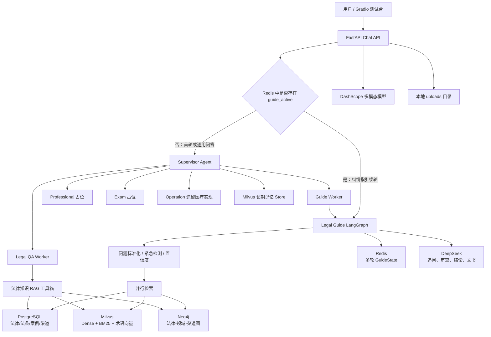
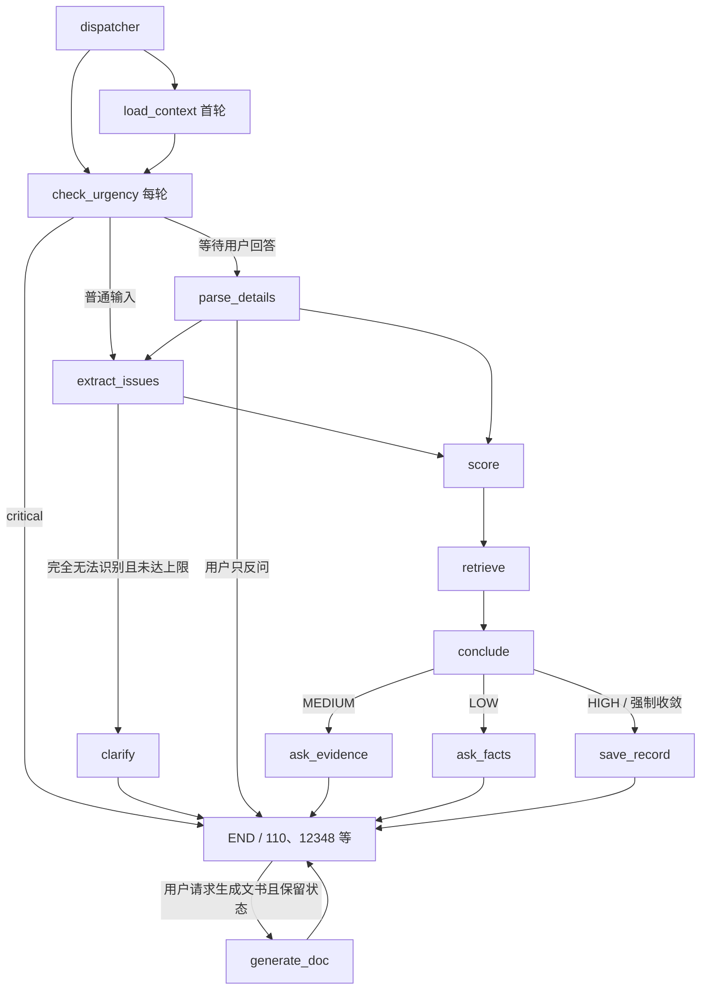
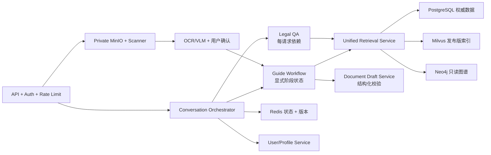

# 法律智能体项目报告

> 评审日期：2026-07-26
> 评审对象：`D:\learn\legal-agent` 当前工作区实际代码、配置、迁移、脚本、测试与本地数据服务
> 当前分支：`feature/multimodal`
> 评审原则：以本地实际实现和实际数据为准，`README.md`、`项目说明.md` 及历史测试报告仅用于对照，不把文档声明直接当作已实现事实。

## 1. 执行摘要

该项目已经形成一套较完整的法律智能体工程原型：以 FastAPI 提供接口，以 Supervisor 负责首轮意图路由，以 LangGraph 驱动“公民法律指引”多轮状态机，并组合 PostgreSQL、Milvus、Neo4j、Redis、MinIO 构建结构化数据、向量检索、知识图谱、会话状态和文件存储能力。核心法律指引链路具有问题标准化、紧急情形检测、置信度分级、并行检索、追问、行动方案、胜算分析、文书草拟和图片证据分析等能力。

从架构方向看，项目的总体思路是合理的，尤其是以下设计值得保留：

- 用 Supervisor 区分“具体纠纷指引”和“通用法律知识问答”。
- 具体纠纷进入确定性的 LangGraph 状态机，而不是完全依赖自由 Agent 推理。
- 每轮重新执行紧急检测，允许在多轮对话中途熔断高危情形。
- 法条检索采用 Dense、BM25、RRF、重排和 PostgreSQL 降级的多级策略。
- 对不同信息完整度使用 HIGH、MEDIUM、LOW 分档，降低信息不足时输出过度确定结论的风险。
- 将法条、案例、渠道和用户证据统一汇总后再生成行动方案，输出结构适合普通用户。

但当前项目仍属于“功能较丰富的内部测试原型”，不宜直接作为生产级法律服务上线。主要原因不是缺少功能，而是部分功能在实际调用链中未真正打通，数据层之间存在明显不一致，测试与代码已不同步，鉴权、上传安全、图查询安全、隐私和审计机制也未达到法律服务系统要求。

综合评价：**5.9/10，核心方向正确，主链路可演示，但工程闭环、数据治理、测试和安全仍需集中整改。**

| 维度 | 评分 | 结论 |
|---|---:|---|
| 总体架构 | 7.5/10 | 分层清楚，Supervisor + 状态机 + 多源 RAG 的方向合理 |
| 公民法律指引 | 7.2/10 | 功能最完整，是项目当前真正的核心能力 |
| 法律知识问答 | 5.0/10 | 工具设计完整，但实际依赖注入使案例、渠道等能力降级 |
| RAG 与知识图谱 | 6.5/10 | 检索策略较好，数据一致性和安全校验不足 |
| 多轮记忆与持久化 | 3.5/10 | Redis 状态可用，但用户上下文、长期记忆、咨询记录存在断链 |
| 多模态与文书生成 | 5.8/10 | 已有可用原型，缺少文件安全、结构化抽取和法律校验 |
| 测试质量 | 4.0/10 | 有回归测试意识，但测试已滞后且完整测试无法收集 |
| 安全与生产就绪度 | 2.8/10 | 无接口鉴权，上传和 NL2Cypher 存在高风险点 |
| 可维护性 | 5.0/10 | 模块较多，但医疗遗留、重复配置、死代码和文档漂移明显 |

## 2. 本次评审范围与实际快照

### 2.1 代码规模

| 目录 | Python 文件数 | 总行数 | 非空行数 | 主要用途 |
|---|---:|---:|---:|---|
| `src/` | 118 | 11,191 | 9,286 | API、Agent、RAG、基础设施和模型 |
| `scripts/` | 27 | 5,853 | 4,894 | 数据导入、索引构建、测试台和评估脚本 |
| `test/` | 5 | 470 | 374 | pytest 单元/回归测试 |

此外，项目根目录还有多份 `_test_*.py`、多模态测试脚本、综合场景 JSON 和历史测试报告。这些更多属于手工集成测试资产，没有统一纳入 `pytest.ini` 的测试发现范围。

### 2.2 当前实际暴露的 API

从 `src.main:app` 实际路由表看，当前只暴露：

| 方法 | 路径 | 功能 |
|---|---|---|
| POST | `/api/v1/chat` | 非流式对话 |
| POST | `/api/v1/chat/stream` | SSE 对话 |
| POST | `/api/v1/chat/upload-image` | 图片证据分析和可选自动注入 |
| GET | `/api/v1/legal/health` | 法律模块占位健康检查 |
| GET | `/health` | 应用存活检查 |
| GET | `/health/deps` | PostgreSQL、Redis、MinIO、Milvus、Neo4j 检查 |

`src/api/routers/knowledge.py` 虽然实现了知识文档上传、删除、列表和通知接口，但没有在 `src/main.py` 中注册，因此这些接口在实际应用中不可访问。

### 2.3 本地服务与数据快照

本次通过项目实际配置直接连接了 PostgreSQL、Redis、Milvus 和 Neo4j。Redis、PostgreSQL、Milvus、Neo4j 均可访问；FastAPI 的 8001 端口当时未启动。

| 存储 | 实际数据 |
|---|---|
| PostgreSQL | 75 部法律、7,105 条法条、231 个案例、103 个渠道、0 个用户、0 条咨询记录、0 条法条案例关联 |
| Milvus | `statute_index` 7,077；`case_index` 12；`legal_term_index` 13,268；`agent_long_term_memory` 9 |
| Neo4j | Law 75、Article 7,105、Channel 103、Domain 23、LegalConcept 13,268、LegalCase 1,680 |
| Neo4j 关系 | HAS_ARTICLE 7,105、APPLIES_TO 77、HANDLES 103、BELONGS_TO 12,706、CITES 0 |

这些数字说明基础数据已经具备一定规模，但三个数据系统并非同一份一致快照：

- PostgreSQL 有 7,105 条法条，Milvus 只有 7,077 条。
- PostgreSQL 有 231 个案例，Milvus 只采样 12 个案例。
- PostgreSQL 有 231 个案例，Neo4j 却残留 1,680 个案例节点。
- PostgreSQL 的 `law_cases` 为 0，Neo4j 也没有 CITES 关系，类案与法条之间没有结构化关联。
- PostgreSQL 中 75 号法律《中华人民共和国民法典》的 `domain` 为空，导致领域统计中有 1,260 条法条落在空领域。
- `articles` 中存在 42 组重复的“law_id + article_no”，合计 53 条重复行。Milvus 使用 `law_id_article_no` 作为主键，重复条号会互相覆盖，是关系库 7,105 与向量库 7,077 数量不一致的重要原因之一。

## 3. 实际总体架构

架构可以分为六层：

1. **交互层**：Gradio 调试台和 FastAPI 接口。
2. **路由层**：Supervisor 识别具体纠纷、知识问答、专业服务、法考和运营意图。
3. **流程层**：具体纠纷由 Legal Guide LangGraph 控制多轮工作流。
4. **知识层**：法条、类案、图谱、渠道和上传文档 RAG。
5. **数据与状态层**：PostgreSQL、Milvus、Neo4j、Redis、MinIO。
6. **模型层**：DeepSeek 负责语言推理，当前实际 Embedding 使用 Volcengine，DashScope 负责重排和视觉理解。

该分层总体合理。问题主要出在层与层的“接缝”：部分 Worker 没有拿到数据库会话或运行上下文，部分路由未注册，部分状态字段在节点间被覆盖，导致设计能力没有完整落地。

## 4. 各项功能的实际评价

### 4.1 Supervisor 意图路由

实现位置：`src/agents/supervisor_agent.py`、`src/agents/tools/worker_tools.py`。

优点：

- 把“具体纠纷”和“通用法律问题”拆为两个不同 Worker，符合用户任务差异。
- 指示 Supervisor 必须透传 Worker 结果，并通过 Redis `guide_last_reply` 再次保证指引回复不被改写。
- Supervisor 自带 Redis Checkpointer 和摘要中间件，具备会话压缩思路。

实际问题：

- Supervisor 暴露了 `call_operation_agent`，但该 Agent 仍是“天宫医疗运营助手”，查询的是问诊量、药品库存和科室排名，与法律项目不符。
- `operation_agent` 创建时 `db_session=None`，其唯一 SQL 工具会直接返回“数据库连接不可用”，因此该功能实际不可用。
- `professional_agent` 和 `exam_agent` 只是固定文本占位，不应在产品界面上被描述为可用能力。
- Supervisor 和摘要中间件硬编码 `deepseek-v4-flash`，没有统一使用配置中的模型对象，增加环境切换风险。
- 非流式 `/chat` 正确传入 `UserContext`，但 `/chat/stream` 和图片自动注入的 Supervisor 路径没有传入 `context`。一旦模型调用需要 `call_guide_agent`，工具读取 `runtime.context.user_id/session_id` 时可能失败。这意味着流式首轮纠纷路由和无活跃会话的图片自动注入存在实际断链风险。

评价：**路由理念合理，非流式主路径基本可用，但流式和运营分支需要修复。**

### 4.2 公民法律指引 LangGraph

实现位置：`src/agents/legal_guide/graph.py`、`state.py`、`prompts.py`、`confidence.py`。

实际图中注册了 14 个节点，包括兼容保留的 `ask_details`；并非文件头注释所说的“9 节点”。核心流程如下：

优点：

- 每轮进入 `check_urgency`，多轮中途出现人身危险也能熔断，这是正确的安全设计。
- 标准术语与口语问题分池：标准术语进入 BM25/LIKE，口语仅进入 Dense/HyDE，检索逻辑较专业。
- LOW 档也先检索并给出初步依据，改善“连续追问但不给价值”的体验。
- 结论提示词限制只能引用检索上下文中的法条，并要求输出有利因素、不利因素、举证责任和综合胜算。
- 追问注入前 400 字法条，使问题更接近构成要件，而不是通用问卷。
- 案例未命中时给出裁判文书网检索提示，降级体验较完整。

逻辑不一致与缺陷：

1. **用户上下文被覆盖。** `run_guide` 初始写入 `{"user_id": ..., "long_term_memories": ...}`，但 `node_load_context` 随后用数据库返回的 `ctx` 整体替换 `user_context`。数据库返回值不含 `user_id`，因此后续 `save_record` 和长期记忆保存通常取不到用户 ID。
2. **咨询记录几乎不会落库。** `save_guide_record` 只接受纯数字 user_id，并要求 `users` 表中已有对应外键；当前 users 和 consultations 都是 0。API 又允许任意字符串 user_id，没有注册或用户建档流程，因此持久化闭环实际未建立。
3. **追问上限多套规则冲突。** 配置是 10，State 注释是事实/证据各 5，节点内部限制是 5，`route_after_conclude` 实际限制为各 3。最终行为由路由的 3 轮决定，其他配置基本失去权威性。
4. **状态阶段判断采用计数器猜测。** `route_after_parse` 通过 `facts_rounds > evidence_rounds` 判断刚才问的是事实还是证据，没有显式记录 `pending_question_type`，未来流程调整后容易误路由。
5. **标准术语池约束可能被破坏。** `node_parse_details` 将 LLM 输出的 `new_issues` 直接并入 `confirmed_issues`，没有先经过三层标准化；口语词可能再次流入 BM25/LIKE。
6. **保序策略不统一。** 前面强调不用 set 保证检索 query 稳定，但 `node_parse_details` 又使用 set 合并问题、证据和不利事实，顺序会漂移。
7. **紧急检测失败时默认 normal。** LLM JSON 解析失败后直接按普通案件继续，属于 fail-open。对于家暴、拘押、威胁等高风险词，建议增加本地规则兜底。
8. **幻觉审查只对 HIGH 档法条适用性执行。** MEDIUM/LOW 仍可能产生错误解释；而且通用 hallucination check 调用失败时默认 grounded，仍是 fail-open。

评价：**工作流主逻辑合理，是本项目最成熟的部分；但状态契约和持久化存在结构性问题，应优先修复。**

### 4.3 法律问题标准化

实现位置：`src/agents/legal_guide/issue_normalizer.py`。

流程为：

1. DeepSeek 从用户描述提取问题和领域。
2. Neo4j `LegalConcept` 做完全匹配。
3. Milvus `legal_term_index` 做语义映射，阈值 0.75，同领域候选优先。

优点：

- 三层结构比单纯关键词或单次 LLM 分类更稳健。
- 将无法标准化的口语保留给向量检索，避免信息丢失。
- 当前术语索引有 13,268 条，已经具备一定覆盖度。

风险：

- `LegalConcept` 来自 LLM 对全部法条自动抽词，不等同于经过法律专家校审的标准术语库。
- 0.75 为固定阈值，没有按领域评估 precision/recall。
- Neo4j 领域确认即使未找到节点也保留模型推断值，错误领域仍可能继续向下传播。
- 历史报告中提到的部分 `DOMAIN_ALIASES` 与当前代码实际不一致，说明文档已发生漂移。

评价：**方案先进，但需要评测集和人工术语治理，不能只看索引数量。**

### 4.4 法条 RAG

实现位置：`src/agents/legal_knowledge/statute_rag.py`、`src/agents/knowledge/reranker.py`、`hyde.py`。

实际检索链路：

- Dense 向量检索。
- 可选 HyDE，Guide 中仅 HIGH 档启用。
- BM25 Sparse 检索。
- Milvus RRF 融合。
- 有领域时同时搜索“领域 + 民法典”和全库，再做第二次 RRF。
- DashScope `qwen3-rerank` 精排。
- Milvus 为空且具备数据库会话时，PostgreSQL ILIKE 兜底。
- 格式化为核心法条与参考法条。

优点：

- Dense 与 Sparse 分工清楚，且使用中文 jieba 训练 BM25 模型。
- 领域检索和全库检索并行，可降低领域分类错误造成的零召回。
- 有超时与多服务降级提示。
- 生成式法条问答支持幻觉检查。

问题：

- `statute_index` 少于 PostgreSQL 28 条，且 PostgreSQL 内部有 53 条重复条号；当前主键设计不能区分同一法律中重复出现的同条号片段。
- 民法典虽然通过固定 law_id=75 跨领域加入检索，但其 PostgreSQL/Neo4j domain 为空，数据建模不统一。
- PG 兜底只在 `deps.db_session` 存在时工作。Guide 有会话，Legal QA 的全局单例没有，因此两条调用路径能力不同。
- Reranker 固定依赖 DashScope，即使当前 Embedding Provider 是 Volcengine，模型供应商配置仍未真正统一。
- 幻觉检查失败默认“有依据”，法律安全上应改为保守降级。

评价：**检索算法组合是项目亮点，当前主要短板在索引一致性、数据主键和失败策略。**

### 4.5 类案检索

实现位置：`src/agents/legal_knowledge/case_rag.py`、`scripts/init_milvus_indexes.py`。

优点：

- 具备 Dense + BM25 + RRF + rerank。
- 从 PostgreSQL 回查标题、来源和裁判要旨，并过滤无标题且无要旨的低质量数据。
- 未命中时生成裁判文书网搜索词，用户体验较好。

实际限制：

- PostgreSQL 有 231 个案例，但初始化脚本按每个领域只取 2 条，当前 Milvus 只有 12 条，不能称为有代表性的类案库。
- 200 条刑事 CAIL 案例没有标题和 gist，会被 `_fetch_case_details` 的质量规则全部过滤。
- PostgreSQL 案例领域仍包含 `real_estate_construction`、`contract_commercial`、`family_marriage` 等旧域码，和当前 13 域规范不一致，领域过滤可能直接漏召回。
- Legal QA 的单例没有 db_session，因此即使 Milvus 命中，也无法取得 details，随后 `valid_hits` 为空并返回兜底；即 **Legal QA 的类案工具实际基本不可用**。
- `law_cases` 和 CITES 都是 0，无法利用“案例引用了哪些法条”做解释或排序。

评价：**代码框架可用，但当前数据规模和调用依赖决定它只能算演示功能。**

### 4.6 法律知识图谱与渠道查询

优点：

- Guide 主链路使用参数化的固定 Cypher 查询领域、法律和渠道，安全且可控。
- 可按地区优先匹配本地或全国渠道。
- 图中已包含 75 部法律、7,105 个 Article 元数据和 13,268 个 LegalConcept。

问题：

- Neo4j 初始化脚本只 MERGE 新数据，不删除 PostgreSQL 已不存在的数据，因此当前残留 1,680 个 LegalCase，远高于 PG 的 231。
- Domain 有 23 个，其中大量是渠道分类域，不完全等同于 Guide 使用的 13 个法律领域。Law 和 Channel 共用一个 Domain 标签，使“法律领域”和“服务渠道分类”混在一起。
- APPLIES_TO 有 77 条而 Law 只有 75 个，说明部分法律存在多域旧关系或残留关系。
- 通用 `legal_knowledge/graph_rag.py` 让 LLM 直接生成并执行 Cypher，仅靠提示词要求查询，没有代码级只读校验。理论上模型可生成 CREATE、DELETE、SET 等写操作，是生产环境高风险点。
- `LEGAL_NL2CYPHER_PROMPT` 中仍有 `contract_commercial`、`real_estate` 等旧域示例，可能诱导模型生成错误过滤值。

评价：**固定查询可用；自由 NL2Cypher 必须增加只读语法校验和只读数据库账号。**

### 4.7 法律知识问答 Agent

实现位置：`src/agents/workers/legal_qa_agent.py`、`src/agents/legal_knowledge/tools.py`。

设计上有五个工具：法条、类案、图谱、渠道、上传文档。工具划分是合理的，但实际运行能力如下：

| 工具 | 实际状态 | 原因 |
|---|---|---|
| `search_statute` | 降级可用 | 无 db_session，法律标题无法回查，可能显示法律 ID |
| `search_similar_cases` | 基本不可用 | 无 db_session 导致案例详情为空，命中后仍被质量过滤 |
| `search_legal_graph` | 可用但有安全风险 | NL2Cypher 无代码级只读校验 |
| `search_channels` | 不可用 | 工具明确要求 db_session，单例创建时为 None |
| `search_legal_docs` | 当前无数据 | `knowledge_docs` collection 不存在，上传 API 也未注册 |

根因是 `get_legal_qa_agent()` 创建全局单例时没有传入每请求数据库会话，也没有用户上下文。该 Agent 的“已完成”状态与实际能力不符。

评价：**工具箱设计完整，但当前集成层只有部分可用，应从“已完成”调整为“待联调”。**

### 4.8 文书生成

实现位置：`src/agents/legal_guide/doc_generator.py`、`prompts.py`。

优点：

- 按领域映射劳动仲裁申请书、消费者投诉信、催告函等文书类型。
- 未知姓名、金额、日期用占位符，避免模型自行补造。
- 将已检索法条、问题、地区和证据注入文书。
- 在 Guide 结束后保留一次 Redis 状态，允许用户回复“生成文书”。

限制：

- 文书生成只有一次 LLM 调用，没有结构化字段校验、法条二次核验、格式校验和风险条款检查。
- 领域到单一文书类型的映射过于粗，例如合同/房产/商事统一生成“催告函”，未根据诉求选择起诉状、答辩状、解除通知或仲裁申请。
- 文书只作为聊天文本返回，没有真正生成 DOCX/PDF，也没有版本、下载、审计和用户确认流程。
- 结束状态的文书路由在 Graph 和 API 层各实现了一套，存在重复逻辑。

评价：**适合作为“参考草稿生成”原型，不宜称为可直接使用的法律文书系统。**

### 4.9 多模态图片证据分析

实现位置：`src/api/routers/chat.py`、`src/agents/tools/multimodal_tools.py`。

优点：

- 能读取当前 GuideState，根据领域、已确认问题、缺失证据和最近追问构建提示词。
- 分析结果可以作为 `【图片证据补充】` 自动注入原对话流程。
- 当前环境已启用多模态，并配置了视觉模型。

风险与缺陷：

- 上传接口没有鉴权、文件大小限制、真实 MIME 检查、扩展名白名单、病毒扫描和图片解码校验。
- `user_id` 直接参与 `Path("uploads") / user_id`，未做路径规范化和越界检查，存在目录穿越风险。
- 文件保存在本地 `uploads`，没有使用已经部署的 MinIO，也没有清理周期和访问控制。
- 无论原文件格式是什么，发送给模型的数据 URI 都写成 `image/jpeg`。
- DashScope 多模态响应的 `content` 在部分 SDK 版本可能是列表而非字符串；后续 `analysis.startswith(...)` 假设其为字符串，兼容性不足。
- 视觉模型输出直接注入法律事实池，没有 OCR 置信度、字段级确认和“请用户核对识别结果”步骤。
- 无活跃 Guide 时自动注入走 Supervisor，但没有传入 `UserContext`，可能无法调用 Guide 工具。

评价：**交互创意较好，但当前更适合受控测试，不适合接收真实敏感证据。**

### 4.10 短期记忆、长期记忆与咨询记录

| 能力 | 实际评价 |
|---|---|
| Supervisor 短期记忆 | Redis Checkpointer 已接入，设计可用 |
| Guide 多轮状态 | Redis JSON 状态 + active 标记可用，是当前多轮连续性的主要保障 |
| 长期记忆搜索/保存 | Supervisor 工具可用，但依赖模型主动调用，缺少明确抽取策略 |
| Guide 自动保存地区 | 实际失败：代码导入不存在的 `get_milvus_store`，异常被捕获后只写日志 |
| 长期记忆数据格式 | `save_memory` 写 `content`，Guide 计划写 `text/type`，与 `search_memory` 的读取格式不统一 |
| 咨询记录落库 | 基本未打通：user_id 被覆盖、要求数字 ID、users 表为空 |

因此，项目当前真正可靠的是“单会话内 Redis 状态”，而不是完整的用户历史档案系统。

## 5. 工作流逻辑是否合理

### 5.1 合理的部分

1. **首轮用 Supervisor、续轮直驱 GuideGraph**：减少 Supervisor 对追问上下文的改写，是合理的性能和一致性折中。
2. **每轮高危检测**：法律场景中用户可能后补暴力、拘押或财产冻结信息，每轮检测比只检测首轮更安全。
3. **先给价值再追问**：所有档位都先检索并输出依据，再根据置信度追问，符合面向普通用户的交互体验。
4. **事实追问与证据追问分开**：LOW 先补构成要件，MEDIUM 再补证据，基本符合案件分析顺序。
5. **检索并行和超时降级**：法条、案例、图谱并行，避免单点拖慢全部响应。
6. **结论结构化**：理解情况、法律依据、类案、路径比较、胜算、行动清单的输出框架适合 ToC 法律指引。

### 5.2 不够合理的部分

1. **用置信度直接代表法律结论可靠度过于粗糙。** 当前评分主要由证据数量、领域、地区、时间和问题数量组成，没有区分证据证明力、证据真实性、诉求类型、对方抗辩、法条适用冲突等。HIGH 更准确地说是“信息完整度较高”，不等同于“胜诉概率高”。
2. **首次结论后再追问会让对话重复。** MEDIUM/LOW 每轮都执行 retrieve + conclude，随后再问问题，用户可能连续收到多份长方案。更合理的方式是首次给“阶段性分析”，收集完信息后再给最终完整方案。
3. **检索查询没有完整案件事实。** Dense query 主要由领域、标准问题、口语问题和证据名构成，缺少金额、主体关系、行为时间、合同条款等结构化事实，类案检索尤其容易失真。
4. **地区码语义不一致。** 正则提取的是“上海”“北京朝阳”等自然语言，但 Neo4j 渠道存储的是 `CN/BJ/SH`，`query_channels_by_region` 直接做等值比较，地方渠道经常无法命中，只能退回全国渠道。
5. **阶段状态没有单一真源。** `phase`、`pending_ask_details`、多个 round 计数器共同决定路由，逻辑可运行但维护成本高。
6. **文书邀请与结束状态耦合。** Graph 已结束但 API 又必须保留 active 状态等待文书确认，使“业务结束”和“会话仍活跃”含义混杂。

总体判断：**业务逻辑的大方向合理，适合继续演进；当前问题主要是状态模型和工程实现没有完全匹配业务设计。**

## 6. 数据架构与数据质量评价

### 6.1 PostgreSQL

适合承担权威原文、案例详情、渠道和咨询记录，是正确选择。但当前存在：

- 法律领域不完整，民法典 domain 为空。
- 案例旧域码未迁移到规范域码。
- 42 组重复法条键，没有数据库唯一约束。
- 200 条刑事案例缺标题和裁判要旨，难以直接作为类案解释材料。
- users、consultations、law_cases 为空，用户与案例关联数据尚未形成。

### 6.2 Milvus

适合存法条、案例、术语和长期记忆向量。当前问题：

- 索引构建脚本声明“断点续传”，但混合索引函数实际强制 `existing_ids=set()` 并全量重算 BM25，注释和行为不一致。
- `case_index` 故意按领域采样 2 条，只适合降低开发成本，不适合实际类案服务。
- 向量维度固定为 1024；一旦切换模型维度，collection 和长期记忆 Store 可能不兼容。
- 当前 Embedding Provider 是 Volcengine，但部分知识上传和遗留 Agent 仍直接构造 DashScope Embeddings。

### 6.3 Neo4j

适合表达 Law-Domain-Channel 和 LegalConcept-Domain 关系，但不宜同时承载彼此语义不同的“法律领域”和“服务渠道分类”。建议拆分 `LegalDomain` 与 `ServiceCategory`，或增加映射关系。

初始化脚本应支持同步删除或全量重建，否则 MERGE 只能增加/更新，不能清理陈旧节点和关系。当前 1,680 个 LegalCase 就是典型的数据漂移结果。

### 6.4 Redis 和 MinIO

Redis 的业务状态池与 Checkpointer bytes 池分离是正确的。需要补充应用关闭时的连接池释放、状态版本号和状态迁移策略。

MinIO 已部署并在应用启动时检查 bucket，但图片证据仍写本地磁盘，知识文档上传 API又未注册，因此对象存储的价值没有充分发挥。

## 7. 测试与质量保障

### 7.1 实际测试结果

- `python -m compileall -q src scripts test`：通过，说明当前 Python 文件语法可编译。
- 运行四个核心测试文件：**17 通过，3 失败**。
- `pytest test --collect-only -q`：收集到 20 个测试后，因 `test/test_supervisor_agent.py` 使用错误导入 `from agents...` 而中断。

三个失败分别说明：

1. 置信度 HIGH 阈值已改为 0.65，但测试仍认为 0.7 应是 MEDIUM。
2. 澄清两轮后的实际逻辑已改为 `score -> retrieve`，测试仍期望直接 conclude。
3. 追问流程已从旧的 `ask_details` 改为分档的 `ask_facts/ask_evidence`，测试仍期望旧路由。

这表明测试不是发现了三个新业务 Bug，而是测试套件已经落后于实际实现。测试滞后本身是重要质量问题，因为它使后续修改无法依赖 CI 判断回归。

### 7.2 其他质量问题

- `test_supervisor_agent.py` 有重复定义的 `new_session` 和 `test_agent_store`，还保留糖尿病、新冠、过敏史等医疗测试文本。
- 根目录综合测试脚本没有统一测试框架、fixture、mock 和稳定断言，更多是手工验收工具。
- 历史测试报告与当前代码存在不一致，例如报告提到的领域别名实现并不完全存在于当前代码。
- 项目没有看到覆盖率门槛、静态类型检查、lint、安全扫描或 CI 配置。
- 全量导入 118 个 `src` 模块时有 10 个导入错误，包括缺少 `trulens`、`langchain_experimental`、不存在的 `src.modules.user` 以及 RAG 配置接口不匹配。

## 8. 配置、依赖与可维护性

### 8.1 配置问题

- `Settings` 中 `VL_MODEL` 定义了两次，后一个定义覆盖前一个。
- 代码默认端口是 PostgreSQL 5432、Redis 6379、Milvus 19530、Neo4j 7687、MinIO 9000，但 docker-compose 和实际 `.env` 使用另一组端口。
- `.env.example` 仍使用 medical 用户、medical_db、medical123 和旧端口，且缺少当前 Volcengine Embedding 的完整示例，直接复制会启动失败。
- `README.md` 仍写后端 8080、Gradio 7860，而实际脚本使用 8001、7862。
- `start_dev.bat` 硬编码 `D:\learn\legal-agent` 和本机 Conda 路径，可移植性较差。
- Supervisor 模型、Reranker 模型等存在硬编码，未全部进入统一 Settings。

### 8.2 遗留代码

项目明显从医疗智能体迁移而来，仍保留：

- `src/agents/inquiry/` 医疗问诊状态机。
- `src/modules/medical/model.py`。
- 药品、处方审核、报告解读、医学运营 Agent。
- `src/rag/` 另一套通用 RAG 框架。
- medical Alembic 迁移和大量医学提示词。

这些代码多数未被主应用使用，但会带来依赖冲突和认知成本。例如医疗与法律模型都定义 `consultations`，在同一进程同时导入时会触发 SQLAlchemy 表重复定义错误；`core/deps.py` 还导入不存在的 `src.modules.user.model`。

### 8.3 依赖管理

`requirements.txt` 是完整环境冻结清单，依赖数量很大，混合了法律主链路、医疗遗留、LlamaIndex、MCP、TruLens 相关代码等。实际又缺少 `trulens`、`langchain_experimental` 等部分模块需要的包。建议拆分：

- `requirements-core.txt`
- `requirements-dev.txt`
- `requirements-eval.txt`
- 可选的 `requirements-multimodal.txt`

## 9. 安全、隐私与法律合规风险

以下问题若准备上线，应按 P0 处理：

1. **聊天和图片接口无鉴权。** `user_id` 完全由请求方传入，可冒充他人会话并尝试读取/覆盖相同 Redis key。
2. **运营工具无权限隔离。** Supervisor 提示中说“仅内部运营人员”，但代码没有角色校验。
3. **上传接口风险高。** 无大小、MIME、路径、恶意文件和保留期控制；可能接收合同、身份证、聊天记录等敏感证据。
4. **NL2Cypher 无只读校验。** 应限制为 MATCH/RETURN/CALL 只读白名单，并使用 Neo4j 只读账号。
5. **JWT 脚手架不安全且未接入。** `jwt_utils.py` 硬编码密钥，并打印 payload 和完整 token；`core/deps.py` 还依赖不存在的用户模型。
6. **默认数据库和对象存储凭据写在配置/compose。** 本地开发可接受，生产必须使用 Secret 管理并强制更换。
7. **日志可能记录敏感案情。** 审计日志记录 question、answer preview 和 user_id，没有脱敏、访问控制和保留周期。
8. **外部模型数据出境/委托处理问题。** 法律纠纷、证据图片和个人信息会发送到 DeepSeek、DashScope、Volcengine，需要明确用户授权、数据处理协议、地域合规和脱敏策略。
9. **“胜算评估”表达风险。** 当前基于规则分数和 LLM 分析，不能等同于真实胜诉率，应改名为“基于当前信息的可行性初评”，避免误导。

## 10. 问题优先级清单

### P0：上线前必须修复

| 问题 | 影响 | 建议 |
|---|---|---|
| `node_load_context` 覆盖 user_id | 咨询记录和自动长期记忆断链 | 合并上下文而不是替换，建立统一 UserContext |
| 流式和图片 Supervisor 调用缺 context | 首轮纠纷工具调用可能失败 | 所有 ainvoke/astream 统一传 UserContext |
| Legal QA 无 db_session | 类案、渠道、法律标题功能降级 | 改为每请求创建 Agent/工具依赖，或工具内获取短生命周期 session |
| Guide 自动记忆调用不存在函数 | 自动保存地区始终失败 | 提供统一 Store 工厂，统一 value schema |
| 无鉴权和会话所有权校验 | 可冒用 user_id/session_id | 接入认证、RBAC、会话归属校验 |
| 图片上传无安全校验 | 目录穿越、资源耗尽、敏感数据泄露 | 规范化路径、限制大小和格式、MinIO 私有桶、清理策略 |
| NL2Cypher 无只读验证 | 可能修改或删除图数据 | AST/关键词白名单 + 只读账号 + 超时 |
| 测试无法完整收集 | 无法可信回归 | 修复导入和过时断言，建立 CI |

### P1：影响核心质量

| 问题 | 建议 |
|---|---|
| PostgreSQL/Milvus/Neo4j 数据不一致 | 建立带版本号的数据发布流程和一致性校验脚本 |
| 民法典 domain 为空、案例旧域码 | 做一次领域标准化迁移 |
| 法条重复键 | 增加唯一约束，重新设计切片主键 |
| case_index 只有 12 条 | 先做数据清洗，再全量或分层索引 |
| Neo4j 残留 1,680 案例 | 提供 `--rebuild` 或同步删除机制 |
| 地区文本与地区码不匹配 | 引入省市区标准码解析和映射表 |
| 多轮结论过长重复 | 区分阶段性分析和最终方案 |
| 置信度命名误导 | 拆成信息完整度、证据充分度、法律适用可靠度 |

### P2：工程治理与扩展

- 清理或独立归档医疗遗留模块。
- 注册并修复知识文档 API，或删除未使用实现。
- 将模型、端口、阈值和供应商全部配置化。
- 将 start 脚本改为相对路径和统一 CLI。
- 引入结构化日志、指标、trace_id、模型耗时与成本统计。
- 为 Prompt、领域模板和数据版本建立变更记录。
- 增加文书结构校验、引用校验和导出能力。

## 11. 推荐的目标架构

建议保留现有总体方向，但收紧边界：

关键调整：

1. API 层先解决身份、权限、限流、会话归属和敏感数据控制。
2. GuideState 增加明确的 `last_question_type`、`analysis_stage`、`user_id` 顶层字段，减少通过计数器推断。
3. 将 RAG 封装成统一 Retrieval Service，使 Guide 和 Legal QA 共享完全相同的数据库会话、标题补全、降级和审计能力。
4. PostgreSQL 作为权威源，Milvus/Neo4j 均由带版本的数据发布任务构建；服务启动时记录当前数据版本。
5. 图片先做安全上传、OCR/VLM 结构化提取，再让用户确认识别结果，确认后才进入证据池。
6. 文书生成先输出结构化 JSON，再渲染 DOCX/PDF，并进行法条引用校验。

## 12. 建议实施路线

### 第一阶段：修通工程闭环

- 修复 UserContext 覆盖、流式 context、Legal QA db_session、长期记忆 Store。
- 移除或隐藏 operation/professional/exam 未完成功能。
- 修复 pytest，确保核心测试全绿。
- 更新 `.env.example`、README、端口和模型配置。

### 第二阶段：治理数据与检索

- 清洗重复法条、空领域和旧域码。
- 重建 Milvus 与 Neo4j，并加入一致性检查。
- 扩充并清洗类案，建立 case-law 引用关系。
- 建立领域、地区、案由和证据类型的受控词表。

### 第三阶段：安全和产品化

- 接入认证、RBAC、速率限制和审计脱敏。
- 图片迁入 MinIO 私有桶，增加安全扫描和生命周期。
- NL2SQL/NL2Cypher 使用只读账号和严格校验。
- 增加可观测性、成本、延迟、召回和引用正确率指标。

### 第四阶段：法律质量评测

- 建立覆盖 13 领域的金标准案件集。
- 分别评估领域分类、术语映射、法条 Recall@K、案例 NDCG、引用正确率、行动方案可执行性和安全拒答。
- 由法律专业人员抽检法条适用、时效、管辖、举证责任和文书质量。

## 13. 最终结论

该项目不是简单的聊天机器人，已经具备多智能体路由、确定性法律工作流、多源 RAG、知识图谱、分级追问、文书和多模态等较完整的技术构件。核心公民法律指引的业务思路总体合理，尤其适合作为后续产品的架构基础。

当前最大问题是“设计完成度高于工程闭环完成度”：一些功能在代码层存在，但实际路由没有注册、依赖没有传入、状态被覆盖或数据不一致，导致用户真实调用时只获得部分能力。项目下一步不宜继续优先增加新 Agent 或新功能，而应先完成上下文、数据库会话、数据版本、测试、安全和权限这五个基础闭环。

在完成 P0/P1 整改后，该项目有潜力成为一个可靠的法律咨询辅助与维权指引平台；在整改前，更适合定位为**内部研发验证、数据与交互实验平台**，不建议直接面向公众提供具有决策影响的法律结论。
