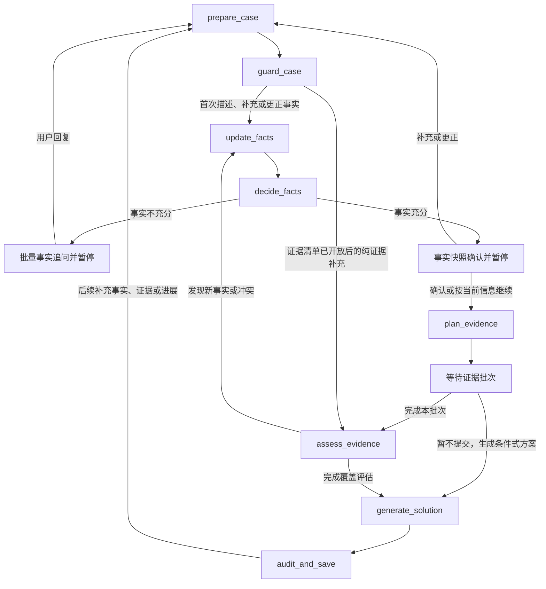

# 维权工作流优化说明书

> 文档状态：下一阶段目标设计  
> 编写日期：2026-07-31  
> 适用范围：FastAPI 后端、GuideGraph、电脑网页端和 Gradio 测试台

## 1. 优化目标

本次优化将维权助手从“对话中交替追问事实和证据、随时接收附件”调整为：

> 先建立案件模型和证明目标，再定向收集证据，最后依据实际提交的材料生成行动方案。

目标包括：

1. 用户开始咨询时只需说明基本案情和已有证据名称，不需要立即上传图片、聊天记录或文档。
2. 从首次描述中提取全部已知事实，建立可持续补充、修正、去重和追溯的动态事实黑板。
3. 每轮批量询问当前已经暴露且会影响责任、诉求、时效、管辖、程序、损失或证据规划的事实缺口，不再一轮只问一个事实。
4. 事实达到决策充分度并经用户确认后，结合法律关系、法律检索和待证事实固化案件专属证据清单。
5. 前端按照证明目标提供分类上传通道，支持集中提交和后续补交。
6. 系统分层评估材料的相关性、来源、完整性、冲突和可能证明范围，不越权认定司法意义上的证据效力。
7. 行动方案必须包含证据检验说明、有利与不利因素、程序风险和定性的维权可能性。
8. 用户在任意阶段都可以补充或更正事实；证据清单开放后可以分批补充证据。
9. 案件长期保留，事实或证据变化时只重算受影响部分，并生成可追溯的新方案版本。
10. 方案输出前必须完成事实、法条、证据边界和 Markdown 格式审校，输出后继续管理行动任务、案件进展和参考文书。

## 2. 不在本次范围内

- 不让大模型代替法院、仲裁机构或行政机关认定真实性、合法性、可采性和最终证明力。
- 不输出具体胜诉百分比或结果保证。
- 不取消安全风险、紧迫期限和证据灭失风险的即时处理。
- 不删除或替换 Gradio；Gradio继续作为同一后端工作流的测试入口。
- 不将电脑网页端扩展为手机端。

## 3. 核心设计原则

### 3.1 默认延迟上传，不禁止提前上传

正常流程不要求用户开始时上传材料。用户确有需要时仍可提前上传，系统必须接收并暂存，但不应因此跳过案情识别、证明目标构建和材料归类。

### 3.2 未上传不等于没有

证据状态必须明确区分：

| 状态 | 含义 | 方案中的处理 |
|---|---|---|
| `submitted` | 系统实际收到材料副本 | 可以进入初步材料评估 |
| `claimed_present` | 用户称持有，但尚未提交 | 只能写“用户称持有” |
| `not_submitted` | 本轮没有提交 | 按当前不可用评估，不得写成不存在 |
| `temporarily_unavailable` | 可能存在，但暂时找不到 | 提示寻找、恢复或替代材料 |
| `third_party_available` | 可向平台、银行、医院等调取 | 给出调取或申请路径 |
| `explicitly_absent` | 用户明确确认没有 | 作为已知证据缺口处理 |
| `not_applicable` | 本案不需要 | 不计入缺口 |

用户点击“完成本批次并评估”后，仍未提交的项目转为 `not_submitted`，不能自动转为 `explicitly_absent`。

### 3.3 先问事实，不让用户回答法律结论

系统不能直接询问“谁应当承担责任”“是否超过诉讼时效”“哪个法院有管辖权”。这些属于系统依据事实和法律进行的判断。

应当询问：

- 双方身份和实际关系；
- 关键行为及先后顺序；
- 发生时间和最近一次处理时间；
- 事情发生地、履行地或线上平台；
- 涉及金额和实际损失；
- 用户希望实现的结果；
- 已经采取的沟通、投诉、仲裁或诉讼措施。

### 3.4 程序控制确定，语言生成灵活

- LLM负责语义提取、材料内容理解和用户可读表达。
- 程序负责阶段路由、状态迁移、事实充分度、核验轮次、证据状态、版本、审计和降级。
- LLM不得隐式跳过证据收集阶段。只有用户明确要求按当前信息继续时，才可以生成标明证据缺口的条件式方案；未提交材料不得改写为已经存在或已经核验。

### 3.5 事实和证据可以持续补充

案件不是一次性问答。用户在事实收集、证据收集、方案生成以及后续执行阶段，都可以补充或更正事实；证据清单开放后，可以持续提交、替换或标记证据状态。

每次用户提交内容时，系统先识别本次事件类型：

- `fact_added`：新增事实；
- `fact_corrected`：更正已有事实；
- `evidence_added`：新增证据；
- `evidence_replaced`：替换证据；
- `evidence_status_changed`：材料状态发生变化；
- `mixed_update`：同一次提交同时包含事实和证据。

事实变化优先进入事实更新和充分度判断；纯证据变化直接进入证据评估。证据内容暴露出新的关键事实或事实冲突时，必须将其转为待用户确认的事实，再回到事实更新流程。

### 3.6 方案是可更新版本，不是案件终点

方案生成后案件继续存在。后续补充事实、补交证据、程序进展或对方回应，都可能触发局部重算和新版本：

```text
补充事实或证据
        |
        v
识别受影响的事实、待证事实和证据需求
        |
        v
局部重新分析
        |
        v
生成新版方案和变化摘要
        |
        v
保留旧版本、材料和行动记录
```

## 4. 目标工作流

```text
恢复案件并识别本次提交类型
        |
        v
案件边界、安全、期限和证据灭失检查（每轮执行）
        |
        v
用户首次描述基本案情和已有证据名称
        |
        v
建立或更新动态事实黑板
        |
        v
批量动态事实追问
        |
        +---- 用户补充多个事实 ----+
        |                           |
        +<---- 更新、修正和去重 <---+
        |
        v
事实达到决策充分度
        |
        v
用户确认事实快照
        |
        v
法律关系、用户诉求、法律检索和待证事实建模
        |
        v
固化案件专属证据清单并开放分类交付入口
        |
        v
用户分批提交证据并确认完成本批次
        |
        v
单份材料评估 -> 必要的核验追问（最多 1 轮）
        |
        v
整体证明目标覆盖评估
        |
        v
行动方案与定性维权可能性
        |
        v
事实、法条、证据边界和格式审校
        |
        v
保存方案版本、行动任务、参考文书和案件进展
        |
        v
后续补充事实或证据 -> 局部重算 -> 新方案版本
```

安全风险、紧迫期限和证据即将灭失时，从任意阶段进入即时提示，处理后再返回原案件阶段。用户可以在事实未完全收敛或未提交证据时要求“现在生成方案”，系统按当前信息输出明确标注条件和缺口的方案，不阻断用户。

## 5. 阶段设计

### 5.1 阶段一：基本案情与证据名称

用户首次只需要提供：

- 事情经过；
- 对方身份及双方关系；
- 时间、地点、平台和金额；
- 希望解决的结果；
- 已经沟通或处理的情况；
- 已有证据的名称，例如订单截图、付款记录、聊天记录、合同、录音。

此阶段只盘点证据名称，不要求上传材料，也不判断证据是否有效。

输出：

- 简明案件摘要；
- 初步法律关系候选；
- 已知证据名称目录；
- 仍缺少的关键事实维度。

### 5.2 阶段二：建立动态事实黑板

系统从用户首次描述中一次提取全部可识别事实，而不是只提取当前问题对应的一项。事实至少覆盖以下维度：

1. 双方身份与实际关系；
2. 关键行为、约定和事件时间线；
3. 时间节点和最近一次处理时间；
4. 地点、履行地或线上平台；
5. 金额、损失和计算方式；
6. 用户希望实现的结果；
7. 已采取的沟通、投诉、仲裁或诉讼措施；
8. 用户提到的证据名称及持有状态；
9. 安全、期限和证据灭失风险。

首次提取后立即建立事实黑板。用户没有提到的内容记录为 `not_provided`，不得由模型补全；表达不清、互相矛盾或明确不知道的内容分别记录对应状态。

此阶段输出：

- 已确认事实；
- 用户明确否认或不知道的事实；
- 待澄清冲突；
- 当前已经暴露的高价值事实缺口；
- 本轮新增事实可能产生的内部证据需求。

### 5.3 阶段三：批量动态事实追问

动态追问是事实收敛的主要机制，但不采用“一轮只问一个事实”的固定问卷。系统每轮必须根据最新事实黑板，批量询问当前已经暴露、尚未明确并且会影响决策的事实。

进入本轮问题批次的事实应当满足至少一个条件：

- 会改变责任主体、责任基础或责任范围；
- 会改变用户请求的类型、范围或金额；
- 会改变诉讼时效、仲裁期限或其他关键期限；
- 会改变管辖、受理机构或程序路径；
- 会改变待证事实或证据需求；
- 能够解决主体、日期、金额、行为或材料之间的冲突；
- 涉及人身安全、紧迫处置或证据保全；
- 对行动方案具有明显信息增益。

批量追问规则：

- 每轮询问当前已经暴露的全部高价值缺口，按照主题分组展示。
- 不设置固定两轮上限，以达到决策充分度为停止标准。
- 单轮问题数量必须可阅读；缺口较多时按优先级拆成多个主题批次，不为了形式上的“一次问全”制造超长问卷。
- 用户一条回复中的多个事实必须全部解析和入库。
- 已经明确、否认或明确不知道的事实不得重复询问。
- 能从事实、已解析材料或可靠检索结果中确定的信息不得再问。
- 不会改变法律分析、证据清单或行动方案的问题不得追问。
- 用户可以回答“不清楚”“没有”，也可以随时要求“现在生成方案”。

#### 5.3.1 动态事实列表、增量更新与停止条件

用户首次描述案件后，系统先建立事实黑板。每条事实使用稳定的语义键，避免模型换一种说法后重复提问：

```text
actor.identity          对方身份
relationship.type       双方关系
event.timeline          事件时间线
event.behavior          关键行为
transaction.amount      金额
transaction.date        交易或付款时间
location.platform       地点或线上平台
claim.request           用户诉求
procedure.history       已采取的处理措施
harm.loss               损失和影响
deadline                期限信息
safety                  安全状态
```

每条事实必须记录状态：

| 状态 | 含义 | 是否再次询问 |
|---|---|---|
| `confirmed` | 用户已经明确说明 | 不再询问 |
| `denied` | 用户明确否认 | 不再询问 |
| `unclear` | 用户表达不清 | 只问澄清问题 |
| `conflicted` | 与其他事实存在冲突 | 只问冲突核对问题 |
| `unknown` | 用户明确表示不知道 | 不重复追问 |
| `not_provided` | 尚未提供 | 进入下一批候选 |
| `superseded` | 后续陈述已替代旧事实 | 保留历史，不再使用旧值 |

每轮处理顺序：

```text
1. 读取当前事实列表和事实状态
2. 找出尚未明确且与当前案件相关的事实
3. 按责任、诉求、期限、管辖、程序、损失和安全分组
4. 按主题展示当前批次的全部高价值事实
5. 解析用户一条回复中的多个事实
6. 将新增事实追加到列表，将修正事实替换为新版本
7. 重新计算下一批事实和待证事实
```

每轮不是只问一个问题，而是批量询问当前已经暴露、且会影响方案的事实。例如：

```markdown
## 请补充目前尚未明确的信息

### 双方和交易
1. 对方是个人、店铺还是公司？
2. 购买的具体商品或服务是什么？

### 时间和金额
3. 什么时候付款或签订约定？
4. 涉及金额是多少？
5. 是否约定履行或发货时间？

### 处理经过
6. 是否联系过对方、平台或其他机构？
7. 您希望退款、赔偿、继续履行，还是其他结果？

> 可以一次回答多个问题；不清楚的项目写“不清楚”即可。
```

用户只回答其中一部分时，系统必须提取本轮全部新增事实，不能只处理第一项。已处于 `confirmed` 或 `denied` 的事实不得再次询问；`unclear` 和 `conflicted` 只能进入针对性的澄清或冲突核对。

#### 5.3.2 定向法律检索如何参与追问

事实追问不是脱离法律依据的固定问卷。每轮事实更新后，节点四可以根据新增、更正或冲突事实，定向检索会改变追问方向的法律条件、程序条件和证明目标：

```text
最新事实黑板
    ↓
识别受影响的法律关系、请求、期限、管辖、程序或证据条件
    ↓
定向检索现行法条、程序规则和权威来源
    ↓
比较已确认条件与未知条件
    ↓
生成新的事实槽位、证明目标候选和本轮批量问题
```

普通事实缺口优先使用事实依赖规则，不做全库检索；只有主体身份、法律关系、期限、管辖、程序或特殊证据存在分叉时才触发 `targeted` 检索。检索结果只能用于形成问题候选和内部依据记录，不能自动写成用户事实或确定性法律结论。节点五仍需对最终事实快照执行完整法律检索、版本校验和正式证据清单固化。

每轮证据需求采用增量账本：

```text
旧内部证据需求
+ 新事实或定向检索产生的证明目标
- 被否认、替代或不适用的需求
= 新一轮内部证据需求
```

这意味着事实阶段可以持续积累“需要证明什么、可能准备什么”，但不等于已经上传、已经核验或已经具备证明力。

事实列表不是固定表单，而是有依赖关系的动态列表。例如确认劳动关系后，才需要补充实际工作地、工资支付方式和离职时间；确认付款争议后，才需要补充付款对象、付款渠道和退款记录。每轮回答结束后必须重新计算依赖项，新暴露的事实可以进入下一批，但已经确认的事实不能重复出现。

事实追问停止条件不是“案件所有细节都已经问完”，而是：

- 责任主体和法律关系基本明确；
- 用户诉求明确；
- 时间、地点、金额和关键经过基本明确；
- 时效、管辖和程序所需事实已经覆盖；
- 重大事实冲突已经处理；
- 没有新的高价值事实槽位；
- 继续追问不会明显改变证据清单或行动方案。

用户说“不清楚”“不知道”或“没有更多信息”时，记录为 `unknown` 或相应状态，不得换一种说法反复追问。达到停止条件后进入待证事实和证据清单阶段；用户主动要求“现在生成方案”时，立即按现有事实生成条件式方案。

#### 5.3.3 事实快照确认

事实达到决策充分度后，不应直接固化证据清单。系统先向用户展示一份可编辑的事实快照，至少包括：

- 双方主体和关系；
- 核心事件时间线；
- 关键约定、履行和违约行为；
- 金额、损失和用户诉求；
- 已采取的处理措施；
- 仍然未知或存在冲突的事项；
- 系统即将据此采用的法律关系候选。

用户可以执行：

- **确认并继续**：进入法律关系和待证事实建模；
- **补充事实**：追加事实后重新判断充分度；
- **更正事实**：保留旧值为 `superseded`，使用新值重新计算；
- **按当前信息继续**：保留未知项并进入条件式分析。

事实快照是本次证据清单和方案版本的输入基线，不代表事实永久冻结。用户后续仍可补充或更正，系统据此生成新的事实快照版本。

### 5.4 阶段四：构建待证事实与证据需求

事实快照确认后，系统先完成法律分析，再固化证据清单。处理顺序为：

```text
确认后的事实快照
        |
        v
识别法律关系和责任主体
        |
        v
明确用户请求及可能的请求权基础
        |
        v
检索适用法律、程序规则和可信办理依据
        |
        v
建立待证事实和举证责任模型
        |
        v
将累计的内部证据需求合并、去重和固化
```

系统综合：

- 已确认案情；
- 法律关系；
- 用户诉求；
- 法律知识库和检索结果；
- 举证责任和程序要求；
- 当前已有证据名称；

生成证明目标矩阵：

| 待证事实 | 建议证据 | 重要程度 | 当前状态 | 替代材料 | 用途说明 |
|---|---|---|---|---|---|
| 双方存在交易关系 | 订单详情、商品页面 | 必需 | 用户称持有 | 平台订单导出 | 说明交易主体和标的 |
| 用户已经付款 | 支付记录、账单导出 | 必需 | 用户称持有 | 银行流水 | 说明付款金额和收款对象 |
| 对方没有履行 | 聊天记录、物流状态 | 重要 | 尚未确认 | 平台客服记录 | 说明未发货及后续沟通 |

证据需求分为：

- **必需材料**：缺失会明显影响请求成立或受理。
- **重要材料**：能够显著补强责任、金额或时间判断。
- **补强材料**：用于相互印证或应对对方抗辩。

该清单是系统根据当前案件形成的整理建议，不得表述为法院、仲裁机构或行政机关的固定材料目录。

#### 5.4.1 证据需求的增量生成与合并

系统每轮生成的是“证据需求”，不是替用户生成证据，也不是每轮重新创建一套完整清单。

事实收集的每一轮结束后，系统根据事实变化量更新证明目标和证据需求：

```text
上一轮证据需求
+
本轮新增事实产生的证据需求
-
语义重复的证据需求
-
因事实修正或否认而失效的证据需求
=
本轮最新证据需求
```

例如：

```text
第一轮事实：用户已经付款
→ 新增：支付记录、银行流水、平台账单

第二轮新增事实：对方未发货
→ 保留上一轮证据需求
→ 新增：物流状态、催发货记录、相关聊天记录

第三轮新增事实：用户已经向平台投诉
→ 保留前两轮证据需求
→ 新增：投诉工单、客服回复、平台处理结果
```

下一轮已经知道上一轮形成的证明目标和证据需求，只处理事实变化带来的增量。相同事实和相同证明目标不得重复生成证据需求，也不得重复要求用户上传同一份材料。

事实变化与证据需求更新规则：

| 事实变化 | 证据需求处理 |
|---|---|
| `added` | 新增相关证明目标和证据需求 |
| `unchanged` | 直接复用，不重新生成 |
| `refined` | 补充原需求的用途、范围或材料要求 |
| `replaced` | 重算受影响的证明目标，调整原需求 |
| `denied` | 将只依赖该事实的需求标记为不适用 |
| `conflicted` | 保留需求但标记待核对，不提前认定最终用途 |
| `superseded` | 停用旧事实关联，保留历史和审计记录 |

证据需求必须使用稳定编号，而不是依赖模型每轮生成的自然语言名称。例如：

```text
transaction.relationship       交易关系
transaction.payment            付款事实
delivery.non_performance       未履行或未发货
communication.demand           催告和沟通
platform.complaint             平台投诉
harm.loss                      实际损失
```

每项证据需求至少保存：

- `requirement_id`：稳定编号；
- `proof_target_id`：对应的待证明事实；
- `dependent_fact_keys`：生成该需求所依赖的事实语义键；
- `recommended_materials`：建议材料；
- `alternative_materials`：替代或补强材料；
- `importance`：必需、重要或补强；
- `status`：候选、有效、待核对、不适用或已停用；
- `generation_round`：首次形成轮次；
- `last_updated_round`：最近更新轮次；
- `change_reason`：新增、补充、修正、否认或冲突；
- `submitted_evidence_ids`：已经关联的用户材料。

合并时按照 `requirement_id` 和 `proof_target_id` 去重。自然语言名称不同但证明目标相同的材料应合并到同一需求下，例如“付款截图”“微信支付记录”和“支付凭证”可以归入 `transaction.payment`，同时保留具体材料名称。

已经上传的材料及其评估状态必须随需求继承。后续事实变化时：

- 仍然相关的材料继续保留；
- 用途发生变化时更新关联关系，不要求用户重新上传；
- 暂时不相关的材料标记为未用于当前证明目标，不直接删除；
- 重新适用时可以恢复关联；
- 所有变化保留版本和原因。

证据需求在事实阶段内部持续增量更新，但通常不在每轮对话中完整展示。只有以下内容可以提前展示：

- 存在灭失风险、需要立即保存的材料；
- 会直接影响下一轮事实判断的关键材料提示；
- 用户主动询问当前需要准备什么。

事实达到决策充分度后，系统将累计形成、去重并完成状态调整的证据需求固化为正式证据清单，再向用户展示分类交付入口。

#### 5.4.2 证据清单的版本与变化

正式证据清单生成后继续保留增量更新能力。建议记录：

- `evidence_plan_version`
- `previous_version`
- `added_requirement_ids`
- `updated_requirement_ids`
- `deactivated_requirement_ids`
- `reactivated_requirement_ids`
- `change_summary`

新增事实只追加或调整受影响的需求，不覆盖整份清单。事实修正导致需求失效时使用“已停用”或“不适用”，不从历史中物理删除。前端只向用户突出本版本新增、变化和仍待提交的项目，避免用户重复准备已经提交的材料。

### 5.5 阶段五：集中收集证据

电脑网页端按待证事实显示独立证据通道。每项支持：

- 文字说明；
- 上传图片、PDF、DOCX或其他允许的材料；
- 标记“稍后提交”；
- 标记“暂时找不到”；
- 标记“可向第三方调取”；
- 明确标记“没有”；
- 填写来源和原件情况。

交互要求：

- 用户可以分批上传。
- 页面持续保存每项材料状态。
- “完成本批次并评估”是批次收敛动作；没有点击前不反复触发完整评估。
- 未操作的项目按 `not_submitted` 处理。
- 系统不得因用户没有上传所有建议材料而阻止生成条件式方案。
- 方案生成后证据中心仍然开放，新增材料进入新的证据批次。
- 用户提交未列入当前清单的材料时先接收并标记为“待归类”，不得拒绝或静默丢弃。
- 提交材料时可以同时填写来源、取得方式、是否保留原件或原始载体及其他背景。

事实收敛前用户提前上传的材料先安全暂存并建立文件记录。只有在证明目标形成后，系统才将其正式关联到证据需求并进入完整评估。

### 5.6 阶段六：证据批次分析

证据评估必须区分“单份材料评估”和“整体证据覆盖评估”，不能用某一份材料的初步结果直接代表整个案件的证明状态。

单份材料分析分为以下层次：

1. **接收状态**：是否实际收到，文件是否可解析。
2. **材料来源**：原件、原始电子载体、平台导出、截图、复制件或用户陈述。
3. **完整性**：是否缺页、裁剪、截断、模糊或缺少上下文。
4. **可见要素**：主体、日期、金额、编号和关键内容是否清晰。
5. **相关性**：材料与哪个待证事实有关。
6. **证明范围**：材料可能说明什么，不能单独说明什么。
7. **一致性**：与用户陈述及其他材料是否存在冲突。
8. **补强方向**：需要原始载体、平台导出、第三方记录或其他材料印证。

不得输出：

- “该证据绝对有效”；
- “法院一定采纳”；
- “证据链已经完整”；
- “凭这一张截图即可胜诉”。

统一说明：

> 本评估仅用于梳理材料用途和补强方向，不认定真实性、合法性、可采性或最终证明力。

### 5.7 阶段七：上传后的核验追问

只在材料属性会明显改变评估时触发，例如：

- 文件是平台直接导出还是截图；
- 是否保留原始设备和完整聊天记录；
- 付款记录中的收款人与交易对方能否对应；
- 截图是否包含完整时间、主体和前后文；
- 不同材料中的金额或日期为何不一致。

限制：

- 最多 1 轮；
- 一轮最多 1 至 2 个相关问题；
- 用户不回答时按未知状态继续生成方案；
- 不允许重新进入开放式、连续的事实盘问。

证据核验回答只用于补充材料来源、完整性和上下文等属性。如果回答中出现新的案件事实或与事实黑板冲突的内容，应转为待确认事实并进入事实更新流程，而不是在证据节点内直接改写案件事实。

#### 5.7.1 整体证明目标覆盖评估

单份材料评估和必要的核验完成后，系统按待证事实计算整体覆盖：

| 覆盖状态 | 含义 |
|---|---|
| `covered` | 当前至少有一组材料能够对该待证事实形成较明确支持 |
| `partially_covered` | 已有相关材料，但来源、完整性、主体对应或关键要素仍不足 |
| `conflicted` | 相关材料之间或材料与用户陈述之间存在重要冲突 |
| `not_submitted` | 已提出证据需求，但本轮未收到可评估材料 |
| `explicitly_absent` | 用户明确表示不存在相应材料 |
| `third_party_available` | 可能通过平台、银行、机关或其他第三方取得 |
| `not_applicable` | 因事实或请求变化，该证明目标不再适用 |

整体评估必须说明：

- 每个待证事实由哪些材料支持；
- 单份材料之间能否相互印证；
- 哪些关键要素仍为空缺或冲突；
- 哪些替代材料可能补足缺口；
- 哪一项补充最可能改变当前判断。

### 5.8 阶段八：行动方案和维权可能性

维权可能性必须拆分评估：

| 维度 | 判断内容 |
|---|---|
| 权利基础 | 请求是否有检索到的法律依据 |
| 事实清晰度 | 关键事实是否明确、是否存在冲突 |
| 证据覆盖度 | 各待证事实是否有当前可用材料支持 |
| 程序可行性 | 主体、时效、管辖和渠道是否明确 |
| 履行风险 | 对方身份、财产、经营状态和执行难度 |

综合结论只使用定性等级：

- 较有利；
- 条件性有利；
- 不确定；
- 风险较高。

不得输出具体胜诉率、成功率百分比或保证性表述。

行动方案必须说明：

- 哪些因素提高维权可能性；
- 哪些因素降低维权可能性；
- 当前证据覆盖了哪些待证事实；
- 哪些材料尚未提交或明确缺失；
- 补充哪份材料最可能改变判断；
- 当前即可执行的低风险行动；
- 推荐路径、替代路径及适用条件。

#### 5.8.1 方案审校、任务和参考文书

方案不得在第一次生成后直接返回。输出前必须完成以下审校：

1. **事实边界**：没有把未知、冲突或用户未确认的内容写成确定事实；
2. **法律边界**：法律依据来自实际检索结果，名称、效力层级和适用条件匹配；
3. **证据边界**：未把“已提交”“用户称持有”“本轮未提交”和“明确没有”混淆；
4. **推理一致性**：责任、诉求、期限、管辖、证据覆盖和行动路径不存在明显矛盾；
5. **表达边界**：不作胜诉保证，不越权认定证据效力；
6. **格式审校**：Markdown 标题、列表、表格和段落层级完整，没有调试信息或重复文本。

审校不通过时只重生成受影响部分；通过后再保存并展示。同时生成：

- 可执行的下一步任务；
- 每项任务的建议期限、状态和依赖材料；
- 适用的投诉、协商、仲裁、诉讼或其他参考文书；
- 本版本相对上一版本的主要变化。

### 5.9 阶段九：后续补充事实、证据和方案版本

案件进入方案阶段后仍可补充或更正事实，也可以继续提交、替换证据和更新材料状态。

#### 5.9.1 补充或更正事实

事实入口在案件全生命周期保持可用。每次新增或更正事实时：

1. 重新执行安全、期限和证据灭失检查；
2. 更新事实黑板并保留被替代值；
3. 判断变化是否影响法律关系、用户请求、待证事实或程序路径；
4. 只更新受影响的证据需求，保留其他需求；
5. 已上传材料继续保留，必要时重新归类或调整用途；
6. 对实质变化重新生成事实快照、证据清单和方案版本；
7. 对非实质变化只更新案件摘要和相关任务。

用户补充的事实不得自动覆盖冲突事实。系统应当展示冲突并请用户确认哪个版本正确，或者继续保留为 `conflicted`。

#### 5.9.2 补充或替换证据

每次新增、替换或删除材料时：

1. 更新证据目录和文件指纹；
2. 只重新分析发生变化的材料；
3. 重新计算证明目标覆盖；
4. 标记维权可能性是否发生变化；
5. 生成新的方案版本；
6. 保留上一版本的生成时间和主要变化说明。

补充证据本身可能产生三种路由：

```text
仅补强既有证明目标
→ 证据评估 → 整体覆盖 → 新方案版本

暴露新的关键事实
→ 待用户确认 → 更新事实 → 更新证据清单 → 重新评估

与已有事实或材料冲突
→ 标记冲突 → 用户核对或保留未知 → 重新评估
```

材料因事实变化暂时不再适用时，不物理删除；应标记为未用于当前证明目标。事实再次变化后允许恢复关联。

#### 5.9.3 长期案件进展

案件状态默认长期保存，直至用户手动删除。方案生成后继续记录：

- 行动任务的待处理、进行中、已完成和放弃状态；
- 投诉、协商、仲裁、诉讼等程序进展；
- 对方、平台或机构的新回复；
- 新增期限和提醒信息；
- 事实快照、证据清单、证据评估和方案的版本关联。

程序进展中包含新的事实或证据时，复用同一回流规则，不另建一套分析流程。

建议版本字段：

- `fact_snapshot_version`
- `legal_model_version`
- `evidence_plan_version`
- `evidence_review_version`
- `plan_version`
- `reviewed_at`
- `changed_fact_keys`
- `changed_evidence_ids`
- `assessment_change_summary`

## 6. 状态机调整

现有 `GuidePhase` 保留，用于兼容历史案件和现有路由。在其内部新增更细的 `workflow_stage`：

```text
case_intake
fact_clarification
fact_confirmation
legal_evidence_planning
evidence_collection
evidence_review
evidence_verification
plan_generation
plan_issued
post_plan_update
```

建议映射：

| 现有 GuidePhase | 新 workflow_stage |
|---|---|
| `CLARIFY` | `case_intake`、`fact_clarification`、`fact_confirmation` |
| `ISSUE_SEARCH` | `legal_evidence_planning` |
| `DETAIL_GATHER` | `evidence_collection`、`evidence_review`、`evidence_verification` |
| `CONCLUDE` | `plan_generation` |
| `END` | `plan_issued`、`post_plan_update` |

新增或扩展状态：

- `workflow_stage`
- `input_event_type`
- `fact_blackboard`
- `fact_changes`
- `fact_sufficiency`
- `fact_snapshot_version`
- `fact_snapshot_confirmed`
- `legal_model`
- `legal_model_version`
- `proof_targets`
- `evidence_inventory`
- `evidence_candidates`
- `required_evidence`
- `evidence_plan_version`
- `evidence_requirement_changes`
- `evidence_collection_status`
- `evidence_batch_id`
- `evidence_submission_completed`
- `evidence_review_version`
- `evidence_coverage`
- `plan_version`
- `plan_audit_result`
- `case_tasks`
- `case_progress`
- `assessment_change_summary`

历史案件没有 `workflow_stage` 时，根据现有 `phase`、证据状态和是否已有方案进行保守迁移，不清空原有事实或证据。

## 7. GuideGraph 节点调整

业务阶段可以细分展示，但 GuideGraph 实现收敛为 8 个核心处理节点。等待用户回复、确认事实快照和提交证据使用 `interrupt` 或等价暂停机制，不作为独立推理节点。

| 节点 | 职责 |
|---|---|
| `prepare_case` | 恢复案件和历史版本，识别本次输入是首次描述、事实补充、事实更正、证据补充、状态变化还是控制指令 |
| `guard_case` | 每轮执行案件边界、人身安全、紧迫期限、证据灭失和必要降级检查 |
| `update_facts` | 从输入和已解析材料中提取全部事实，更新、修正、去重、标记冲突并保留事实历史 |
| `decide_facts` | 评估事实充分度，内部增量更新证据需求；不充分时生成批量追问，充分时生成事实快照等待确认 |
| `plan_evidence` | 完成法律关系、用户请求、法律检索、待证事实和举证责任建模，固化证据清单并创建交付入口 |
| `assess_evidence` | 进行单份材料评估、最多一轮核验和整体证明目标覆盖评估；发现新事实时回流事实节点 |
| `generate_solution` | 根据法律、事实、证据、程序和履行风险生成定性维权可能性、行动方案、任务和参考文书 |
| `audit_and_save` | 审校事实、法条、证据边界和 Markdown 格式，保存事实快照、证据清单、评估、方案、任务及变化版本 |

路由优先级：

1. 安全和紧迫性；
2. 用户明确控制指令；
3. 案件边界；
4. 当前 `workflow_stage`；
5. 决策充分性；
6. 事实问题的信息增益和证据核验轮次限制。

核心路由：



`decide_facts` 可以调用独立的事实充分度、问题规划和证据需求合并函数；`plan_evidence` 可以调用法律检索、请求权分析和待证事实构建函数；`assess_evidence` 可以调用文件解析、单份评估、核验规划和覆盖计算函数。这些内部函数不必全部拆成图节点，只有需要独立路由、暂停、重试或持久化边界的职责才成为节点。

证据清单开放前收到的纯证据补充由 `prepare_case` 暂存，并返回案件当前事实阶段；同一次输入同时包含事实和证据时，先执行 `update_facts`，再按更新后的证明目标归类证据。方案生成后的非实质事实补充可以在 `decide_facts` 判断后返回原阶段；实质变化必须重新确认事实快照，并更新受影响的法律模型、证据清单和方案。

不得将节点继续合并到 5 个以下。事实提取与事实决策、证据规划与证据评估、方案生成与审校保存必须保持独立，以便测试、失败重试和避免状态污染。

## 8. 前端交互调整

电脑网页端采用五段式案件工作台：

```text
基本案情 -> 事实补充 -> 事实确认 -> 证据中心 -> 方案与进展
```

案件页在所有阶段长期保留三个固定入口：

- **补充或更正案情**；
- **补充证据**；
- **完成本批次并重新评估**。

系统根据当前阶段决定入口行为。事实入口始终可用；证据清单尚未固化时，补充的材料先暂存，清单固化后自动归类。

### 8.1 基本案情

- 默认不突出附件上传。
- 支持输入已有证据名称标签。
- 显示“此阶段无需上传材料”。

### 8.2 事实补充

- 按主题展示本轮尚未明确的高价值事实。
- 已知字段不重复出现。
- 支持一条回复同时回答多个问题，也支持部分回答。
- 每轮提交后展示新增、修正、冲突和仍缺少的事实摘要。

### 8.3 事实确认

- 展示可编辑的事实快照和关键时间线。
- 明确区分已确认、未知和冲突事实。
- 提供“确认并继续”“补充事实”“更正事实”和“按当前信息继续”。
- 显示事实快照版本，但不向用户展示内部状态键。

### 8.4 证据中心

- 按待证事实分组，而不是单一总上传框。
- 每项显示重要程度、当前状态、用途和替代材料。
- 支持文字说明、图片、PDF、DOCX、稍后补、暂时找不到、可调取和明确没有。
- 提供“完成本批次并评估”按钮。
- 方案生成后继续开放，突出新增、变化和仍待提交的项目。
- 未归类材料进入待归类区，评估后关联至一个或多个证明目标。

### 8.5 方案与进展

- 显示证据覆盖矩阵；
- 显示材料检验说明；
- 显示有利、不利和不确定因素；
- 显示定性维权可能性；
- 显示推荐路径和行动清单；
- 显示方案版本和补证后的变化。
- 显示行动任务、建议期限、任务状态和参考文书；
- 支持记录对方、平台、仲裁机构或法院的后续回复；
- 事实或证据变化后提示哪些判断发生变化，不覆盖旧版本。

## 9. 回复格式规范

所有面向用户的模型回答使用标准 Markdown。

### 9.1 批量事实追问

```markdown
## 请补充目前尚未明确的信息

### 双方和事件

1. **对方身份：** 对方是个人、店铺还是公司？
2. **约定内容：** 双方具体约定了什么？

### 时间和金额

3. **关键时间：** 什么时候付款，约定何时履行？
4. **金额损失：** 涉及金额和其他实际损失是多少？

### 处理经过

5. **已采取措施：** 是否联系过对方、平台或其他机构？
6. **希望结果：** 希望退款、赔偿、继续履行，还是其他结果？

> 可以一次回答多个问题；不清楚的写“不清楚”，没有的写“没有”。
```

每轮实际问题只包含当前事实黑板中的高价值缺口，以上仅为格式示例，不是固定问卷。

### 9.2 事实快照

```markdown
## 请确认案件事实

### 已确认

- **双方关系：** ...
- **核心经过：** ...
- **时间与金额：** ...
- **您的诉求：** ...

### 仍不明确

- ...

### 需要核对的冲突

- ...

> 您可以回复“确认并继续”，也可以直接补充或更正具体内容。
```

### 9.3 证据评估

```markdown
## 本批证据评估

### 已收到的材料

### 单份材料说明

### 整体证明目标覆盖

### 当前缺口与替代材料

### 最值得优先补充的内容

> 本评估仅用于梳理材料用途和补强方向，不认定真实性、合法性、可采性或最终证明力。
```

### 9.4 最终方案

```markdown
## 核心判断

## 已确认事实

## 证据检验结果

## 证据缺口与替代材料

## 有利与不利因素

## 当前维权可能性

## 推荐行动方案

## 下一步清单

## 版本变化
```

格式要求：

- 标题单独成行，标题、正文和列表之间保留空行。
- 并列条件、证据、路径和步骤使用列表。
- 单个自然段原则上不超过四句话。
- 只加粗期限、金额、核心判断和关键行动。
- 不在一个长段落中混合事实、法律依据、证据结论和行动建议。

## 10. API 和数据调整

现有 `/api/v1/chat/upload-document` 和 `/api/v1/chat/upload-image` 可以保留，后续扩展以下关联信息：

- `case_id`
- `evidence_requirement_id`
- `evidence_batch_id`
- `source_form`
- `original_available`
- `submission_status`

建议新增批次控制接口或等价控制消息：

- 补充或更正事实；
- 确认事实快照；
- 完成本批次提交；
- 重新打开证据收集；
- 替换某份材料；
- 删除某份材料；
- 重新生成证据评估；
- 获取方案版本列表。

统一案件事件至少携带 `case_id`、`event_type`、`base_version` 和事件载荷。后端应当根据 `event_type` 路由事实补充、事实更正、证据补充或混合更新，并使用 `base_version` 防止多个页面或重复请求静默覆盖较新的案件状态。

建议提供或扩展以下读取能力：

- 获取当前事实快照及其版本；
- 获取证据清单、批次和评估状态；
- 获取方案版本和变化摘要；
- 获取案件行动任务和进展；
- 获取等待用户完成的当前暂停点。

删除案件时继续统一清理案件状态、附件关联、证据评估、方案版本和长期记忆。

## 11. Gradio 兼容

Gradio继续调用相同后端状态机：

- 基本案情、批量事实追问和事实快照使用 Markdown 消息展示；
- 证据需求以 Markdown 表格或列表展示；
- 支持一次选择多个文件；
- 上传时传递对应的证据需求编号；
- 使用“完成本批次并评估”触发批次分析；
- 支持通过聊天消息补充或更正事实；
- 方案生成后仍可补交证据并显示新版本；
- 展示与网页端相同的 Markdown 方案文本。

Gradio不需要复制网页端的完整证据工作台，但不得绕过事实快照、证据状态、批次分析、审校和方案版本规则。相同案件输入应进入同一组 8 个核心节点，避免网页端和 Gradio出现两套行为。

## 12. 异常和降级

| 情形 | 处理 |
|---|---|
| 用户拒绝继续回答 | 按现有信息进入条件式方案 |
| 用户不上传任何材料 | 将建议材料标记为本轮未提交，仍生成条件式方案 |
| 材料解析失败 | 保留文件和指纹，标记无法解析，不静默丢弃 |
| 大模型证据分析失败 | 使用确定性材料库存和未知质量状态继续 |
| 知识库检索失败 | 明确降级，不编造法条或案例 |
| 材料相互冲突 | 标记冲突并给出核对方法，不自行选择一个为真 |
| 证据暴露新事实 | 转为待确认事实，确认后回流事实更新，不直接改写案件事实 |
| 用户后续补交 | 只重评变化材料和受影响的证明目标，生成新方案版本 |
| 用户后续更正事实 | 保留旧事实版本，重算受影响的法律分析、证据需求和方案 |
| 并发或重复提交 | 使用案件版本校验和事件幂等键，避免覆盖或重复分析 |
| 涉及现实危险 | 优先提供安全行动并暂停普通流程 |
| 期限紧迫 | 先给时效保护和证据保全行动，再继续收集 |

## 13. 实施顺序

### 第一阶段：状态与路由

- 新增 `workflow_stage` 和证据提交状态；
- 实现历史案件兼容映射；
- 调整收敛与控制指令路由；
- 保持现有前端和 Gradio仍可运行。

### 第二阶段：批量事实收集

- 实现动态事实黑板、稳定事实键和事实版本；
- 从一条输入中提取全部新增、修正、否认和冲突事实；
- 动态隐藏已知、已否认和明确不知道的字段；
- 实现批量高价值追问、决策充分度和事实快照确认；
- 接入按事实变化触发的定向法律检索，支持从法律条件反推事实问题；
- 保存检索来源、版本、定位、适用范围和检索缺口，不将检索结论写入事实黑板；
- 补充重复问题、依赖事实和停止条件测试。

### 第三阶段：证据需求和集中提交

- 构建证明目标矩阵；
- 实现证据需求状态；
- 扩展上传接口关联字段；
- 开发网页端证据中心；
- 为 Gradio增加批次提交能力。

### 第四阶段：证据评估和方案版本

- 实现批次证据分析；
- 实现上传后单轮核验；
- 分离单份材料评估和整体证明目标覆盖；
- 改造证据覆盖、方案输出和输出前审校；
- 实现后续补充事实、补充证据和版本差异；
- 实现行动任务、案件进展和参考文书关联。

### 第五阶段：联调和迁移

- 迁移或兼容已有长期案件；
- 前端、后端和 Gradio联调；
- 运行完整场景回归；
- 使用典型案件验证首次输入、批量追问、事实确认、无证据、部分证据、冲突证据、后续补事实和后续补证。

## 14. 验收标准

### 14.1 流程

- 首轮不强制上传多模态材料。
- 基本案情和证据名称可以一次提交。
- 一条用户回复中的多个事实都能被提取和更新。
- 每轮批量事实追问不重复已确认、已否认或明确不知道的信息。
- 事实追问以决策充分度停止，不因固定轮次过早结束。
- 事实收敛后必须展示可补充、可更正的事实快照。
- 上传后核验追问不超过 1 轮。
- 用户随时可以要求按现有信息生成方案。
- 用户在方案生成后仍可补充或更正事实。
- 用户在证据清单开放后可以分批补交证据。

### 14.2 证据

- 未上传和明确没有严格区分。
- 相同事实和证明目标不会重复生成证据需求。
- 新增事实只增量追加或更新受影响的证据需求。
- 事实修正、否认或冲突会调整需求状态，不直接删除历史。
- 已上传材料及评估状态能够跨事实轮次和清单版本继承。
- 每份材料关联至少一个待证事实或标记为暂无法归类。
- 材料评估明确说明可能用途、限制和补强方向。
- 解析失败的附件不会静默丢失。
- 不输出司法意义上的确定证据效力结论。

### 14.3 方案

- 包含核心判断、事实、证据检验、证据缺口、利弊、维权可能性、路径和行动清单。
- 维权可能性基于法律、事实、证据、程序和履行风险综合判断。
- 不输出具体胜诉百分比或绝对承诺。
- 无材料时仍能生成条件式行动方案。
- 后续补充事实或证据后能够生成新版本并说明变化。
- 输出前事实、法条、证据边界和 Markdown 格式审校通过。
- 方案任务和案件进展可以长期更新，不因方案生成而关闭案件。

### 14.4 展示

- 回答使用清晰 Markdown 层级。
- 标题、列表、引用和提示块在网页端与 Gradio中均可阅读。
- 不出现连续大段平铺文字。
- 不显示内部 Agent、数据库、Redis键或模型调试信息。

## 15. 必测场景

1. 用户只描述基本案情，没有任何证据。
2. 用户只填写证据名称，不上传文件。
3. 用户一次回答当前批次的全部事实问题。
4. 用户只回答本轮部分事实，下一轮只询问剩余及新暴露的高价值缺口。
5. 用户连续回答“不清楚”并要求立即生成方案。
6. 用户提前上传材料。
7. 用户在证据中心提交全部建议材料。
8. 用户只提交部分材料，其余没有操作。
9. 用户明确表示某项证据不存在。
10. 用户表示材料可从平台或银行调取。
11. 上传材料模糊、裁剪或解析失败。
12. 多份材料中的日期或金额相互冲突。
13. 用户不上传任何材料但要求生成方案。
14. 方案生成后补交关键证据。
15. 后续证据使维权可能性上调、下调或保持不变。
16. 涉及人身危险、紧迫期限或证据即将灭失。
17. 历史长期案件在新状态机中继续对话。
18. 网页端与 Gradio对同一案件产生一致的后端状态。
19. 多轮新增事实只追加新的证据需求，不重复已有需求。
20. 事实被补充、修正、否认或替代后，关联证据需求正确更新或停用。
21. 已上传材料在证据清单升级后仍保留文件、关联和评估状态。
22. 自然语言名称不同但证明目标相同的证据需求能够按稳定编号合并。
23. 事实收敛后用户更正关键时间或金额，法律分析、证据清单和方案只重算受影响部分。
24. 用户补充的证据暴露新事实，系统先要求确认，再回流事实流程。
25. 方案生成后补充非关键事实，只更新相关摘要和任务，不重复完整追问。
26. 方案生成后补交关键证据，整体证据覆盖和方案版本正确变化。
27. 用户同一条消息同时补充事实和上传证据，先更新事实，再归类和评估材料。
28. 用户重复提交同一批次或使用旧页面提交，不产生重复材料和错误版本覆盖。
29. 事实、证据、方案和行动任务在案件长期保存后可以继续更新，直至用户手动删除。
